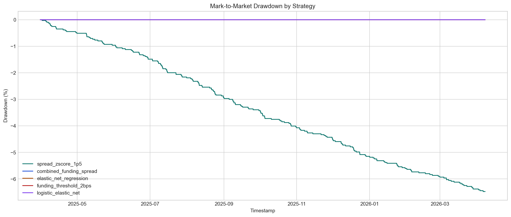
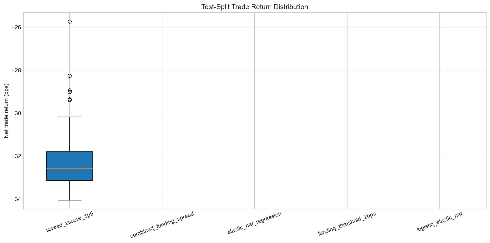

# Backtest Report

## Overview

- Symbol: `BTCUSDT`
- Provider: `binance`
- Frequency: `1h`
- Signal artifact: `data/artifacts/signals/binance/btcusdt/1h/baseline/signals.parquet`
- Market dataset: `data/processed/binance/btcusdt/1h/hourly_market_data.parquet`
- Output root: `data/artifacts/backtests`
- Signal rows: `318422`
- Active signal count: `2856`
- Signal status: `warning`
- Signal reason: `combined_funding_spread: test: signal_count == 0 for split 'test'.; elastic_net_regression: validation: signal_count == 0 for split 'validation'.; test: signal_count == 0 for split 'test'.; funding_threshold_2bps: test: signal_count == 0 for split 'test'.; logistic_l1: test: signal_count == 0 for split 'test'.; logistic_regression: validation: signal_count == 0 for split 'validation'.; test: signal_count == 0 for split 'test'.; ridge_regression: validation: signal_count == 0 for split 'validation'.; test: signal_count == 0 for split 'test'.`
- Signal prediction modes: `['static']`
- Signal calibration methods: `['none', 'sigmoid']`
- Signal checkpoint metrics: `[]`
- Signal effective checkpoint metrics: `[]`
- Signal selected losses: `[]`
- Signal preprocessing scalers: `[]`
- Canonical market rows: `46152`

## Simplifying Assumptions

- Signals are observed at timestamp `t` and executed after `1` bar(s) using `open` prices.
- Direction is fixed to `short_perp_long_spot` for this run.
- Hedge mode is `equal_notional_hedge`; the implemented prototype uses equal USD notional on perp and spot legs.
- Delta-neutral abstraction uses fixed per-leg notional of `10000.0` USD.
- Primary leaderboard split is `test`; combined/in-sample behavior should be treated as secondary diagnostics.
- Primary risk metrics use mark-to-market equity. Realized-only equity remains in the artifact for auditability.
- Funding mode is `prototype_bar_sum` with `initial_notional` funding notional.
- PnL includes explicit perp-leg, spot-leg, and funding components.
- Trading fees use taker fee `5.0` bps on all four round-trip transactions.
- Slippage is modeled through adverse execution prices using `3.0` bps. `embedded_slippage_cost_usd` is a diagnostic, not a second deduction.
- Gas cost is `2.0` USD per closed trade.
- Stop logic is `bar_close_observed` and `next_bar_executed`, not intrabar execution.
- Simple annualized Sharpe uses square-root scaling and may be distorted by sparse, serially correlated trading returns.
- When a strategy has zero executable trades on the evaluation split, Sharpe and drawdown fields are reported as NaN because they are not meaningful for a flat path.

## Run Diagnostics

- Implied gross leverage: `0.2`
- Max gross leverage guard: `2.0`
- Leverage check passed: `True`
- Funding event source: `all_aligned_rows`
- Funding rows used: `46081`
- Nonzero funding rows used: `3089`

## Equity And Risk Notes

- `mark_to_market_equity_usd` marks open positions on every bar and is the source for primary drawdown and Sharpe metrics.
- `realized_equity_usd` only changes when trades close. It is useful for audit trails, but can understate intratrade risk.
- `embedded_slippage_cost_usd` is the preferred diagnostic implied by adverse execution prices; legacy `estimated_slippage_cost_usd` is retained only as an alias.

## Strategy Summary

| strategy_name | source_subtype | evaluation_split | status | diagnostic_reason | prediction_mode | calibration_method | checkpoint_selection_effective_metric | selected_loss | preprocessing_scaler | signal_threshold | has_trades | trade_count | cumulative_return | annualized_return | sharpe_ratio | raw_period_sharpe | autocorr_adjusted_sharpe | max_drawdown | realized_max_drawdown | mark_to_market_max_drawdown | win_rate | profit_factor | average_trade_return_bps | median_trade_return_bps | exposure_time_fraction | total_net_pnl_usd |
| --- | --- | --- | --- | --- | --- | --- | --- | --- | --- | --- | --- | --- | --- | --- | --- | --- | --- | --- | --- | --- | --- | --- | --- | --- | --- | --- |
| spread_zscore_1p5 | rule_based | test | completed |  | static | none |  |  |  | 2.0 | True | 200 | -0.064749 | -0.063419 | -14.072107 | -0.150351 | -12.912402 | -0.064749 | -0.064749 | -0.064749 | 0.0 | 0.0 | -32.374269 | -32.56414 | 0.026477 | -6474.853785 |
| combined_funding_spread | rule_based | test | no_tradable_signals | test: signal_count == 0 for split 'test'. | static | none |  |  |  | 0.0 | False | 0 | 0.0 | 0.0 |  |  |  |  |  |  |  |  |  |  | 0.0 | 0.0 |
| elastic_net_regression | baseline_linear | test | no_tradable_signals | validation: signal_count == 0 for split 'validation'.; test: signal_count == 0 for split 'test'. | static | none |  |  |  | 0.0 | False | 0 | 0.0 | 0.0 |  |  |  |  |  |  |  |  |  |  | 0.0 | 0.0 |
| funding_threshold_2bps | rule_based | test | no_tradable_signals | test: signal_count == 0 for split 'test'. | static | none |  |  |  | 3.0 | False | 0 | 0.0 | 0.0 |  |  |  |  |  |  |  |  |  |  | 0.0 | 0.0 |
| logistic_l1 | baseline_linear | test | no_tradable_signals | test: signal_count == 0 for split 'test'. | static | none |  |  |  | 0.5 | False | 0 | 0.0 | 0.0 |  |  |  |  |  |  |  |  |  |  | 0.0 | 0.0 |
| logistic_regression | baseline_linear | test | no_tradable_signals | validation: signal_count == 0 for split 'validation'.; test: signal_count == 0 for split 'test'. | static | sigmoid |  |  |  | 0.5 | False | 0 | 0.0 | 0.0 |  |  |  |  |  |  |  |  |  |  | 0.0 | 0.0 |
| ridge_regression | baseline_linear | test | no_tradable_signals | validation: signal_count == 0 for split 'validation'.; test: signal_count == 0 for split 'test'. | static | none |  |  |  | 0.0 | False | 0 | 0.0 | 0.0 |  |  |  |  |  |  |  |  |  |  | 0.0 | 0.0 |

## Split Summary

| strategy_name | signal_split | source_subtype | prediction_mode | calibration_method | checkpoint_selection_effective_metric | selected_loss | trade_count | win_rate | profit_factor | average_trade_return_bps | median_trade_return_bps | average_holding_hours | median_holding_hours | max_consecutive_losses | total_turnover_usd | total_funding_pnl_usd | total_net_pnl_usd |
| --- | --- | --- | --- | --- | --- | --- | --- | --- | --- | --- | --- | --- | --- | --- | --- | --- | --- |
| combined_funding_spread | train | rule_based | static | none |  |  | 46 | 0.0 | 0.0 | -31.603369 | -32.346002 | 1.0 | 1.0 | 46 | 1840000.0 | 0.0 | -1453.754968 |
| combined_funding_spread | validation | rule_based | static | none |  |  | 3 | 0.0 | 0.0 | -31.555761 | -32.343217 | 1.0 | 1.0 | 3 | 120000.0 | 0.0 | -94.667282 |
| elastic_net_regression | train | baseline_linear | static | none |  |  | 6 | 0.666667 | 8.496974 | 33.40012 | 6.360311 | 2.166667 | 2.0 | 1 | 240000.0 | 0.0 | 200.400721 |
| funding_threshold_2bps | train | rule_based | static | none |  |  | 200 | 0.0 | 0.0 | -33.923359 | -33.933253 | 1.0 | 1.0 | 200 | 8000000.0 | 0.0 | -6784.671852 |
| funding_threshold_2bps | validation | rule_based | static | none |  |  | 9 | 0.0 | 0.0 | -33.604761 | -33.974805 | 1.0 | 1.0 | 9 | 360000.0 | 0.0 | -302.44285 |
| logistic_l1 | train | baseline_linear | static | none |  |  | 433 | 0.016166 | 0.019113 | -28.947747 | -30.634579 | 2.524249 | 1.0 | 133 | 17320000.0 | 363.8462 | -12534.374494 |
| logistic_l1 | validation | baseline_linear | static | none |  |  | 13 | 0.0 | 0.0 | -32.67478 | -34.035809 | 1.153846 | 1.0 | 13 | 520000.0 | 3.1856 | -424.772141 |
| logistic_regression | train | baseline_linear | static | sigmoid |  |  | 1 | 1.0 | inf | 121.504187 | 121.504187 | 1.0 | 1.0 | 0 | 40000.0 | 0.0 | 121.504187 |
| ridge_regression | train | baseline_linear | static | none |  |  | 20 | 0.25 | 1.131911 | 1.571862 | -12.026944 | 1.55 | 1.0 | 11 | 800000.0 | 61.4125 | 31.437237 |
| spread_zscore_1p5 | test | rule_based | static | none |  |  | 200 | 0.0 | 0.0 | -32.374269 | -32.56414 | 1.185 | 1.0 | 200 | 8000000.0 | 7.9136 | -6474.853785 |
| spread_zscore_1p5 | train | rule_based | static | none |  |  | 700 | 0.007143 | 0.016974 | -30.29208 | -31.821551 | 1.411429 | 1.0 | 570 | 28000000.0 | 70.593 | -21204.456266 |
| spread_zscore_1p5 | validation | rule_based | static | none |  |  | 157 | 0.0 | 0.0 | -32.007754 | -32.563769 | 1.375796 | 1.0 | 157 | 6280000.0 | 21.0287 | -5025.217388 |

## Figures

