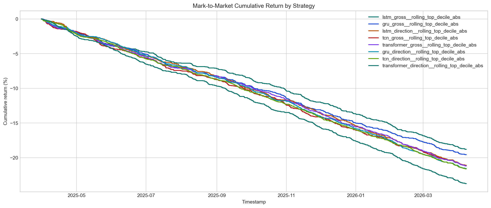
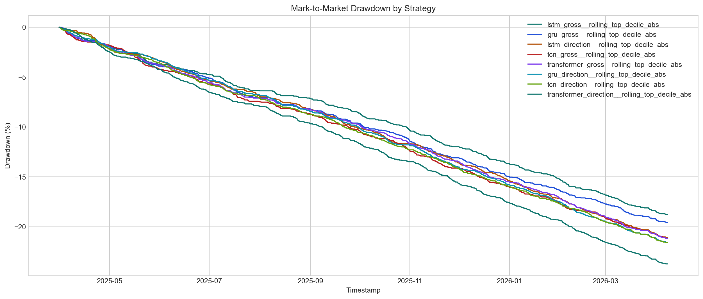
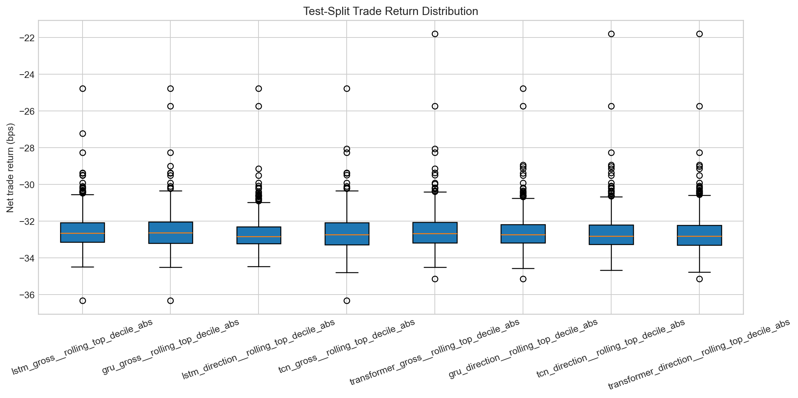

# Backtest Report

## Overview

- Symbol: `BTCUSDT`
- Provider: `binance`
- Frequency: `1h`
- Signal artifact: `data/artifacts/signals/exploratory_dl/binance/btcusdt/1h/exploratory/signals.parquet`
- Market dataset: `data/processed/binance/btcusdt/1h/hourly_market_data.parquet`
- Output root: `data/artifacts/backtests/exploratory_dl`
- Signal rows: `727808`
- Active signal count: `227147`
- Signal status: `ok`
- Signal reason: `None`
- Signal prediction modes: `[]`
- Signal calibration methods: `[]`
- Signal checkpoint metrics: `[]`
- Signal effective checkpoint metrics: `[]`
- Signal selected losses: `[]`
- Signal preprocessing scalers: `[]`
- Canonical market rows: `46152`

## Simplifying Assumptions

- Signals are observed at timestamp `t` and executed after `1` bar(s) using `open` prices.
- Direction is fixed to `any` for this run.
- Hedge mode is `equal_notional_hedge`; the implemented prototype uses equal USD notional on perp and spot legs.
- Delta-neutral abstraction uses fixed per-leg notional of `10000.0` USD.
- Primary leaderboard split is `test`; combined/in-sample behavior should be treated as secondary diagnostics.
- Primary risk metrics use mark-to-market equity. Realized-only equity remains in the artifact for auditability.
- Funding mode is `prototype_bar_sum` with `initial_notional` funding notional.
- PnL includes explicit perp-leg, spot-leg, and funding components.
- Trading fees use taker fee `5.0` bps on all four round-trip transactions.
- Slippage is modeled through adverse execution prices using `3.0` bps. `embedded_slippage_cost_usd` is a diagnostic, not a second deduction.
- Gas cost is `2.0` USD per closed trade.
- Stop logic is `bar_close_observed` and `next_bar_executed`, not intrabar execution.
- Simple annualized Sharpe uses square-root scaling and may be distorted by sparse, serially correlated trading returns.
- When a strategy has zero executable trades on the evaluation split, Sharpe and drawdown fields are reported as NaN because they are not meaningful for a flat path.

## Run Diagnostics

- Implied gross leverage: `0.2`
- Max gross leverage guard: `2.0`
- Leverage check passed: `True`
- Funding event source: `all_aligned_rows`
- Funding rows used: `46081`
- Nonzero funding rows used: `3089`

## Equity And Risk Notes

- `mark_to_market_equity_usd` marks open positions on every bar and is the source for primary drawdown and Sharpe metrics.
- `realized_equity_usd` only changes when trades close. It is useful for audit trails, but can understate intratrade risk.
- `embedded_slippage_cost_usd` is the preferred diagnostic implied by adverse execution prices; legacy `estimated_slippage_cost_usd` is retained only as an alias.

## Strategy Summary

| strategy_name | source_subtype | evaluation_split | status | diagnostic_reason | prediction_mode | calibration_method | checkpoint_selection_effective_metric | selected_loss | preprocessing_scaler | signal_threshold | has_trades | trade_count | cumulative_return | annualized_return | sharpe_ratio | raw_period_sharpe | autocorr_adjusted_sharpe | max_drawdown | realized_max_drawdown | mark_to_market_max_drawdown | win_rate | profit_factor | average_trade_return_bps | median_trade_return_bps | exposure_time_fraction | total_net_pnl_usd |
| --- | --- | --- | --- | --- | --- | --- | --- | --- | --- | --- | --- | --- | --- | --- | --- | --- | --- | --- | --- | --- | --- | --- | --- | --- | --- | --- |
| lstm_gross__rolling_top_decile_abs | deep_learning_showcase | test | completed |  | static | none | validation_avg_signal_return_bps | huber | robust |  | True | 578 | -0.187913 | -0.184317 | -24.179597 | -0.258343 | -19.994044 | -0.187913 | -0.187913 | -0.187913 | 0.0 | 0.0 | -32.510955 | -32.655921 | 0.107251 | -18791.332038 |
| gru_gross__rolling_top_decile_abs | deep_learning_showcase | test | completed |  | static | none | validation_avg_signal_return_bps | huber | robust |  | True | 601 | -0.195558 | -0.191833 | -24.734215 | -0.264269 | -20.081595 | -0.195558 | -0.195558 | -0.195558 | 0.0 | 0.0 | -32.538741 | -32.635546 | 0.103899 | -19555.783327 |
| lstm_direction__rolling_top_decile_abs | deep_learning_showcase | test | completed |  | static | none | validation_avg_signal_return_bps | bce_with_logits | robust |  | True | 645 | -0.210871 | -0.206893 | -25.748799 | -0.275109 | -23.338916 | -0.210871 | -0.210871 | -0.210871 | 0.0 | 0.0 | -32.69315 | -32.84203 | 0.107586 | -21087.082039 |
| tcn_gross__rolling_top_decile_abs | deep_learning_showcase | test | completed |  | static | none | validation_avg_signal_return_bps | huber | robust |  | True | 649 | -0.211737 | -0.207745 | -25.805094 | -0.275711 | -21.696019 | -0.211737 | -0.211737 | -0.211737 | 0.0 | 0.0 | -32.62505 | -32.733028 | 0.107139 | -21173.657443 |
| transformer_gross__rolling_top_decile_abs | deep_learning_showcase | test | completed |  | static | none | validation_avg_signal_return_bps | huber | robust |  | True | 651 | -0.211804 | -0.207811 | -25.88072 | -0.276519 | -23.049016 | -0.211804 | -0.211804 | -0.211804 | 0.0 | 0.0 | -32.535168 | -32.67678 | 0.102223 | -21180.394538 |
| gru_direction__rolling_top_decile_abs | deep_learning_showcase | test | completed |  | static | none | validation_avg_signal_return_bps | bce_with_logits | robust |  | True | 661 | -0.215534 | -0.211481 | -26.080968 | -0.278658 | -25.005149 | -0.215534 | -0.215534 | -0.215534 | 0.0 | 0.0 | -32.607223 | -32.733271 | 0.109485 | -21553.374658 |
| tcn_direction__rolling_top_decile_abs | deep_learning_showcase | test | completed |  | static | none | validation_avg_signal_return_bps | bce_with_logits | robust |  | True | 662 | -0.216053 | -0.211991 | -26.117826 | -0.279052 | -25.59445 | -0.216053 | -0.216053 | -0.216053 | 0.0 | 0.0 | -32.636377 | -32.808952 | 0.10334 | -21605.281565 |
| transformer_direction__rolling_top_decile_abs | deep_learning_showcase | test | completed |  | static | none | validation_avg_signal_return_bps | bce_with_logits | robust |  | True | 726 | -0.237273 | -0.232874 | -27.521736 | -0.294052 | -25.973936 | -0.237273 | -0.237273 | -0.237273 | 0.0 | 0.0 | -32.682205 | -32.808646 | 0.106133 | -23727.28074 |
| lstm_gross__validation_tuned_balanced_support | deep_learning_showcase | test | completed |  | static | none | validation_avg_signal_return_bps | huber | robust | 1.302625 | True | 1249 | -0.407382 | -0.400763 | -36.477922 | -0.389743 | -35.986663 | -0.407382 | -0.407382 | -0.407382 | 0.0 | 0.0 | -32.616684 | -32.732163 | 0.3041 | -40738.238007 |
| gru_gross__validation_tuned_balanced_support | deep_learning_showcase | test | completed |  | static | none | validation_avg_signal_return_bps | huber | robust | 1.280822 | True | 1279 | -0.417882 | -0.411157 | -36.981962 | -0.395128 | -37.871564 | -0.417882 | -0.417882 | -0.417882 | 0.0 | 0.0 | -32.672573 | -32.765305 | 0.302424 | -41788.221037 |
| tcn_gross__validation_tuned_balanced_support | deep_learning_showcase | test | completed |  | static | none | validation_avg_signal_return_bps | huber | robust | 1.485068 | True | 1307 | -0.427849 | -0.421027 | -37.440261 | -0.400025 | -39.456673 | -0.427849 | -0.427849 | -0.427849 | 0.0 | 0.0 | -32.735204 | -32.839063 | 0.28589 | -42784.911041 |
| transformer_gross__validation_tuned_balanced_support | deep_learning_showcase | test | completed |  | static | none | validation_avg_signal_return_bps | huber | robust | 1.203363 | True | 1552 | -0.508434 | -0.500967 | -41.196899 | -0.440162 | -41.995553 | -0.508434 | -0.508434 | -0.508434 | 0.0 | 0.0 | -32.7599 | -32.847105 | 0.327785 | -50843.364899 |
| gru_direction__validation_tuned_balanced_support | deep_learning_showcase | test | completed |  | static | none | validation_avg_signal_return_bps | bce_with_logits | robust | 0.44775 | True | 1835 | -0.603037 | -0.595174 | -44.728503 | -0.477895 | -45.066947 | -0.603063 | -0.603037 | -0.603063 | 0.0 | 0.0 | -32.863046 | -32.939309 | 0.404536 | -60303.689336 |
| lstm_direction__validation_tuned_balanced_support | deep_learning_showcase | test | completed |  | static | none | validation_avg_signal_return_bps | bce_with_logits | robust | 0.433322 | True | 1881 | -0.618304 | -0.61042 | -45.15553 | -0.482457 | -44.369884 | -0.618313 | -0.618304 | -0.618313 | 0.0 | 0.0 | -32.871044 | -32.9554 | 0.461401 | -61830.433652 |
| tcn_direction__validation_tuned_balanced_support | deep_learning_showcase | test | completed |  | static | none | validation_avg_signal_return_bps | bce_with_logits | robust | 0.487498 | True | 1905 | -0.628009 | -0.620118 | -45.532778 | -0.486488 | -46.234197 | -0.628018 | -0.628009 | -0.628018 | 0.0 | 0.0 | -32.96637 | -33.039491 | 0.483745 | -62800.934975 |
| transformer_direction__validation_tuned_balanced_support | deep_learning_showcase | test | completed |  | static | none | validation_avg_signal_return_bps | bce_with_logits | robust | 0.518078 | True | 2021 | -0.667312 | -0.659448 | -46.847671 | -0.500537 | -44.804472 | -0.667312 | -0.667312 | -0.667312 | 0.0 | 0.0 | -33.018894 | -33.110766 | 0.478159 | -66731.185072 |

## Split Summary

| strategy_name | signal_split | source_subtype | prediction_mode | calibration_method | checkpoint_selection_effective_metric | selected_loss | trade_count | win_rate | profit_factor | average_trade_return_bps | median_trade_return_bps | average_holding_hours | median_holding_hours | max_consecutive_losses | total_turnover_usd | total_funding_pnl_usd | total_net_pnl_usd |
| --- | --- | --- | --- | --- | --- | --- | --- | --- | --- | --- | --- | --- | --- | --- | --- | --- | --- |
| gru_direction__rolling_top_decile_abs | test | deep_learning_showcase | static | none | validation_avg_signal_return_bps | bce_with_logits | 661 | 0.0 | 0.0 | -32.607223 | -32.733271 | 1.482602 | 1.0 | 661 | 26440000.0 | 14.5421 | -21553.374658 |
| gru_direction__rolling_top_decile_abs | train | deep_learning_showcase | static | none | validation_avg_signal_return_bps | bce_with_logits | 2190 | 0.001826 | 0.003119 | -31.423081 | -32.054054 | 1.526941 | 1.0 | 1230 | 87600000.0 | 241.6895 | -68816.546462 |
| gru_direction__rolling_top_decile_abs | validation | deep_learning_showcase | static | none | validation_avg_signal_return_bps | bce_with_logits | 438 | 0.0 | 0.0 | -32.322802 | -32.514754 | 1.584475 | 1.0 | 438 | 17520000.0 | 67.7332 | -14157.387132 |
| gru_direction__validation_tuned_balanced_support | test | deep_learning_showcase | static | none | validation_avg_signal_return_bps | bce_with_logits | 1835 | 0.0 | 0.0 | -32.863046 | -32.939309 | 1.973297 | 1.0 | 1835 | 73400000.0 | 33.6251 | -60303.689336 |
| gru_direction__validation_tuned_balanced_support | train | deep_learning_showcase | static | none | validation_avg_signal_return_bps | bce_with_logits | 6053 | 0.001322 | 0.001864 | -31.881722 | -32.415627 | 2.754832 | 2.0 | 3085 | 242120000.0 | 1293.7326 | -192980.062513 |
| gru_direction__validation_tuned_balanced_support | validation | deep_learning_showcase | static | none | validation_avg_signal_return_bps | bce_with_logits | 1272 | 0.0 | 0.0 | -32.553531 | -32.703949 | 2.577044 | 1.0 | 1272 | 50880000.0 | 229.4038 | -41408.091197 |
| gru_gross__rolling_top_decile_abs | test | deep_learning_showcase | static | none | validation_avg_signal_return_bps | huber | 601 | 0.0 | 0.0 | -32.538741 | -32.635546 | 1.547421 | 1.0 | 601 | 24040000.0 | 37.4129 | -19555.783327 |
| gru_gross__rolling_top_decile_abs | train | deep_learning_showcase | static | none | validation_avg_signal_return_bps | huber | 1883 | 0.002124 | 0.002367 | -31.266898 | -31.993926 | 1.867764 | 1.0 | 874 | 75320000.0 | 446.6457 | -58875.568478 |
| gru_gross__rolling_top_decile_abs | validation | deep_learning_showcase | static | none | validation_avg_signal_return_bps | huber | 406 | 0.0 | 0.0 | -32.26762 | -32.471881 | 1.726601 | 1.0 | 406 | 16240000.0 | 66.8521 | -13100.653585 |
| gru_gross__validation_tuned_balanced_support | test | deep_learning_showcase | static | none | validation_avg_signal_return_bps | huber | 1279 | 0.0 | 0.0 | -32.672573 | -32.765305 | 2.116497 | 1.0 | 1279 | 51160000.0 | 94.7282 | -41788.221037 |
| gru_gross__validation_tuned_balanced_support | train | deep_learning_showcase | static | none | validation_avg_signal_return_bps | huber | 4743 | 0.001898 | 0.001429 | -31.668985 | -32.143849 | 3.51887 | 2.0 | 2323 | 189720000.0 | 2031.1032 | -150205.997856 |
| gru_gross__validation_tuned_balanced_support | validation | deep_learning_showcase | static | none | validation_avg_signal_return_bps | huber | 1043 | 0.0 | 0.0 | -32.428754 | -32.612947 | 3.139022 | 2.0 | 1043 | 41720000.0 | 319.4389 | -33823.190412 |
| lstm_direction__rolling_top_decile_abs | test | deep_learning_showcase | static | none | validation_avg_signal_return_bps | bce_with_logits | 645 | 0.0 | 0.0 | -32.69315 | -32.84203 | 1.493023 | 1.0 | 645 | 25800000.0 | 4.532 | -21087.082039 |
| lstm_direction__rolling_top_decile_abs | train | deep_learning_showcase | static | none | validation_avg_signal_return_bps | bce_with_logits | 2132 | 0.002345 | 0.003675 | -31.470026 | -32.117245 | 1.566604 | 1.0 | 989 | 85280000.0 | 222.2879 | -67094.09638 |
| lstm_direction__rolling_top_decile_abs | validation | deep_learning_showcase | static | none | validation_avg_signal_return_bps | bce_with_logits | 431 | 0.0 | 0.0 | -32.36556 | -32.54057 | 1.707657 | 1.0 | 431 | 17240000.0 | 53.1774 | -13949.55618 |
| lstm_direction__validation_tuned_balanced_support | test | deep_learning_showcase | static | none | validation_avg_signal_return_bps | bce_with_logits | 1881 | 0.0 | 0.0 | -32.871044 | -32.9554 | 2.195641 | 1.0 | 1881 | 75240000.0 | 24.5559 | -61830.433652 |
| lstm_direction__validation_tuned_balanced_support | train | deep_learning_showcase | static | none | validation_avg_signal_return_bps | bce_with_logits | 6078 | 0.000987 | 0.001954 | -31.871096 | -32.382005 | 2.815729 | 2.0 | 3053 | 243120000.0 | 1116.6923 | -193712.522013 |
| lstm_direction__validation_tuned_balanced_support | validation | deep_learning_showcase | static | none | validation_avg_signal_return_bps | bce_with_logits | 1237 | 0.0 | 0.0 | -32.491245 | -32.658355 | 2.64996 | 2.0 | 1237 | 49480000.0 | 226.7603 | -40191.670644 |
| lstm_gross__rolling_top_decile_abs | test | deep_learning_showcase | static | none | validation_avg_signal_return_bps | huber | 578 | 0.0 | 0.0 | -32.510955 | -32.655921 | 1.6609 | 1.0 | 578 | 23120000.0 | 37.529 | -18791.332038 |
| lstm_gross__rolling_top_decile_abs | train | deep_learning_showcase | static | none | validation_avg_signal_return_bps | huber | 1681 | 0.00119 | 0.002426 | -31.157552 | -31.936189 | 2.093397 | 1.0 | 1447 | 67240000.0 | 533.2047 | -52375.844481 |
| lstm_gross__rolling_top_decile_abs | validation | deep_learning_showcase | static | none | validation_avg_signal_return_bps | huber | 372 | 0.0 | 0.0 | -32.122766 | -32.404044 | 1.913978 | 1.0 | 372 | 14880000.0 | 87.262 | -11949.669087 |
| lstm_gross__validation_tuned_balanced_support | test | deep_learning_showcase | static | none | validation_avg_signal_return_bps | huber | 1249 | 0.0 | 0.0 | -32.616684 | -32.732163 | 2.179343 | 1.0 | 1249 | 49960000.0 | 83.9396 | -40738.238007 |
| lstm_gross__validation_tuned_balanced_support | train | deep_learning_showcase | static | none | validation_avg_signal_return_bps | huber | 4419 | 0.002037 | 0.000827 | -31.579976 | -32.039895 | 3.96334 | 2.0 | 3223 | 176760000.0 | 2017.3214 | -139551.913295 |
| lstm_gross__validation_tuned_balanced_support | validation | deep_learning_showcase | static | none | validation_avg_signal_return_bps | huber | 977 | 0.0 | 0.0 | -32.333957 | -32.494537 | 3.339816 | 2.0 | 977 | 39080000.0 | 317.2953 | -31590.275832 |
| tcn_direction__rolling_top_decile_abs | test | deep_learning_showcase | static | none | validation_avg_signal_return_bps | bce_with_logits | 662 | 0.0 | 0.0 | -32.636377 | -32.808952 | 1.397281 | 1.0 | 662 | 26480000.0 | 0.6439 | -21605.281565 |
| tcn_direction__rolling_top_decile_abs | train | deep_learning_showcase | static | none | validation_avg_signal_return_bps | bce_with_logits | 2178 | 0.003214 | 0.005456 | -31.260794 | -32.071876 | 1.541781 | 1.0 | 1016 | 87120000.0 | 372.6891 | -68086.010032 |
| tcn_direction__rolling_top_decile_abs | validation | deep_learning_showcase | static | none | validation_avg_signal_return_bps | bce_with_logits | 485 | 0.0 | 0.0 | -32.474337 | -32.672375 | 1.449485 | 1.0 | 485 | 19400000.0 | 46.9544 | -15750.053687 |
| tcn_direction__validation_tuned_balanced_support | test | deep_learning_showcase | static | none | validation_avg_signal_return_bps | bce_with_logits | 1905 | 0.0 | 0.0 | -32.96637 | -33.039491 | 2.272966 | 1.0 | 1905 | 76200000.0 | -5.9617 | -62800.934975 |
| tcn_direction__validation_tuned_balanced_support | train | deep_learning_showcase | static | none | validation_avg_signal_return_bps | bce_with_logits | 5789 | 0.001209 | 0.000974 | -31.854778 | -32.377241 | 2.961997 | 2.0 | 2692 | 231560000.0 | 1647.7025 | -184407.308594 |
| tcn_direction__validation_tuned_balanced_support | validation | deep_learning_showcase | static | none | validation_avg_signal_return_bps | bce_with_logits | 1332 | 0.0 | 0.0 | -32.700373 | -32.840605 | 2.460961 | 1.0 | 1332 | 53280000.0 | 203.6815 | -43556.897178 |
| tcn_gross__rolling_top_decile_abs | test | deep_learning_showcase | static | none | validation_avg_signal_return_bps | huber | 649 | 0.0 | 0.0 | -32.62505 | -32.733028 | 1.477658 | 1.0 | 649 | 25960000.0 | 38.8561 | -21173.657443 |
| tcn_gross__rolling_top_decile_abs | train | deep_learning_showcase | static | none | validation_avg_signal_return_bps | huber | 1960 | 0.002551 | 0.006752 | -31.066008 | -31.996009 | 1.697449 | 1.0 | 938 | 78400000.0 | 442.4668 | -60889.374783 |
| tcn_gross__rolling_top_decile_abs | validation | deep_learning_showcase | static | none | validation_avg_signal_return_bps | huber | 441 | 0.0 | 0.0 | -32.274285 | -32.495438 | 1.587302 | 1.0 | 441 | 17640000.0 | 60.7201 | -14232.959666 |
| tcn_gross__validation_tuned_balanced_support | test | deep_learning_showcase | static | none | validation_avg_signal_return_bps | huber | 1307 | 0.0 | 0.0 | -32.735204 | -32.839063 | 1.957919 | 1.0 | 1307 | 52280000.0 | 97.6338 | -42784.911041 |
| tcn_gross__validation_tuned_balanced_support | train | deep_learning_showcase | static | none | validation_avg_signal_return_bps | huber | 4572 | 0.00175 | 0.001438 | -31.56581 | -32.027481 | 3.30315 | 2.0 | 2677 | 182880000.0 | 1885.7747 | -144318.883206 |
| tcn_gross__validation_tuned_balanced_support | validation | deep_learning_showcase | static | none | validation_avg_signal_return_bps | huber | 1063 | 0.0 | 0.0 | -32.505378 | -32.66483 | 3.07714 | 2.0 | 1063 | 42520000.0 | 303.0058 | -34553.217167 |
| transformer_direction__rolling_top_decile_abs | test | deep_learning_showcase | static | none | validation_avg_signal_return_bps | bce_with_logits | 726 | 0.0 | 0.0 | -32.682205 | -32.808646 | 1.30854 | 1.0 | 726 | 29040000.0 | 11.998 | -23727.28074 |
| transformer_direction__rolling_top_decile_abs | train | deep_learning_showcase | static | none | validation_avg_signal_return_bps | bce_with_logits | 2401 | 0.001249 | 0.002261 | -31.743877 | -32.21089 | 1.393586 | 1.0 | 1308 | 96040000.0 | 217.1488 | -76217.048498 |
| transformer_direction__rolling_top_decile_abs | validation | deep_learning_showcase | static | none | validation_avg_signal_return_bps | bce_with_logits | 509 | 0.0 | 0.0 | -32.535053 | -32.661012 | 1.363458 | 1.0 | 509 | 20360000.0 | 61.5603 | -16560.341979 |
| transformer_direction__validation_tuned_balanced_support | test | deep_learning_showcase | static | none | validation_avg_signal_return_bps | bce_with_logits | 2021 | 0.0 | 0.0 | -33.018894 | -33.110766 | 2.117763 | 1.0 | 2021 | 80840000.0 | 39.0428 | -66731.185072 |
| transformer_direction__validation_tuned_balanced_support | train | deep_learning_showcase | static | none | validation_avg_signal_return_bps | bce_with_logits | 5957 | 0.001007 | 0.001099 | -32.009992 | -32.522136 | 2.77304 | 2.0 | 2804 | 238280000.0 | 1316.7655 | -190683.524092 |
| transformer_direction__validation_tuned_balanced_support | validation | deep_learning_showcase | static | none | validation_avg_signal_return_bps | bce_with_logits | 1356 | 0.0 | 0.0 | -32.744628 | -32.876077 | 2.419617 | 1.0 | 1356 | 54240000.0 | 230.796 | -44401.715774 |
| transformer_gross__rolling_top_decile_abs | test | deep_learning_showcase | static | none | validation_avg_signal_return_bps | huber | 651 | 0.0 | 0.0 | -32.535168 | -32.67678 | 1.40553 | 1.0 | 651 | 26040000.0 | 32.7688 | -21180.394538 |
| transformer_gross__rolling_top_decile_abs | train | deep_learning_showcase | static | none | validation_avg_signal_return_bps | huber | 2014 | 0.001986 | 0.005466 | -31.220369 | -31.991732 | 1.671797 | 1.0 | 922 | 80560000.0 | 354.9174 | -62877.822945 |
| transformer_gross__rolling_top_decile_abs | validation | deep_learning_showcase | static | none | validation_avg_signal_return_bps | huber | 426 | 0.0 | 0.0 | -32.33009 | -32.557037 | 1.593897 | 1.0 | 426 | 17040000.0 | 58.6155 | -13772.618202 |
| transformer_gross__validation_tuned_balanced_support | test | deep_learning_showcase | static | none | validation_avg_signal_return_bps | huber | 1552 | 0.0 | 0.0 | -32.7599 | -32.847105 | 1.890464 | 1.0 | 1552 | 62080000.0 | 87.5981 | -50843.364899 |
| transformer_gross__validation_tuned_balanced_support | train | deep_learning_showcase | static | none | validation_avg_signal_return_bps | huber | 4796 | 0.00146 | 0.002175 | -31.657557 | -32.195144 | 3.603628 | 2.0 | 2456 | 191840000.0 | 1888.1584 | -151829.644949 |
| transformer_gross__validation_tuned_balanced_support | validation | deep_learning_showcase | static | none | validation_avg_signal_return_bps | huber | 1118 | 0.0 | 0.0 | -32.535979 | -32.663902 | 2.915921 | 1.0 | 1118 | 44720000.0 | 273.4437 | -36375.224441 |

## Figures

