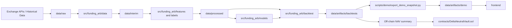

# Technical Architecture Design

## Document Status

This document is the implementation-oriented technical design for the repository.

It is intentionally concrete:

- the first milestone targets `BTCUSDT`
- the first data venue is `Binance`
- the first research workflow is offline and reproducible
- the first on-chain component is a prototype accounting vault, not a live execution system

If the codebase later expands to multi-symbol or multi-exchange research, this document should be updated instead of silently drifting away from the implementation.

## 1. Problem Definition

The project aims to build a complete course-project prototype for funding-rate-driven statistical arbitrage on perpetual futures.

The core practical question is:

> Can we use historical perpetual funding-rate behavior, basis dislocations, and short-horizon market features to identify trades whose expected post-cost return is positive, while representing strategy accounting in a simple on-chain vault?

The repository is not trying to prove that all funding rates are exploitable. It is trying to build a credible end-to-end system that:

1. collects and cleans the relevant data,
2. engineers predictive features,
3. defines labels based on post-cost trade outcomes,
4. compares simple baselines with deep models,
5. evaluates results under explicit backtest assumptions,
6. mirrors strategy NAV and user share accounting in a Solidity vault,
7. demonstrates the workflow in a lightweight frontend.

In implementation terms, the project should produce:

- reusable Python modules under `src/funding_arb/`
- runnable CLI workflows under `scripts/`
- reproducible configs under `configs/`
- a Foundry contract workspace under `contracts/`
- static or lightweight demo outputs consumable by `frontend/`

## 2. Why Perpetual Funding-Rate Arbitrage Exists

Perpetual futures do not expire, so exchanges use funding payments to keep the perpetual price close to the spot or index price. When the perpetual trades above reference price, longs typically pay shorts. When it trades below reference price, shorts typically pay longs.

This creates arbitrage-like opportunities because the market is not frictionless. Funding-rate dislocations persist for several reasons:

- directional demand can push traders heavily long or short for hours or days
- capital is fragmented across venues
- inventory and margin constraints limit who can hedge immediately
- transaction fees and slippage reduce the set of profitable trades
- shorting the hedge leg is sometimes operationally harder than holding the perp leg
- funding is paid on a schedule, not continuously, so timing matters
- the spread between mark, index, and traded price can stay dislocated before converging

In this project, the economic edge comes from one or both of these effects:

- funding carry: earning net funding while hedged against direction
- basis mean reversion: capturing convergence between perpetual price and reference price

The key design point is that a high funding rate alone is not enough. The trade is only attractive if expected net PnL remains positive after:

- entry and exit fees
- slippage
- holding horizon
- optional borrow or shorting assumptions
- execution timing rules

## 3. What "Delta-Neutral" Means in This Project

"Delta-neutral" in this repository means that the strategy attempts to keep net directional exposure to the underlying close to zero.

For a single underlying such as BTC:

- long spot and short perpetual of similar notional is approximately delta-neutral
- short spot and long perpetual of similar notional is also approximately delta-neutral, but operationally harder because spot borrowing or a synthetic short is required

The project should model delta-neutrality as:

`net_delta ~= delta_perp_leg + delta_hedge_leg ~= 0`

For the first implementation milestone, the recommended operational definition is:

- primary trade direction: `short perp + long spot/reference hedge` when funding is sufficiently positive
- optional second direction: `long perp + short spot/synthetic hedge` when funding is sufficiently negative

This recommendation is deliberate. The positive-funding side is easier to explain, backtest, and demonstrate. The negative-funding side should be supported later only if borrow assumptions are modeled explicitly.

What delta-neutral does **not** mean here:

- perfect elimination of all risk
- zero basis risk
- zero execution risk
- zero liquidation risk in leveraged venues

The hedge removes most first-order directional exposure. It does not remove funding forecast error, spread widening, execution drag, or venue-specific basis shocks.

## 4. Project Scope and Non-Goals

### In scope

- one clean monorepo for data, modeling, backtesting, contracts, frontend, docs, and tests
- one initial symbol and venue for the first full pipeline, recommended as `BTCUSDT` on Binance
- historical perpetual, spot, and reference/index data ingestion
- feature engineering and label generation
- baseline rules and ML/deep learning models
- backtests with explicit costs and assumptions
- a Solidity vault prototype with deposit, withdraw, shares, NAV updates, pause, and events
- a lightweight demo UI driven by exported artifacts and mock vault state

### Explicit non-goals

- live trading
- direct exchange order routing
- production-grade market making or latency arbitrage
- automated on-chain execution of perp and spot hedges
- trust-minimized oracle design
- audited smart contracts
- multi-chain deployment
- production backend services or microservice orchestration

### First-phase implementation boundary

The first usable end-to-end milestone should stop at:

1. one symbol
2. one exchange
3. one canonical hourly dataset
4. one baseline strategy
5. one deep model family
6. one cost-aware backtest path
7. one locally demonstrable vault flow

## 5. System Architecture

### High-level architecture

### Layer A: Offline data and modeling layer

This layer owns data ingestion, cleaning, canonical alignment, features, labels, and model training.

#### Recommended module ownership

| Area | Primary files | Responsibility |
| --- | --- | --- |
| Data fetch CLI | `scripts/data/fetch_market_data.py` | User-facing CLI entry point for fetching raw data |
| Data orchestration | `src/funding_arb/data/pipeline.py` | Fetch, normalize, validate, and persist raw/interim datasets |
| Exchange adapters | `src/funding_arb/data/clients.py` | Future exchange-specific clients such as Binance REST or CCXT wrappers |
| Schema definitions | `src/funding_arb/data/schemas.py` | Future canonical column schema and validation rules |
| Feature pipeline | `src/funding_arb/features/pipeline.py` | Build features from canonical datasets |
| Label generation | `src/funding_arb/labels/generator.py` | Create regression/classification labels from future outcomes |
| Baseline models | `src/funding_arb/models/baselines.py` | Rule baselines and simple ML baselines |
| Deep models | `src/funding_arb/models/deep_learning.py` | Future PyTorch models and training loops |
| Shared configs | `configs/data/`, `configs/features/`, `configs/models/` | Experiment and pipeline assumptions |

#### Recommended implementation pattern

- raw pull results go to `data/raw/`
- cleaned and time-aligned outputs go to `data/interim/`
- feature and label datasets go to `data/processed/`
- trained models and reports go to `data/artifacts/`

This layer should remain batch-oriented. The project does not need a backend API in the first phase.

### Layer B: Backtesting layer

This layer converts predictions or rule signals into positions, costs, PnL, and evaluation metrics.

#### Recommended module ownership

| Area | Primary files | Responsibility |
| --- | --- | --- |
| Backtest CLI | `scripts/backtests/run_backtest.py` | User-facing entry point for strategy evaluation |
| Backtest engine | `src/funding_arb/backtest/engine.py` | Position accounting, funding accrual, execution cost handling |
| Strategy rules | `src/funding_arb/strategies/rules.py` | Future signal-to-position logic for threshold and model-based strategies |
| Evaluation metrics | `src/funding_arb/evaluation/metrics.py` | Sharpe, drawdown, return, win rate, cost attribution |
| Backtest configs | `configs/backtests/default.yaml` | Capital, fees, slippage, rebalance assumptions |

The backtest should be a pure off-chain simulation. It should consume historical data and model outputs, then write summary artifacts for the frontend and demo export step.

### Layer C: On-chain vault layer

This layer is the accounting and presentation layer for user capital, not the trading engine itself.

#### Recommended module ownership

| Area | Primary files | Responsibility |
| --- | --- | --- |
| Vault contract | `contracts/src/DeltaNeutralVault.sol` | Deposit, withdraw, share accounting, NAV updates, pause, owner actions |
| Demo asset | `contracts/src/MockStablecoin.sol` | Mock stablecoin for local testing and demo deposits |
| Contract tests | `contracts/test/DeltaNeutralVault.t.sol` | Future Foundry tests for core vault behavior |
| Deployment scripts | `contracts/script/Deploy.s.sol` | Future local deployment script |
| NAV update scripts | `contracts/script/UpdateNav.s.sol` | Future off-chain to on-chain NAV update demo flow |

This layer should only mirror off-chain strategy outcomes. The contract should never pretend to run ML inference or read exchange APIs directly.

### Layer D: Frontend/demo layer

This layer visualizes outputs from the research and vault workflows.

#### Recommended module ownership

| Area | Primary files | Responsibility |
| --- | --- | --- |
| Frontend shell | `frontend/src/main.ts` | Application entry point |
| Styling | `frontend/src/style.css` | Lightweight demo styling |
| Artifact readers | `frontend/src/artifacts.ts` | Future loading/parsing of demo JSON and CSV artifacts |
| Vault UI | `frontend/src/vault.ts` | Future local mock vault interaction view |
| Demo export CLI | `scripts/demo/export_demo_snapshot.py` | Convert backtest outputs into frontend-friendly artifacts |
| Demo configs | `configs/demo/default.yaml` | Symbol, artifact directory, refresh assumptions |

The recommended first demo architecture is static artifact consumption rather than a live API. That keeps the demo simple and reproducible.

## 6. Data Requirements

### Recommended first-phase market scope

- symbol: `BTCUSDT`
- perp venue: `Binance USD-M perpetual`
- reference sources:
  - Binance spot klines
  - Binance mark/index or premium index endpoints
- base research frequency: `1h`
- default primary history window: `2021-01-01` to `2026-04-07` UTC
- funding settlement awareness: `8h`

### Required datasets

| Dataset | Minimum fields | Why it is needed |
| --- | --- | --- |
| Funding history | `timestamp`, `symbol`, `venue`, `funding_rate`, `funding_interval_hours` | Core carry signal and label component |
| Perpetual price bars | `timestamp`, `open`, `high`, `low`, `close`, `volume` | Entry, exit, basis, volatility |
| Spot or index bars | `timestamp`, `open`, `high`, `low`, `close`, `volume` if available | Hedge leg and basis construction |
| Mark/index data | `timestamp`, `mark_price` or `index_price` | Better basis estimate than traded close alone |
| Optional microstructure fields | `open_interest`, `taker_buy_volume`, `premium_index` | Feature enrichment if the source supports them |

### Canonical dataset requirements

The merged canonical dataset should be time-indexed in UTC and sorted ascending. At a minimum, the cleaned hourly table should expose:

| Column | Type | Notes |
| --- | --- | --- |
| `timestamp` | datetime64 UTC | Decision timestamp |
| `symbol` | string | Example: `BTCUSDT` |
| `venue` | string | Example: `binance` |
| `perp_close` | float | Perpetual close or mark-aligned price |
| `spot_close` | float | Spot reference |
| `index_price` | float | Preferred if available |
| `funding_rate` | float | Funding applied on exchange schedule |
| `funding_interval_hours` | int | Usually `8` for the initial setup |
| `perp_volume` | float | Liquidity proxy |
| `spot_volume` | float | Optional but useful |

### Storage format recommendation

The repository should prefer:

- raw downloads: original JSON or CSV snapshots under `data/raw/`
- cleaned and modeled datasets: `parquet` under `data/interim/` and `data/processed/`

`pyarrow` is already available in the designated environment, so Parquet is the right default for larger intermediate datasets.

## 7. Feature Design Ideas

The feature set should be simple enough for the first milestone, but rich enough to test whether funding dislocations are predictable after costs.

### Recommended first-pass features

| Feature | Example definition | Purpose |
| --- | --- | --- |
| `basis_bps` | `1e4 * (perp_close - spot_close) / spot_close` | Measures dislocation between perp and hedge leg |
| `funding_rate` | raw funding rate | Core carry input |
| `funding_annualized` | `funding_rate * (24 / interval_hours) * 365` | Makes funding more comparable across windows |
| `basis_zscore_24h` | rolling z-score of basis | Mean-reversion intensity |
| `funding_zscore_24h` | rolling z-score of funding | Detect abnormal funding regimes |
| `realized_vol_24h` | rolling volatility from returns | Regime filter and risk estimate |
| `basis_change_1h` | basis delta over 1 hour | Spread momentum |
| `spot_return_1h` | 1-hour spot return | Market context |
| `perp_return_1h` | 1-hour perp return | Market context |
| `funding_sign_run_length` | consecutive same-sign funding periods | Captures persistence |

### Strongly recommended second-pass features

| Feature | Purpose |
| --- | --- |
| `time_to_next_funding` | Entry timing matters near settlement |
| `rolling_volume_ratio` | Avoid thin-liquidity conditions |
| `open_interest_change` | Sentiment and crowding proxy |
| `premium_index_level` | Better proxy for perp premium than close-only basis |
| `volatility_regime_bucket` | Helps both baselines and deep models filter noise |

### Feature engineering ownership

- `src/funding_arb/features/pipeline.py`: feature creation orchestration
- `src/funding_arb/features/transforms.py`: future reusable rolling/z-score transforms
- `configs/features/default.yaml`: default windows and label horizon coupling

### Feature design rules

- only use information available at time `t`
- use train-only normalization statistics where normalization is needed
- avoid features that depend on future funding prints or future spot bars
- prefer interpretable first-pass features before adding complex latent signals

## 8. Label Design Choices

The project should not label data using raw future price direction alone. The label must match the actual strategy goal: post-cost edge from a delta-neutral trade.

### Recommended primary label

Use a regression target:

`future_net_edge_bps`

This should estimate the post-cost trade outcome over a defined horizon, for example 8 hours or 24 hours:

`future_net_edge_bps = expected funding PnL + basis convergence PnL - fees - slippage - optional borrow/gas adjustments`

This is the best primary label because it aligns directly with whether the trade should be taken.

### Recommended derived labels

| Label | Definition | Use |
| --- | --- | --- |
| `is_profitable` | `future_net_edge_bps > 0` | Basic binary classification |
| `is_tradeable` | `future_net_edge_bps > min_expected_edge_bps` | Practical signal threshold |
| `trade_direction` | `+1`, `0`, `-1` | Future support for asymmetric long/short funding regimes |

### Recommended initial horizon choices

- primary horizon: `8h`
- secondary horizon for robustness: `24h`

The 8-hour horizon is naturally aligned with the common funding interval in the initial design. A 24-hour version helps test persistence and robustness.

### Label ownership

- `src/funding_arb/labels/generator.py`: label computation logic
- `configs/features/default.yaml`: horizon and threshold settings

### Label design rules

- labels must be shifted so the trade enters after the signal timestamp
- cost terms must be included in the label if the model is supposed to predict tradeability
- negative-funding labels should include borrow assumptions if short-spot or synthetic shorting is modeled

## 9. Baseline Strategy Choices

The project should begin with simple baselines that are economically interpretable.

### Baseline 1: Positive-funding threshold rule

Recommended first baseline:

- enter `short perp + long spot` when:
  - `funding_annualized` is above a threshold
  - `basis_zscore` is not already too adverse
  - volatility is below a filter threshold
- exit when:
  - funding normalizes
  - basis reverts
  - max holding time is reached

This is the first baseline because it matches the cleanest delta-neutral carry story.

### Baseline 2: Symmetric threshold rule

Extend the threshold logic to allow both directions:

- positive funding: short perp / long spot
- negative funding: long perp / short spot or synthetic short hedge

This should only be enabled once borrow assumptions are explicit.

### Baseline 3: Simple statistical model

Recommended first ML baseline:

- logistic regression for `is_tradeable`
- or linear regression / ridge regression for `future_net_edge_bps`

Use a small interpretable feature set first, then compare it against the threshold rule.

### Baseline 4: Rolling mean-reversion model

An additional simple baseline can use:

- basis z-score
- basis momentum
- volatility filter
- time-to-funding

This remains close to statistical arbitrage logic and provides a stronger benchmark than pure funding-threshold rules.

### Strategy ownership

- `src/funding_arb/models/baselines.py`: scoring models and rule baselines
- `src/funding_arb/strategies/rules.py`: future conversion from score to trade decision
- `scripts/models/train_baseline.py`: training or calibration entry point

## 10. Deep Learning Model Choices

Deep learning should be treated as a comparison against strong simple baselines, not as the default assumption.

### Recommended first deep model: LSTM

Use an LSTM sequence model with:

- lookback window: `24` to `72` hours
- input: multivariate feature sequence
- output:
  - regression head for `future_net_edge_bps`, or
  - binary classification head for `is_tradeable`

Why LSTM first:

- easy to explain
- aligned with sequential time-series structure
- directly supported by the existing `torch` environment
- lower implementation overhead than a Transformer in the first milestone

### Recommended second deep model: Transformer encoder

Only add this after the LSTM baseline is working.

Use it if:

- the feature set becomes richer
- there is enough training history
- the team wants to compare a more expressive sequence model

### Training recommendations

- split by time, never randomly
- normalize using training-only statistics
- save model metadata with config, seed, feature set, and horizon
- compare against the best rule baseline and the best simple ML baseline

### Deep model ownership

- `src/funding_arb/models/deep_learning.py`: future PyTorch models and training loops
- `configs/models/lstm.yaml`: model hyperparameters
- `scripts/models/train_deep_model.py`: future CLI entry point

## 11. Backtesting Assumptions

The backtest must be explicit enough that results are interpretable and reproducible.

### Implemented prototype assumptions

| Assumption | Recommended setting |
| --- | --- |
| Decision frequency | Hourly |
| Execution timing | Enter at next bar open if available |
| Funding accrual | Configurable `prototype_bar_sum` or `event_aware` mode |
| Position size | Fixed notional from config |
| Concurrent positions | Start with 1 |
| Fees | Charge on both perp and hedge legs at entry and exit |
| Slippage | Symmetric bps penalty embedded in effective prices |
| Gas cost | Small fixed USD penalty for demo comparability |
| Borrow cost | Zero in phase 1 unless modeling negative-funding short-spot trades |
| Liquidation model | Omitted in phase 1, document as limitation |
| Primary split | Test split by default; combined metrics are secondary |
| Primary risk curve | Mark-to-market equity; realized-only equity retained for audit |

### PnL components to model explicitly

- perp leg mark-to-market PnL
- hedge leg mark-to-market PnL
- funding payments received or paid
- trading fees
- embedded slippage diagnostics
- optional gas or operational fixed cost

### Recommended output artifacts

The backtest layer should write at least:

- `data/artifacts/backtests/.../trade_log.parquet`
- `data/artifacts/backtests/.../primary_trade_log.parquet`
- `data/artifacts/backtests/.../equity_curve.parquet`
- `data/artifacts/backtests/.../strategy_metrics.parquet`
- `data/artifacts/backtests/.../combined_strategy_metrics.parquet`
- `data/artifacts/backtests/.../leaderboard.parquet`
- `data/artifacts/backtests/.../backtest_manifest.json`

### Evaluation metrics

At minimum, report:

- cumulative return
- annualized return
- Sharpe ratio
- maximum drawdown
- realized-only and mark-to-market drawdown
- profit factor
- hit rate
- average trade return
- median trade return
- exposure time
- funding contribution share
- turnover
- cost drag

### Backtest ownership

- `src/funding_arb/backtest/engine.py`: simulation engine
- `src/funding_arb/evaluation/metrics.py`: metrics and summaries
- `configs/backtests/default.yaml`: assumptions
- `scripts/backtests/run_backtest.py`: CLI entry point

## 12. Smart Contract Scope

The contract layer should represent strategy participation and NAV reporting, not trading.

### Required vault behaviors

- accept deposits in a mock stablecoin
- mint and track vault shares
- allow withdrawals based on share ownership
- update NAV through an owner-controlled function
- emit events for deposits, withdrawals, NAV updates, and pause changes
- pause critical flows in emergencies

### Recommended first contract boundary

The contract should assume:

- trading happens off-chain
- strategy state is summarized off-chain
- an admin or controller account updates NAV

This is intentionally centralized for the prototype. The point is to demonstrate hybrid architecture, not decentralized oracle security.

### Contract ownership

- `contracts/src/DeltaNeutralVault.sol`: main vault logic
- `contracts/src/MockStablecoin.sol`: demo deposit asset
- `contracts/test/DeltaNeutralVault.t.sol`: future tests
- `contracts/script/Deploy.s.sol`: future deployment
- `contracts/script/UpdateNav.s.sol`: future admin NAV update demonstration

### Contract non-goals

- direct exchange integration
- on-chain ML inference
- live oracle pull from off-chain exchanges
- upgradeable proxy complexity
- multi-asset vault routing in phase 1

## 13. Demo Workflow

The demo should tell a coherent story from data to strategy to contract.

### Recommended end-to-end workflow

1. Fetch raw market data with `scripts/data/fetch_market_data.py`.
2. Clean and align the canonical dataset in `src/funding_arb/data/`.
3. Build features and labels with `src/funding_arb/features/` and `src/funding_arb/labels/`.
4. Train a baseline and optionally an LSTM.
5. Run a backtest and generate summary artifacts.
6. Export a frontend-friendly snapshot with `scripts/demo/export_demo_snapshot.py`.
7. Deploy `MockStablecoin` and `DeltaNeutralVault` locally for demo purposes.
8. Mint mock stablecoin, deposit into the vault, and update NAV to reflect backtest results.
9. Load the frontend and show:
   - strategy summary
   - backtest metrics
   - current demo vault NAV
   - mock deposit and withdrawal behavior

### Recommended demo artifacts

The export step should eventually produce:

- `data/artifacts/demo/dashboard_snapshot.json`
- `data/artifacts/demo/equity_curve.parquet` or CSV
- `data/artifacts/demo/recent_signals.json`
- `data/artifacts/demo/vault_snapshot.json`

The frontend should prefer static artifact loading first. A backend API can wait unless the demo clearly outgrows static files.

## 14. Risks, Limitations, and Future Work

### Key risks

| Risk | Why it matters | Mitigation |
| --- | --- | --- |
| Funding data misalignment | Wrong timestamps will invalidate labels and PnL | Centralize schema validation and UTC normalization |
| Lookahead bias | Easy to leak future information in rolling features or labels | Shift labels and use next-bar execution only |
| Underestimated costs | Strategy can look profitable when it is not | Keep fees, slippage, and optional borrow costs explicit in config |
| Regime instability | Funding behavior changes across market regimes | Use time-based splits and out-of-sample evaluation |
| Negative-funding realism | Short hedge assumptions may be too optimistic | Treat negative-funding side as phase 2 unless borrow model is explicit |
| Contract overclaim | Users may misread the vault as a trading system | Document clearly that the vault mirrors off-chain results only |

### Main limitations of the first prototype

- single-symbol first milestone
- single-venue first milestone
- no live trading
- no liquidation or margin call simulation in phase 1
- owner-controlled NAV updates in the contract
- frontend is a demo view, not a production user application

### Recommended future work

1. Add `ccxt`-based or direct REST clients for multi-exchange ingestion.
2. Expand the canonical dataset to include open interest and premium-index features.
3. Add negative-funding trades with explicit borrow-cost assumptions.
4. Introduce `src/funding_arb/strategies/` for cleaner separation between model score and execution rule.
5. Add contract tests in Foundry and a local deployment script.
6. Export richer demo artifacts such as signal timelines and cost attribution.
7. If needed later, add a thin backend only for serving artifacts, not for the core research loop.

## Recommended Implementation Order

To keep the architecture aligned with coding effort, the next coding tasks should follow this order:

1. Implement canonical data ingestion for Binance `BTCUSDT`.
2. Add cleaned schema validation and Parquet output.
3. Build first-pass features and primary labels.
4. Implement the positive-funding threshold baseline.
5. Implement the first cost-aware backtest.
6. Add LSTM sequence model after the baseline pipeline is stable.
7. Add local Foundry tests for the vault.
8. Export demo artifacts and wire them into the frontend.

This order keeps the project demonstrable at every stage and minimizes wasted work on components that depend on unstable upstream data logic.
