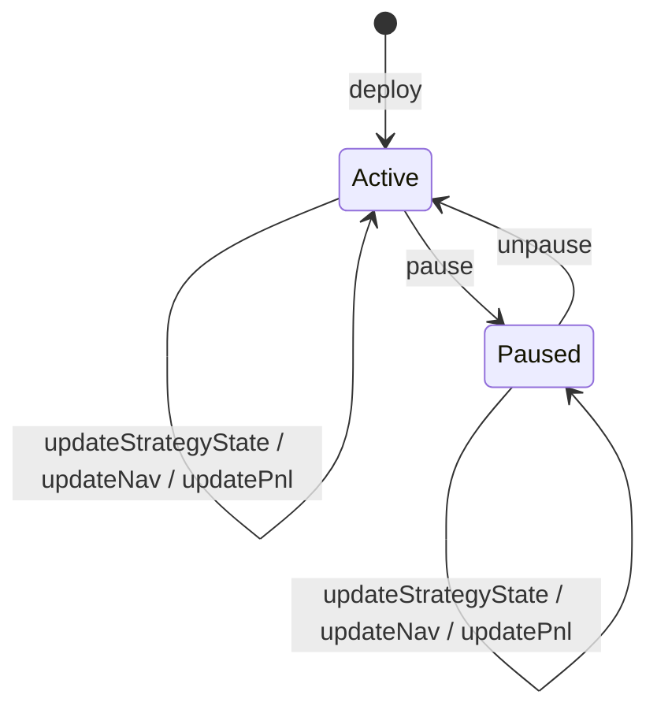

# Solidity Vault Prototype Specification

## Status

This document is the implementation-facing contract specification for the course-project vault prototype.

It is intentionally concrete and scoped for the current repository:

- one vault
- one deposit asset
- one off-chain strategy state feed
- one trusted operator path for NAV and PnL updates

This document should be treated as the canonical design reference for future Solidity work in:

- `contracts/src/DeltaNeutralVault.sol`
- `contracts/src/MockStablecoin.sol`
- future Foundry tests under `contracts/test/`

## Current Implementation Snapshot

The repository now includes a first complete prototype implementation in:

- `contracts/src/DeltaNeutralVault.sol`
- `contracts/src/MockStablecoin.sol`
- `contracts/test/DeltaNeutralVault.t.sol`
- `contracts/script/DeployLocal.s.sol`
- `contracts/script/UpdateVaultState.s.sol`

Implementation note:

- to keep the course-project workspace self-contained, the current version uses small local `Ownable2StepLite`, `PausableLite`, and `ReentrancyGuardLite` helpers instead of importing OpenZeppelin
- the security model and interfaces still follow the same intent described below
- if the project later adds `openzeppelin-contracts`, these lightweight helpers can be swapped for audited library versions without changing the external vault behavior

## Design Recommendation

The recommended first implementation is:

- a custom single-asset vault
- internal, non-transferable share accounting
- owner/admin plus operator split
- owner/operator-reported NAV and PnL
- explicit pause control
- event-rich but storage-light state tracking

The vault should **not** use ERC4626 in v1.

Reason:

- ERC4626 is best when vault assets are natively represented by on-chain token balances
- this project's strategy performance is computed off-chain and only mirrored on-chain
- a custom vault is easier to explain, easier to audit, and less likely to over-promise live DeFi behavior

## 1. Project Goal Of The Vault

The vault is the on-chain accounting layer for a hybrid off-chain/on-chain course project.

Its goal is to represent:

- user deposits
- user share balances
- the current reported net asset value of the strategy
- cumulative strategy PnL updates
- basic strategy state and pause state

The vault exists so the project can demonstrate a believable DeFi-style participation model:

1. users deposit a mock stablecoin
2. the vault mints internal shares
3. off-chain research and backtesting produce strategy results
4. an operator updates the vault's reported NAV and strategy state
5. users can inspect balances and withdraw according to current share ownership

The vault is therefore a **state-management and accounting contract**, not a trading contract.

## 2. What This Vault Does And Does Not Do

### What the vault does

- accepts deposits of a single mock stablecoin
- tracks total shares and per-user share balances
- prices deposits and withdrawals against a reported vault NAV
- allows a trusted operator to update strategy state
- allows a trusted operator to update NAV and PnL
- supports emergency pause and unpause
- emits explicit events for transparency and demo visualization

### What the vault does not do

- execute trades on Binance or any exchange
- custody perp positions on-chain
- maintain real cross-exchange inventory
- verify off-chain market data trustlessly
- calculate ML signals or arbitrage logic on-chain
- liquidate positions
- manage multiple assets or multiple strategies
- provide production-grade oracle security
- serve as a real-world deployable DeFi vault

## 3. User Flows

### Deposit flow

Recommended function:

```solidity
function deposit(uint256 assets, address receiver) external returns (uint256 shares);
```

Expected behavior:

1. vault must not be paused
2. `assets > 0`
3. `receiver != address(0)`
4. user transfers mock stablecoin into the vault
5. vault calculates shares using current reported NAV
6. vault credits `shareBalance[receiver]`
7. vault increments `totalShares`
8. vault increments `reportedNavAssets` by the deposited asset amount
9. vault emits a `Deposit` event

Recommended share-mint rule:

- if `totalShares == 0`, mint `shares = assets`
- if `totalShares > 0` and `reportedNavAssets == 0`, revert because the vault is economically insolvent for pricing purposes
- otherwise mint:

`shares = floor(assets * totalShares / reportedNavAssets_before_deposit)`

This keeps first deposit logic simple and prevents over-minting later deposits.
The current implementation follows this safer rule and reverts with `VaultInsolvent()` if shares exist while reported NAV is zero.

### Withdraw flow

Recommended function:

```solidity
function withdraw(uint256 assets, address receiver) external returns (uint256 sharesBurned);
```

Expected behavior:

1. vault must not be paused
2. `assets > 0`
3. `receiver != address(0)`
4. vault computes shares needed to redeem requested assets
5. caller must own enough shares
6. vault must have enough actual token liquidity to transfer the assets
7. vault burns shares from caller
8. vault decrements `totalShares`
9. vault decrements `reportedNavAssets` by the withdrawn amount
10. vault transfers stablecoin to `receiver`
11. vault emits a `Withdraw` event

Recommended burn rule:

`sharesBurned = ceil(assets * totalShares / reportedNavAssets_before_withdrawal)`

Using ceil division protects the vault from under-burning shares.

### Shares accounting

For the first version, shares should be **internal and non-transferable**.

Recommended interface:

- `totalShares()`
- `shareBalance(address account)`
- `previewDeposit(uint256 assets)`
- `previewWithdraw(uint256 assets)`
- `convertToShares(uint256 assets)`
- `convertToAssets(uint256 shares)`

Why non-transferable shares in v1:

- keeps the contract simpler and more auditable
- avoids ERC20 transfer edge cases that are irrelevant to the course demo
- avoids implying protocol composability the project does not actually support

## 4. Admin / Operator Flows

### Role split

Recommended roles:

- `owner`
  - governance/admin role
  - can set operator
  - can pause and unpause
  - can transfer ownership
- `operator`
  - trusted off-chain updater
  - can update strategy state
  - can update NAV
  - can update PnL

This split keeps authority understandable:

- owner controls permissions and emergency actions
- operator controls off-chain strategy reporting

### Update strategy state

Recommended function:

```solidity
function updateStrategyState(
    uint8 newState,
    bytes32 signalHash,
    bytes32 metadataHash
) external;
```

Purpose:

- reflect whether the off-chain strategy is idle, active, or in emergency state
- expose a hashed reference to an off-chain snapshot, signal report, or frontend artifact

Recommended state enum:

```solidity
enum StrategyState {
    Idle,
    Active,
    Emergency,
    Settled
}
```

### Update NAV

Recommended function:

```solidity
function updateNav(
    uint256 newReportedNavAssets,
    bytes32 reportHash
) external;
```

Behavior:

- operator submits an absolute NAV number
- vault stores the new NAV
- vault computes the delta versus the prior NAV
- vault updates `lastNavUpdateAt`
- vault emits `NavUpdated`

This is the cleanest primary accounting function because it makes the reported state explicit.

### Update PnL

Recommended function:

```solidity
function updatePnl(
    int256 pnlDeltaAssets,
    bytes32 reportHash
) external;
```

Behavior:

- operator reports incremental profit or loss
- vault applies the delta to `reportedNavAssets`
- vault updates cumulative PnL
- vault emits `PnlUpdated`

Design rule:

- `updateNav` is the canonical absolute updater
- `updatePnl` is a convenience incremental updater
- both must ultimately affect the same core accounting state

### Pause / unpause

Recommended functions:

```solidity
function pause() external;
function unpause() external;
```

Pause should stop:

- deposits
- withdrawals

Pause does **not** have to stop:

- ownership transfers
- operator updates

Reason:

- in an emergency, the team may still need to record a final NAV or loss event while preventing new user actions

## 5. Security Assumptions

This prototype is intentionally trust-based in several places.

The main security assumptions are:

- the `owner` is trusted to manage permissions honestly
- the `operator` is trusted to post correct off-chain strategy state and NAV updates
- the mock stablecoin is trusted and non-malicious
- the project uses only a simple ERC20-style asset, not fee-on-transfer or rebasing tokens
- frontend users understand that on-chain NAV is reported, not trustlessly verified

Recommended security controls for v1:

- `Ownable2Step` for safer ownership transfer
- `Pausable` for emergency stop
- `ReentrancyGuard` on deposit and withdraw
- check-effects-interactions ordering
- zero-address validation
- explicit input validation on all externally callable functions
- no arbitrary external calls besides stablecoin transfers

Important risk to document clearly:

- `reportedNavAssets` can differ from actual token balance in the vault
- if reported NAV is higher than actual cash held on-chain, withdrawals can revert until the vault is topped up

That is acceptable for a course prototype, but it must be explicit in docs and UI.

## 6. Simplifying Assumptions For A Course-Project Prototype

The first vault version should assume:

- one asset only, recommended as mock USDC with 6 decimals
- one strategy only
- one global NAV number
- no strategy sub-accounts
- no management fee
- no performance fee
- no whitelist
- no deposit cap unless needed later
- no withdrawal queue
- no share transfers
- no on-chain execution
- no real oracle

Operational assumption:

- when profits are only simulated off-chain, the team may need to mint or transfer additional mock stablecoin into the vault before demonstrating large withdrawals

This is acceptable because the stablecoin itself is also a demo asset.

## 7. Event Design

The event set should support three goals:

- auditable accounting
- easy frontend integration
- clear demo storytelling

Recommended events:

```solidity
event Deposit(
    address indexed caller,
    address indexed receiver,
    uint256 assets,
    uint256 shares
);

event Withdraw(
    address indexed caller,
    address indexed receiver,
    uint256 assets,
    uint256 shares
);

event StrategyStateUpdated(
    uint8 previousState,
    uint8 newState,
    bytes32 signalHash,
    bytes32 metadataHash,
    address indexed updater
);

event NavUpdated(
    uint256 previousNavAssets,
    uint256 newNavAssets,
    int256 navDeltaAssets,
    bytes32 reportHash,
    address indexed updater
);

event PnlUpdated(
    int256 pnlDeltaAssets,
    int256 cumulativePnlAssets,
    uint256 newNavAssets,
    bytes32 reportHash,
    address indexed updater
);

event OperatorUpdated(
    address indexed previousOperator,
    address indexed newOperator
);

event Paused(address indexed account);
event Unpaused(address indexed account);
event OwnershipTransferred(address indexed previousOwner, address indexed newOwner);
```

Event design rule:

- store compact state on-chain
- emit richer context in events
- prefer `bytes32` hashes over large strings in storage

## 8. Access-Control Design

Recommended access-control model:

- `owner` as the top-level admin
- `operator` as a dedicated strategy updater

Recommended permissions:

| Action | Owner | Operator | User |
| --- | --- | --- | --- |
| deposit | no special privilege | no special privilege | yes |
| withdraw | no special privilege | no special privilege | yes |
| set operator | yes | no | no |
| pause | yes | optional yes | no |
| unpause | yes | optional no | no |
| update strategy state | yes | yes | no |
| update NAV | yes | yes | no |
| update PnL | yes | yes | no |
| transfer ownership | yes | no | no |

Recommended implementation choice:

- use OpenZeppelin `Ownable2Step`
- store one `operator` address
- create `onlyOwnerOrOperator` modifier for updater functions

Why not full `AccessControl` in v1:

- the role model is simple
- `owner + operator` is easier to read in a course demo
- fewer moving parts improve auditability

Current implementation note:

- the owner can also clear the operator by setting `operator = address(0)`
- this is useful for demo scenarios where the team wants to disable external updates temporarily while keeping owner recovery paths available

## 9. Recommended Contract Storage Layout

Keep storage grouped and minimal.

### Group A: immutable configuration

| Variable | Type | Notes |
| --- | --- | --- |
| `asset` | `IERC20` or `IERC20Metadata` | mock stablecoin deposited into the vault |

### Group B: access control and status

| Variable | Type | Notes |
| --- | --- | --- |
| `owner` | inherited | from `Ownable2Step` |
| `operator` | `address` | trusted updater |
| `paused` | inherited | from `Pausable` |
| `strategyState` | `StrategyState` | current off-chain strategy lifecycle state |

### Group C: share accounting

| Variable | Type | Notes |
| --- | --- | --- |
| `totalShares` | `uint256` | total outstanding internal shares |
| `shareBalance` | `mapping(address => uint256)` | per-user share balance |

### Group D: reported strategy accounting

| Variable | Type | Notes |
| --- | --- | --- |
| `reportedNavAssets` | `uint256` | current reported total NAV in asset units |
| `cumulativePnlAssets` | `int256` | cumulative strategy PnL since initialization |
| `lastNavUpdateAt` | `uint256` | last NAV update timestamp |
| `lastPnlUpdateAt` | `uint256` | last PnL update timestamp |
| `lastReportHash` | `bytes32` | most recent off-chain snapshot hash |
| `lastSignalHash` | `bytes32` | latest signal snapshot hash |
| `lastMetadataHash` | `bytes32` | latest generic metadata hash |

### Group E: optional bookkeeping helpers

These are optional but useful:

| Variable | Type | Purpose |
| --- | --- | --- |
| `depositCount` | `uint256` | demo analytics |
| `withdrawCount` | `uint256` | demo analytics |
| `navUpdateCount` | `uint256` | versioning / frontend refresh |

Storage rules:

- do not store long strings
- do not store arrays unless a later demo truly needs them
- prefer hashes and counters over verbose history
- historical detail should live in events

## 10. Testing Plan

The contract should be tested with Foundry.

Recommended primary test file:

- `contracts/test/DeltaNeutralVault.t.sol`

Recommended mock:

- `contracts/src/MockStablecoin.sol`

### Core unit tests

1. constructor sets asset, owner, and initial state correctly
2. first deposit mints 1:1 shares
3. second deposit mints proportional shares at existing NAV
4. withdraw burns the correct number of shares using ceil rounding
5. withdraw reverts for insufficient shares
6. withdraw reverts for insufficient on-chain liquidity
7. deposit reverts when paused
8. withdraw reverts when paused
9. only owner can set operator
10. only owner or operator can update strategy state
11. only owner or operator can update NAV
12. only owner or operator can update PnL
13. pause and unpause emit correct events
14. ownership transfer works correctly

### Accounting tests

1. `updateNav` correctly changes reported NAV and emits delta
2. `updatePnl` correctly updates both cumulative PnL and NAV
3. deposits increase reported NAV by deposit amount
4. withdrawals decrease reported NAV by withdrawn amount
5. share price behavior remains consistent after NAV gain
6. share price behavior remains consistent after NAV loss

### Event tests

1. `Deposit` emits correct caller, receiver, assets, shares
2. `Withdraw` emits correct caller, receiver, assets, shares
3. `StrategyStateUpdated` emits previous and new state correctly
4. `NavUpdated` and `PnlUpdated` emit correct report hashes

### Invariant-style tests

Useful invariants for a later pass:

- sum of all known user share balances equals `totalShares`
- no user can withdraw more assets than their shares imply
- pause never blocks owner transfer or updater state recording unless explicitly intended

## 11. Local Workflow

The practical local workflow for the current implementation is:

1. compile the workspace
2. run unit tests
3. deploy `MockStablecoin` and `DeltaNeutralVault`
4. mint demo assets if needed
5. update strategy state and NAV/PnL through the operator path

Recommended commands:

```bash
cd contracts
forge build
forge test -vv
forge script script/DeployLocal.s.sol:DeployLocal --rpc-url http://127.0.0.1:8545 --broadcast
forge script script/UpdateVaultState.s.sol:UpdateVaultState --rpc-url http://127.0.0.1:8545 --broadcast
```

Recommended deployment environment variables:

- `PRIVATE_KEY`
- `INITIAL_OPERATOR`
- `INITIAL_MINT`
- `VAULT_ADDRESS`
- `UPDATE_STRATEGY_STATE`
- `UPDATE_NAV`
- `UPDATE_PNL`
- `STRATEGY_STATE`
- `NEW_REPORTED_NAV_ASSETS`
- `PNL_DELTA_ASSETS`
- `SIGNAL_HASH`
- `METADATA_HASH`
- `REPORT_HASH`

Important operational note:

- this repository currently documents the full Foundry workflow, but the machine used during this implementation did not have `forge` installed
- the contract code, test files, and script files are written to match the Foundry workspace layout, but compile/test execution still needs a local Foundry installation

## Recommended State-Transition Diagram



## Recommended Next Solidity Task

After this spec, the next implementation step should be:

1. refactor `contracts/src/DeltaNeutralVault.sol` to match this document
2. upgrade `contracts/src/MockStablecoin.sol` only as needed for tests and demo minting
3. add Foundry tests before adding any extra contract features
