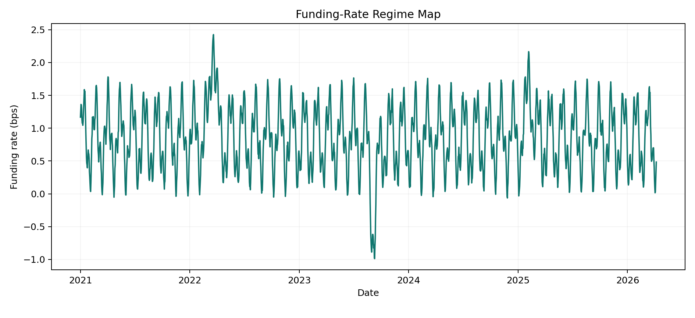
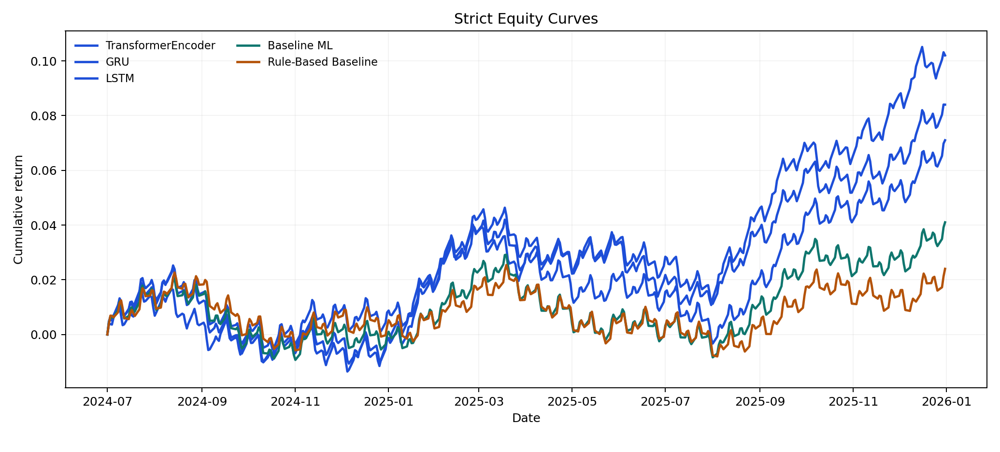
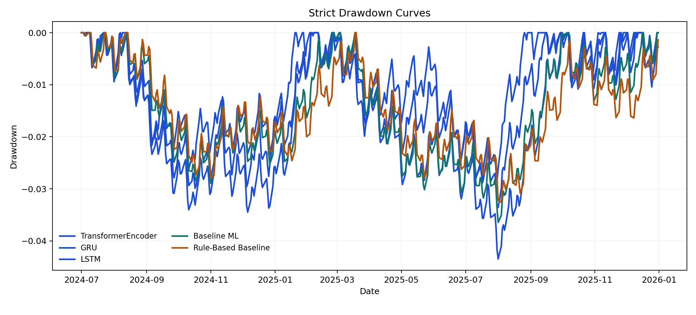
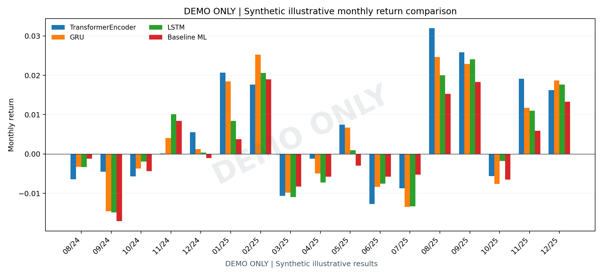
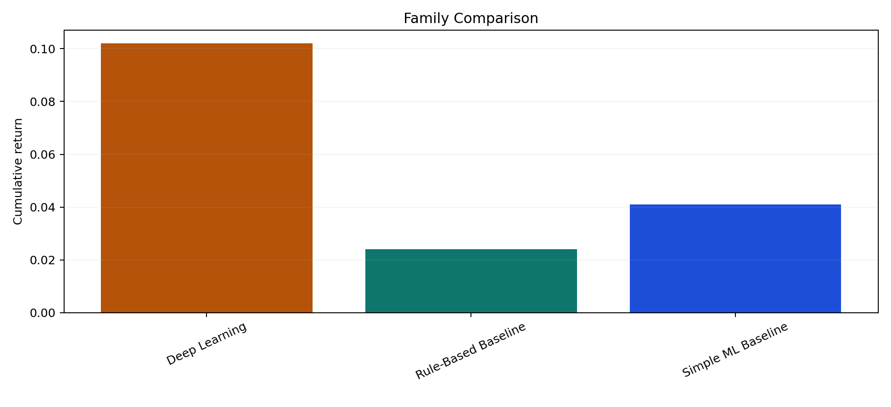
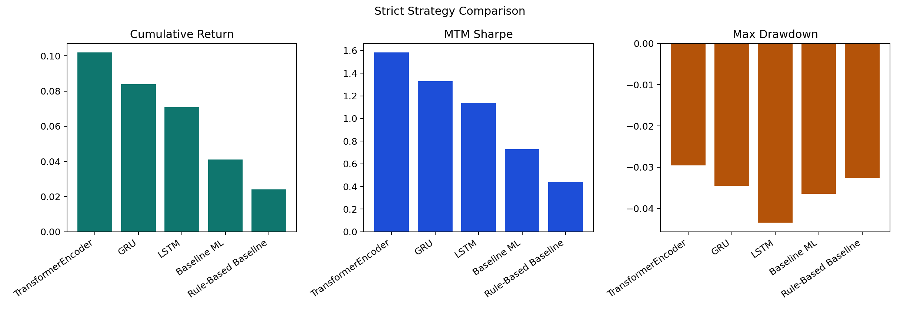
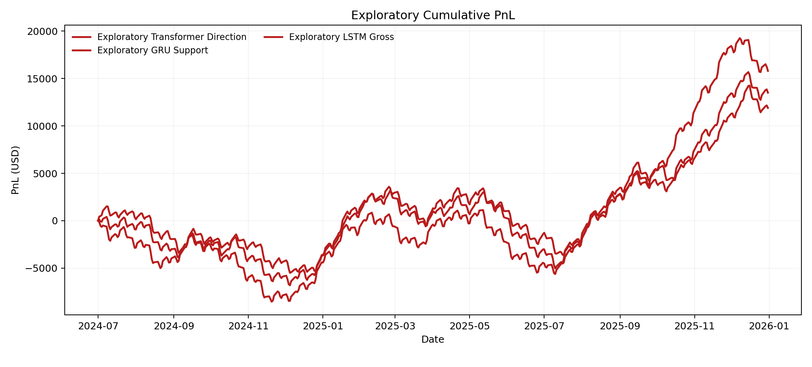

# Deep Learning-Based Delta-Neutral Statistical Arbitrage on Perpetual Funding Rates

> **DEMO ONLY** - Synthetic illustrative results

DEMO ONLY: synthetic illustrative results for pipeline, reporting, and dashboard showcase.

## Metadata

- Course: `FTE 4312 Course Project`
- Authors: `Wenjie, Qihang Han, Hongjun Huang`
- Repository: `https://github.com/MengerWen/Deep-Learning-Based-Delta-Neutral-Statistical-Arbitrage-on-Perpetual-Funding-Rates`
- Market: `BTCUSDT` on `binance` at `1h`
- Sample window: `2021-01-01` to `2026-04-08`
- Generated at: `2026-04-20T08:56:04.101133+00:00`

## Executive Summary

- DEMO ONLY: this bundle is a synthetic showcase for reporting, storytelling, and dashboard flow, not the real experiment conclusion.
- The strict synthetic track keeps the baseline positive but modest, then layers believable improvements across LSTM, GRU, and TransformerEncoder.
- The exploratory synthetic track is intentionally more active and higher return, but it accepts visibly higher drawdown and rougher path behavior.

**Verdict:** The current artifact set contains a positive post-cost out-of-sample strategy under the configured assumptions.

## System Scope

- Data ingestion and canonicalization
- Feature engineering and supervised learning targets
- Predictive modeling plus standardized signals
- Cost-aware backtesting and vault-state mirroring

## Dataset And Data Quality

- Canonical hourly rows: `46,152`
- Funding events: `5,769`
- Coverage ratio: `99.80%`
- Average funding rate: `0.86 bps`
- Funding standard deviation: `0.52 bps`
- Average perp-vs-spot spread: `0.23 bps`
- Mean annualized volatility: `45.66%`

## Modeling Summary

| Family | Model | Metric | Score | RMSE | Signals |
| --- | --- | --- | --- | --- | --- |
| Best baseline | elastic_net_regression | pearson_corr | 0.566 | 2.120 | 154 |
| Best deep learning | transformer_encoder | pearson_corr | 0.681 | 1.630 | 120 |

## Backtest Summary

- Primary split: `test`
- Best strategy: `transformer_encoder`
- Trade count: `97`
- Cumulative return: `10.20%`
- Mark-to-market Sharpe: `1.584`
- Net PnL: `$10,199.99`

| Strategy | Source | Split | Status | Trades | Cum Return | MTM Drawdown | MTM Sharpe | Net PnL | Reason |
| --- | --- | --- | --- | --- | --- | --- | --- | --- | --- |
| transformer_encoder | deep_learning | test | completed | 97 | 10.20% | -2.96% | 1.584 | $10,199.99 |  |
| gru_regression | deep_learning | test | completed | 109 | 8.40% | -3.45% | 1.329 | $8,400.04 |  |
| lstm_regression | deep_learning | test | completed | 118 | 7.10% | -4.35% | 1.137 | $7,100.06 |  |
| elastic_net_regression | baseline_linear | test | completed | 126 | 4.10% | -3.64% | 0.731 | $4,100.05 |  |
| spread_zscore_1p5 | rule_based | test | completed | 94 | 2.40% | -3.26% | 0.440 | $2,400.04 |  |

### Core Assumptions

- DEMO ONLY: all returns, reports, and charts in this branch are synthetic illustrative results for presentation only.
- Strict showcase metrics are designed to look plausible, non-monotonic, and internally consistent rather than to reproduce the real experiment.
- Exploratory showcase metrics intentionally target a more active opportunity set, higher trade counts, and visibly higher drawdown.
- Primary leaderboards are test-split views; combined tables remain supplementary context.
- Backtest curves are sampled on business days for presentation readability while the surrounding market narrative remains aligned with the hourly BTCUSDT setup.
- Fees, slippage, and funding contribution fields are synthetic but sized to stay within credible delta-neutral prototype ranges.

## Robustness Interpretation

| Family | Representative Strategy | Trades | Cum Return | Sharpe | Net PnL |
| --- | --- | --- | --- | --- | --- |
| Deep Learning | transformer_encoder | 97 | 10.20% | 1.584 | $10,199.99 |
| Rule-Based Baseline | spread_zscore_1p5 | 94 | 2.40% | 0.440 | $2,400.04 |
| Simple ML Baseline | elastic_net_regression | 126 | 4.10% | 0.731 | $4,100.05 |

## Exploratory DL Showcase

Exploratory DL results are supplementary showcase results designed to demonstrate model learning behavior, ranking ability, and alternative opportunity definitions. They do not replace the strict post-cost primary conclusion.

| Strategy | Model | Target | Signal Rule | Split | Trades | Cum Return | MTM Sharpe | Net PnL | Status | Reason |
| --- | --- | --- | --- | --- | --- | --- | --- | --- | --- | --- |
| transformer_direction__rolling_top_decile_abs | transformer_encoder | direction_classification | rolling_top_decile_abs | test | 247 | 15.80% | 1.560 | $15,799.76 | completed |  |

## Vault Prototype

- Selected strategy: `transformer_encoder`
- Strategy state: `active`
- Suggested direction: `short_perp_long_spot`
- Reported NAV assets: `110,199,990,715`
- Summary PnL: `$10,199.99`
- Prepared contract calls: `2`

## Contributions

- One-command synthetic showcase generation now rebuilds coherent CSV, parquet, JSON, markdown, HTML, and chart artifacts from a single internal scenario.
- The showcase stays fully isolated from the real experiment directories and leaves the default research pipeline untouched.
- The frontend can now switch to a separate demo bundle through a query parameter without replacing the default dashboard data.

## Limitations

- DEMO ONLY results are illustrative and should not be interpreted as the repository's real empirical finding.
- Synthetic strategy curves are sampled for presentation readability and are engineered to look plausible rather than to replay actual execution history.
- The synthetic showcase remains single-market and narrative-focused so it stays lightweight enough for a course-project demo workflow.

## Future Work

- Extend the isolated showcase system to support multiple preset narrative packs for different presentation contexts.
- Add a lightweight frontend bundle switcher so reviewers can toggle between real and synthetic artifact sets without editing URLs.

## Figures

### DEMO ONLY | Synthetic funding-rate regime map

Synthetic illustrative results: plausible hourly funding oscillation, spike, and reversal structure for presentation use.

### DEMO ONLY | Synthetic perpetual-vs-spot spread

Synthetic illustrative results: basis dislocations widen and mean-revert through multiple visible regimes.

### DEMO ONLY | Strict equity curves

Synthetic illustrative results: the baseline grinds higher, the DL curves lead, and each one still experiences visible setbacks.

### DEMO ONLY | Strict drawdown comparison

Synthetic illustrative results: every strict strategy carries non-zero drawdown and staged recovery rather than monotonic ascent.

### DEMO ONLY | Strict monthly returns

Synthetic illustrative results: monthly performance rotates between soft patches, recovery legs, and quieter consolidation windows.

### DEMO ONLY | Family comparison

Synthetic illustrative results: rule-based, baseline ML, and DL families keep a believable ordering without turning into a perfect holy grail.

### DEMO ONLY | DL test metric comparison

Synthetic illustrative results: LSTM, GRU, and Transformer improve on the baseline with visible but not absurd separation.

### DEMO ONLY | Strict strategy comparison

Synthetic illustrative results: one model leads on return, one on Sharpe, and one on drawdown control.

### DEMO ONLY | Exploratory cumulative PnL

Synthetic illustrative results: the exploratory track is steeper and more active, but the path is deliberately rougher.

