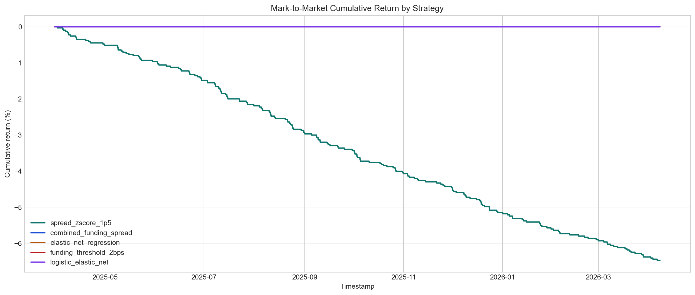
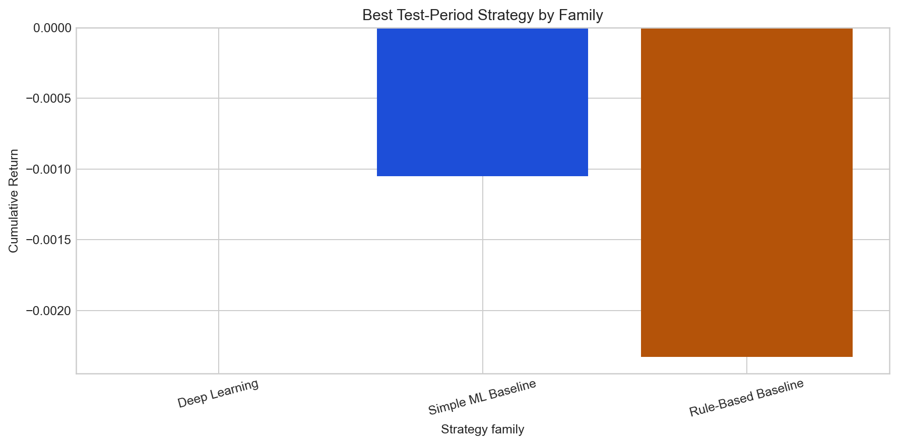

# Deep Learning-Based Delta-Neutral Statistical Arbitrage on Perpetual Funding Rates

Final technical report for the end-to-end research, backtesting, vault, and showcase prototype.

## Metadata

- Course: `FTE 4312 Course Project`
- Authors: `Wenjie, Qihang Han, Hongjun Huang`
- Repository: `https://github.com/MengerWen/Deep-Learning-Based-Delta-Neutral-Statistical-Arbitrage-on-Perpetual-Funding-Rates`
- Market: `BTCUSDT` on `binance` at `1h`
- Sample window: `2021-01-01` to `2026-04-08`
- Generated at: `2026-04-16T04:22:00.863003+00:00`

## Executive Summary

- The repository now has a full artifact chain from market-data ingestion to quantitative evaluation, vault accounting, and presentation delivery.
- The data and modeling layers learn meaningful structure in funding-rate dislocations, with test Pearson correlation above 0.64 for the strongest models.
- Under explicit fees, slippage, gas, and next-bar execution, the current out-of-sample strategies do not produce positive post-cost alpha.
- This negative result is still valuable because it is documented honestly, reproducibly, and inside a coherent hybrid DeFi system design.

**Verdict:** No positive post-cost out-of-sample strategy survives the current friction model, but the repository now demonstrates a coherent research-to-vault prototype.

## System Scope

- Data ingestion and canonicalization
- Feature engineering and supervised learning targets
- Predictive modeling plus standardized signals
- Cost-aware backtesting and vault-state mirroring

## Dataset And Data Quality

- Canonical hourly rows: `46,152`
- Funding events: `3,092`
- Coverage ratio: `100.00%`
- Average funding rate: `1.04 bps`
- Funding standard deviation: `1.89 bps`
- Average perp-vs-spot spread: `-1.53 bps`
- Mean annualized volatility: `50.86%`

## Modeling Summary

| Family | Model | Metric | Score | RMSE | Signals |
| --- | --- | --- | --- | --- | --- |
| Best baseline | elastic_net_regression | pearson_corr | 0.677 | 1.269 | 0 |
| Best deep learning | transformer_encoder | pearson_corr | 0.646 | 1.209 | 0 |

## Backtest Summary

- Primary split: `test`
- Best strategy: `spread_zscore_1p5`
- Trade count: `200`
- Cumulative return: `-6.47%`
- Mark-to-market Sharpe: `-14.072`
- Net PnL: `$-6,474.85`

| Strategy | Source | Split | Trades | Cum Return | MTM Drawdown | MTM Sharpe | Net PnL |
| --- | --- | --- | --- | --- | --- | --- | --- |
| spread_zscore_1p5 | rule_based | test | 200 | -6.47% | -6.47% | -14.072 | $-6,474.85 |
| combined_funding_spread | rule_based | test | 0 | 0.00% | 0.00% | 0.000 | $0.00 |
| elastic_net_regression | baseline_linear | test | 0 | 0.00% | 0.00% | 0.000 | $0.00 |
| funding_threshold_2bps | rule_based | test | 0 | 0.00% | 0.00% | 0.000 | $0.00 |
| logistic_elastic_net | baseline_linear | test | 0 | 0.00% | 0.00% | 0.000 | $0.00 |

### Core Assumptions

- Single-asset, delta-neutral prototype with at most one open position per strategy.
- Signals at timestamp t are executed after entry_delay_bars using the configured execution price field.
- Primary leaderboard and strategy metrics use the configured reporting.primary_split, which defaults to test.
- Primary equity, drawdown, and Sharpe metrics use mark-to-market equity; realized-only columns are retained for audit.
- Funding PnL uses funding_mode=prototype_bar_sum and funding_notional_mode=initial_notional.
- Hedge mode is equal_notional_hedge; current implementation uses equal USD notional on the perp and spot legs.
- Trading fees use taker_fee_bps on all four round-trip leg transactions.
- Slippage is modeled by adverse execution prices; embedded_slippage_cost_usd is the preferred diagnostic and is not deducted twice.

## Robustness Interpretation

| Family | Representative Strategy | Trades | Cum Return | Sharpe | Net PnL |
| --- | --- | --- | --- | --- | --- |
| Simple ML Baseline | logistic_regression | 3 | -0.11% | -1.709 | $-105.01 |
| Deep Learning | lstm | 0 | 0.00% | 0.000 | $0.00 |
| Rule-Based Baseline | combined_funding_spread | 7 | -0.23% | -2.618 | $-232.82 |

## Vault Prototype

- Selected strategy: `spread_zscore_1p5`
- Strategy state: `idle`
- Suggested direction: `flat`
- Reported NAV assets: `93,525,146,215`
- Summary PnL: `$-6,474.85`
- Prepared contract calls: `2`

## Contributions

- A reproducible Python pipeline for market data, engineered features, post-cost labels, and standardized signals.
- A benchmark stack spanning rule-based heuristics, linear predictive baselines, and multiple deep sequence architectures.
- A delta-neutral backtest engine with explicit transaction costs, funding accrual, mark-to-market accounting, and robustness analysis.
- A Solidity vault prototype that mirrors deposits, shares, strategy state, and NAV/PnL updates via a trusted operator workflow.
- A static, presentation-ready showcase site and final report that package the repository into course-submission deliverables.

## Limitations

- The current prototype focuses on a single main market path, Binance BTCUSDT, at 1-hour frequency.
- Execution is simplified to next-bar pricing with explicit but still stylized fees, slippage, and gas assumptions.
- The vault is an accounting prototype rather than a live multi-venue execution protocol.
- The operator sync remains trusted and does not implement a decentralized oracle or adversarial security model.
- Current deep-learning models show predictive structure but mostly abstain from trading under the existing post-cost thresholding rules.

## Future Work

- Extend the dataset to multiple venues and symbols so funding dislocations can be compared cross-sectionally.
- Revisit thresholding, calibration, and position sizing so predictive models can be translated into better trade selection.
- Add microstructure-aware execution assumptions such as intrabar fills, borrow costs, and liquidation stress.
- Replace the trusted operator bridge with a better-specified oracle or signed update flow for the vault layer.
- Enrich the showcase with replay data or a lightweight hosted API if the demo scope later expands.

## Figures

### Funding Rate Regime Map

Hourly funding history shows persistent positive funding with episodic spikes and reversals.

### Perpetual vs Spot Spread

Basis dislocations stay small on average but widen during stress and short-lived directional bursts.

### Cumulative Returns by Strategy

The explicit delta-neutral backtest makes the ranking between rule-based, baseline ML, and learned models easy to explain.

### Drawdown Profile

Even prototype strategies need a clear view of path dependence and downside depth.

### Robustness Family Comparison

Rule-based, simple ML, and deep learning outputs are compared under one shared evaluation lens.

### Deep Learning Model Zoo

Phase 2 compares LSTM, GRU, TCN, and TransformerEncoder under one shared regression task.

### Deep Learning Strategy Lens

The same sequence models are ranked again using a trading-oriented signal-return metric.

