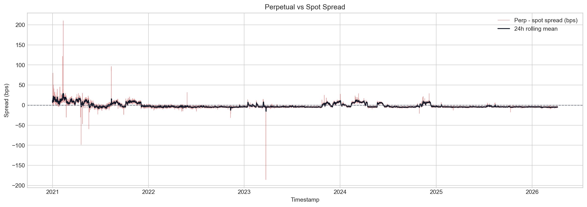
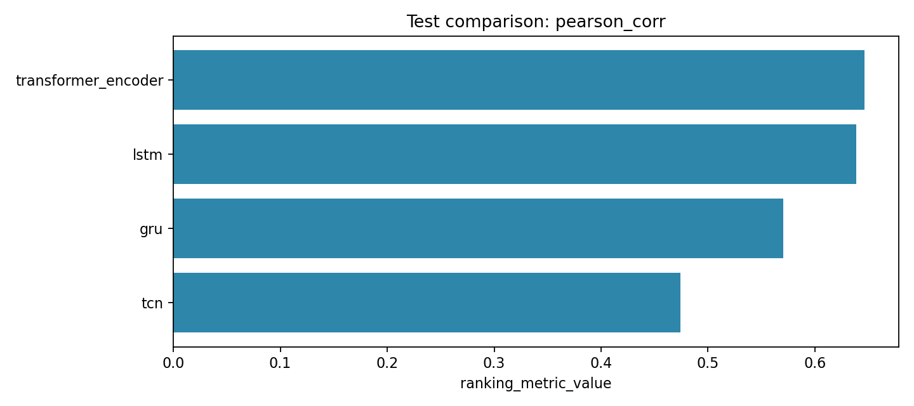

# Deep Learning-Based Delta-Neutral Statistical Arbitrage on Perpetual Funding Rates

Strict conclusion plus exploratory DL showcase summary.

## Metadata

- Course: `FTE 4312 Course Project`
- Authors: `Wenjie, Qihang Han, Hongjun Huang`
- Repository: `https://github.com/MengerWen/Deep-Learning-Based-Delta-Neutral-Statistical-Arbitrage-on-Perpetual-Funding-Rates`
- Market: `BTCUSDT` on `binance` at `1h`
- Sample window: `2021-01-01` to `2026-04-08`
- Generated at: `2026-04-17T06:32:59.341751+00:00`

## Executive Summary

- The repository preserves a strict post-cost primary conclusion while adding a fully separate exploratory DL showcase track.
- Strict results remain the official answer for tradable post-cost alpha under the current friction model.
- Exploratory results are supplementary and demonstrate learning behavior, ranking ability, and signed opportunity structure.

**Verdict:** No positive post-cost out-of-sample strategy survives the current friction model, but the repository now demonstrates a coherent research-to-vault prototype.

## System Scope

- Data ingestion and canonicalization
- Feature engineering and supervised learning targets
- Predictive modeling plus standardized signals
- Cost-aware backtesting and vault-state mirroring

## Dataset And Data Quality

- Canonical hourly rows: `46,152`
- Funding events: `3,092`
- Coverage ratio: `100.00%`
- Average funding rate: `1.04 bps`
- Funding standard deviation: `1.89 bps`
- Average perp-vs-spot spread: `-1.53 bps`
- Mean annualized volatility: `50.86%`

## Modeling Summary

| Family | Model | Metric | Score | RMSE | Signals |
| --- | --- | --- | --- | --- | --- |
| Best baseline | elastic_net_regression | pearson_corr | 0.677 | 1.269 | 0 |
| Best deep learning | transformer_encoder | pearson_corr | 0.646 | 1.209 | 0 |

## Backtest Summary

- Primary split: `test`
- Best strategy: `spread_zscore_1p5`
- Trade count: `200`
- Cumulative return: `-6.47%`
- Mark-to-market Sharpe: `-14.072`
- Net PnL: `$-6,474.85`

| Strategy | Source | Split | Status | Trades | Cum Return | MTM Drawdown | MTM Sharpe | Net PnL | Reason |
| --- | --- | --- | --- | --- | --- | --- | --- | --- | --- |
| spread_zscore_1p5 | rule_based | test | completed | 200 | -6.47% | -6.47% | -14.072 | $-6,474.85 |  |
| combined_funding_spread | rule_based | test | no_tradable_signals | 0 | 0.00% | n/a | n/a | $0.00 | test: signal_count == 0 for split 'test'. |
| elastic_net_regression | baseline_linear | test | no_tradable_signals | 0 | 0.00% | n/a | n/a | $0.00 | validation: signal_count == 0 for split 'validation'.; test: signal_count == 0 for split 'test'. |
| funding_threshold_2bps | rule_based | test | no_tradable_signals | 0 | 0.00% | n/a | n/a | $0.00 | test: signal_count == 0 for split 'test'. |
| logistic_l1 | baseline_linear | test | no_tradable_signals | 0 | 0.00% | n/a | n/a | $0.00 | test: signal_count == 0 for split 'test'. |

### Core Assumptions

- Single-asset, delta-neutral prototype with at most one open position per strategy.
- Signals at timestamp t are executed after entry_delay_bars using the configured execution price field.
- Primary leaderboard and strategy metrics use the configured reporting.primary_split, which defaults to test.
- Primary equity, drawdown, and Sharpe metrics use mark-to-market equity; realized-only columns are retained for audit.
- Funding PnL uses funding_mode=prototype_bar_sum and funding_notional_mode=initial_notional.
- Hedge mode is equal_notional_hedge; current implementation uses equal USD notional on the perp and spot legs.
- Trading fees use taker_fee_bps on all four round-trip leg transactions.
- Slippage is modeled by adverse execution prices; embedded_slippage_cost_usd is the preferred diagnostic and is not deducted twice.

## Robustness Interpretation

| Family | Representative Strategy | Trades | Cum Return | Sharpe | Net PnL |
| --- | --- | --- | --- | --- | --- |
| Simple ML Baseline | elastic_net_regression | 0 | 0.00% | nan | $0.00 |
| Deep Learning | transformer_encoder | 0 | 0.00% | nan | $0.00 |
| Rule-Based Baseline | spread_zscore_1p5 | 200 | -6.47% | -14.072 | $-6,474.85 |

## Exploratory DL Showcase

Exploratory DL results are supplementary showcase results designed to demonstrate model learning behavior, ranking ability, and alternative opportunity definitions. They do not replace the strict post-cost primary conclusion.

| Strategy | Model | Target | Signal Rule | Split | Trades | Cum Return | MTM Sharpe | Net PnL | Status | Reason |
| --- | --- | --- | --- | --- | --- | --- | --- | --- | --- | --- |
| lstm_gross__rolling_top_decile_abs | lstm | gross_opportunity_regression | rolling_top_decile_abs | test | 578 | -18.79% | -24.180 | $-18,791.33 | completed | None |

## Vault Prototype

- Selected strategy: `spread_zscore_1p5`
- Strategy state: `idle`
- Suggested direction: `flat`
- Reported NAV assets: `93,525,146,215`
- Summary PnL: `$-6,474.85`
- Prepared contract calls: `2`

## Contributions

- A reproducible strict pipeline from market data to backtest, vault accounting, and final reporting.
- A separate exploratory DL track with gross-opportunity and direction-aware targets, independent signals, independent backtests, and frontend-ready diagnostics.

## Limitations

- Exploratory showcase outputs are not the primary investment conclusion and should not be read as strict tradable alpha evidence.
- Both tracks still operate on a single Binance BTCUSDT hourly research path.

## Future Work

- Extend the strict and exploratory tracks to multi-symbol or multi-venue settings for richer ranking problems.
- Test more calibration and portfolio-construction logic on top of the exploratory directional outputs.

## Figures

### Funding Rate Regime Map

Hourly funding history shows persistent positive funding with episodic spikes and reversals.

### Perpetual vs Spot Spread

Basis dislocations stay small on average but widen during stress and short-lived directional bursts.

### Cumulative Returns by Strategy

The explicit delta-neutral backtest makes the ranking between rule-based, baseline ML, and learned models easy to explain.

### Drawdown Profile

Even prototype strategies need a clear view of path dependence and downside depth.

### Robustness Family Comparison

Rule-based, simple ML, and deep learning outputs are compared under one shared evaluation lens.

### Deep Learning Model Zoo

Phase 2 compares LSTM, GRU, TCN, and TransformerEncoder under one shared regression task.

### Deep Learning Strategy Lens

The same sequence models are ranked again using a trading-oriented signal-return metric.

