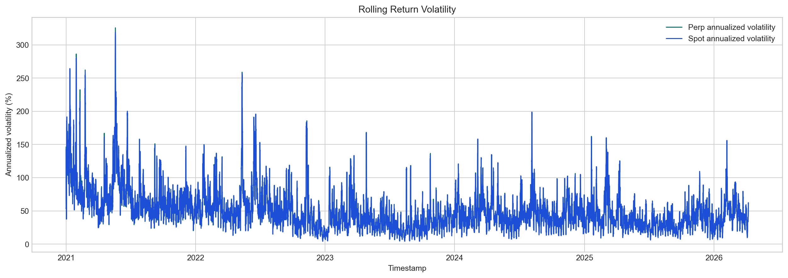
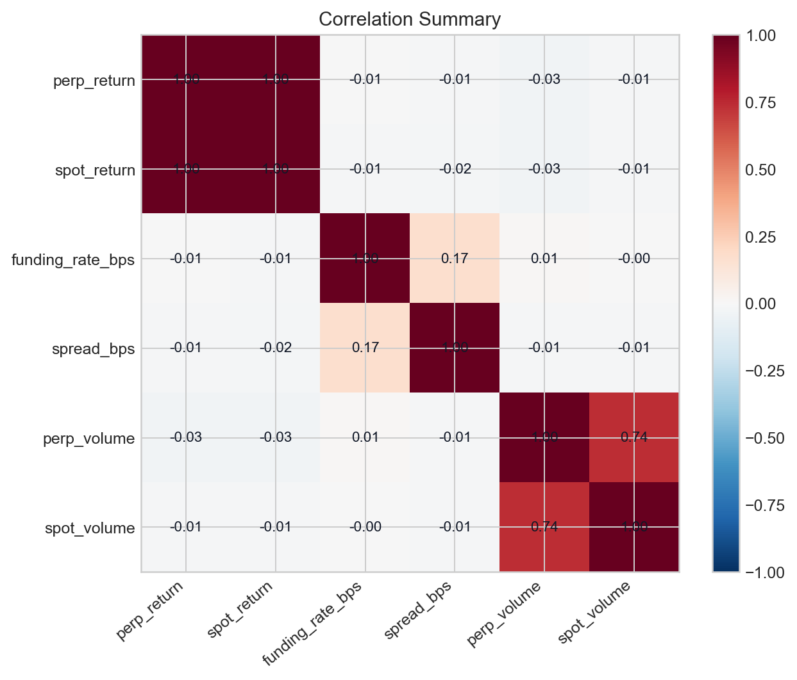

# Data Quality Report

## Overview

- Symbol: `BTCUSDT`
- Provider: `binance`
- Venue: `binance`
- Frequency: `1h`
- Source dataset: `data/processed/binance/btcusdt/1h/hourly_market_data.parquet`
- Report output root: `reports/data_quality`
- Canonical rows: `46152`
- Raw source rows: `{'perpetual_bars': 46152, 'spot_bars': 46138, 'funding_rates': 5769}`

## Time Coverage

| start_timestamp | end_timestamp | actual_rows | unique_timestamps | expected_rows_in_observed_range | coverage_ratio | duplicate_timestamps | missing_hours_inside_observed_range | non_standard_gap_count | max_gap_hours | median_gap_hours | funding_event_rows |
| --- | --- | --- | --- | --- | --- | --- | --- | --- | --- | --- | --- |
| 2021-01-01T00:00:00+00:00 | 2026-04-07T23:00:00+00:00 | 46152 | 46152 | 46152 | 1.0 | 0 | 0 | 0 | 1.0 | 1.0 | 3092 |

## Missingness Summary

| column | missing_count | missing_pct |
| --- | --- | --- |
| open_interest | 46152 | 100.0 |
| perp_rolling_vol_annualized | 2 | 0.0043 |
| spot_rolling_vol_annualized | 2 | 0.0043 |
| perp_return | 1 | 0.0022 |
| spot_return | 1 | 0.0022 |

## Distribution Summary

| column | count | mean | std | min | p01 | p05 | median | p95 | p99 | max |
| --- | --- | --- | --- | --- | --- | --- | --- | --- | --- | --- |
| perp_close | 46152 | 55473.803415 | 29178.002182 | 15637.9 | 16650.551 | 19353.865 | 48241.485 | 110689.26 | 118540.791 | 125986.0 |
| spot_close | 46152 | 55482.59507 | 29188.59476 | 15649.52 | 16659.1173 | 19362.461 | 48229.385 | 110731.2795 | 118562.9122 | 126011.18 |
| funding_rate_bps | 46152 | 0.06966 | 0.554295 | -11.1953 | 0.0 | 0.0 | 0.0 | 0.310305 | 1.0 | 24.8993 |
| perp_volume | 46152 | 14196.690788 | 16312.086381 | 63.932 | 1211.61369 | 2241.22345 | 9168.9905 | 42229.30965 | 79669.89957 | 355275.447 |
| spot_volume | 46152 | 2998.125747 | 4632.939385 | 0.0 | 159.720193 | 291.935622 | 1411.653764 | 11271.312606 | 22651.486661 | 137207.1886 |
| spread_bps | 46152 | -1.534091 | 5.816238 | -185.754986 | -7.593572 | -6.220689 | -3.813768 | 9.866486 | 16.932744 | 210.12259 |

## Correlation Summary

| feature | perp_return | spot_return | funding_rate_bps | spread_bps | perp_volume | spot_volume |
| --- | --- | --- | --- | --- | --- | --- |
| perp_return | 1.0 | 0.999 | -0.0063 | -0.0092 | -0.0342 | -0.0101 |
| spot_return | 0.999 | 1.0 | -0.0088 | -0.0199 | -0.0339 | -0.0099 |
| funding_rate_bps | -0.0063 | -0.0088 | 1.0 | 0.1697 | 0.0101 | -0.0018 |
| spread_bps | -0.0092 | -0.0199 | 0.1697 | 1.0 | -0.0136 | -0.0138 |
| perp_volume | -0.0342 | -0.0339 | 0.0101 | -0.0136 | 1.0 | 0.7363 |
| spot_volume | -0.0101 | -0.0099 | -0.0018 | -0.0138 | 0.7363 | 1.0 |

## Key Findings

- Funding events observed: `3092`
- Average realized funding rate: `1.039758` bps
- Funding-rate standard deviation: `1.891661` bps
- Funding-rate range: `-11.1953` to `24.8993` bps
- Share of positive funding events: `0.878719`
- Average perp-vs-spot spread: `-1.534091` bps
- 95th percentile absolute spread: `10.035461` bps
- Mean annualized perp volatility: `0.508612`
- Mean annualized spot volatility: `0.509159`

## Figures

