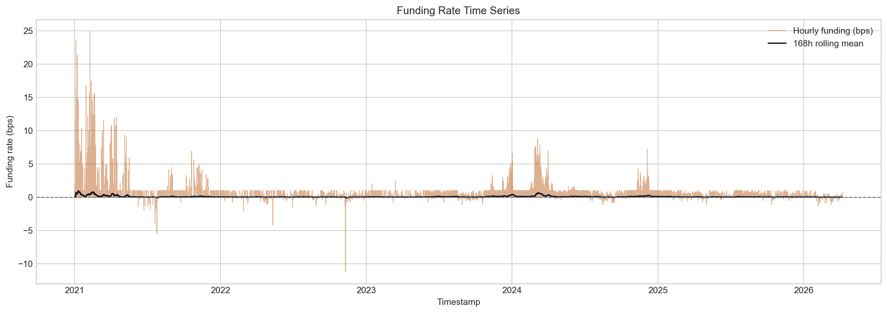
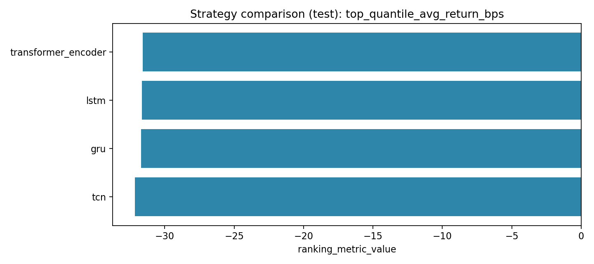
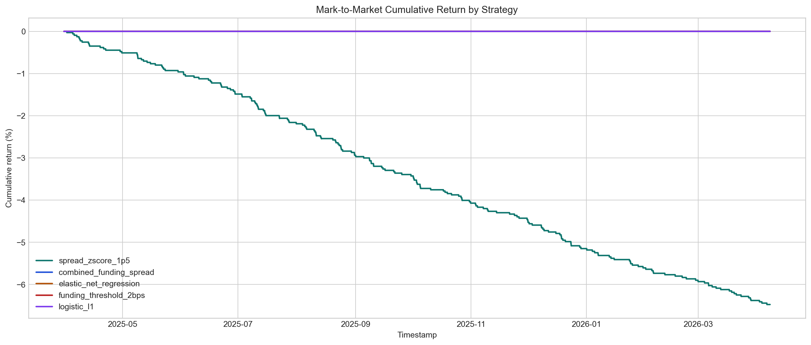
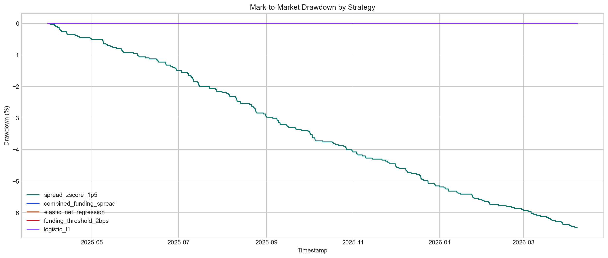
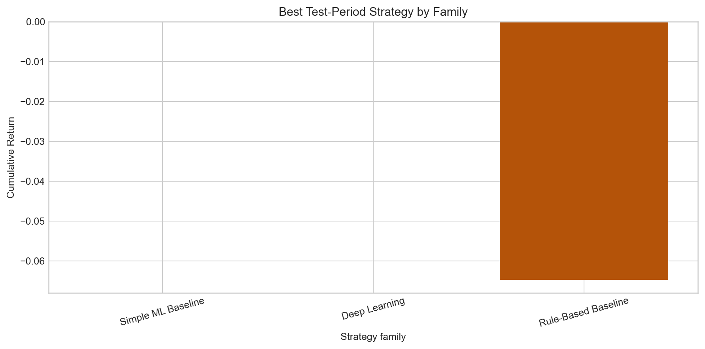

# Deep Learning-Based Delta-Neutral Statistical Arbitrage on Perpetual Funding Rates

**Final Technical Report**

**Course:** FTE 4312 Course Project  
**Authors:** Wenjie, Qihang Han, Hongjun Huang  
**Repository:** <https://github.com/MengerWen/Deep-Learning-Based-Delta-Neutral-Statistical-Arbitrage-on-Perpetual-Funding-Rates>  
**Primary market:** Binance BTCUSDT perpetual and spot, 1-hour frequency  
**Primary sample window:** 2021-01-01 00:00 UTC to 2026-04-07 23:00 UTC  
**Report source artifacts:** `reports/final_showcase/binance/btcusdt/1h/summary.json` and related project outputs  
**Report prepared:** 2026-04-22

## Abstract

This project studies whether perpetual futures funding-rate dislocations can be converted into a credible delta-neutral statistical arbitrage prototype. The implemented system builds a full research and demonstration pipeline: Binance BTCUSDT market data is fetched and canonicalized into an hourly dataset; interpretable funding, basis, volatility, liquidity, and regime features are constructed without future leakage; supervised labels estimate future post-cost returns for a short-perpetual and long-spot hedge; rule-based baselines, penalized linear models, and compact deep-learning sequence models are trained; standardized signals are backtested with explicit transaction costs, slippage, gas, funding accrual, and mark-to-market accounting; and the selected strategy state is mirrored into a Solidity vault prototype through a trusted off-chain operator workflow.

The main empirical conclusion is intentionally conservative. Although several models learn measurable structure in the target series, with the best strict baseline reaching test Pearson correlation of 0.677 and the best strict deep-learning model reaching 0.646, the validation and test periods contain no positive tradeable post-cost labels under the configured friction model. The only strict strategy that produces test-period trades, the spread z-score rule, executes 200 trades and loses 6.47 percent, with net PnL of -6,474.85 USD on 100,000 USD starting capital. The official result is therefore: no positive post-cost out-of-sample strategy survives the current single-asset friction model. This negative result is still valuable because the repository demonstrates a coherent, reproducible, and honest end-to-end prototype for off-chain quantitative research, cost-aware evaluation, vault accounting, and classroom presentation.

## Executive Summary

The project began with an attractive DeFi research idea: perpetual futures use funding payments to keep contract prices close to spot prices, so abnormal funding and basis regimes may create delta-neutral opportunities. The implemented prototype tests this idea in a disciplined way instead of assuming the edge exists. It asks whether a strategy can identify moments where funding carry and basis behavior remain profitable after transaction costs, and whether the resulting off-chain strategy state can be represented transparently in a smart-contract vault.

The repository now contains all major layers expected from the proposal:

| Layer | Implemented outcome |
| --- | --- |
| Data ingestion | Binance BTCUSDT perpetual, spot, and funding data are normalized to an hourly canonical table. |
| Data quality | Time coverage, missingness, distributions, correlations, and market charts are generated. |
| Feature engineering | 81 primary engineered features are created from funding, basis, volatility, liquidity, and regime groups. |
| Label generation | Future 24-hour post-cost return labels are built with next-bar execution and explicit trading costs. |
| Baselines | Rule-based signals, logistic models, Ridge, and ElasticNet are evaluated with time-series-safe tuning. |
| Deep learning | LSTM, GRU, TCN, and Transformer encoder sequence models are trained and compared. |
| Signal layer | Model and rule outputs are normalized into a single downstream signal schema. |
| Backtesting | Delta-neutral trades are simulated with fees, slippage, gas, funding, and mark-to-market risk. |
| Robustness | Cost, holding-window, threshold, family, and feature-ablation checks are reported. |
| Solidity vault | A single-asset vault supports deposits, withdrawals, shares, NAV/PnL updates, pausing, and operator updates. |
| Integration | A dry-run operator flow converts backtest results into vault update calldata. |
| Frontend | A lightweight Vite dashboard and static report/showcase artifacts support the final demo. |

The official empirical verdict is negative but credible:

- The canonical dataset contains 46,152 hourly rows and 3,092 aligned funding events.
- Funding events are mostly positive, with average realized funding of 1.04 bps and standard deviation of 1.89 bps.
- The average perp-vs-spot spread is -1.53 bps, while the 95th percentile absolute spread is about 10.04 bps.
- The strict 24-hour post-cost labels are extremely sparse. In the model-ready dataset, the train split has a tradeable rate of about 0.193 percent, while validation and test have 0 percent tradeable positive labels.
- The best strict baseline model is ElasticNet regression with test Pearson correlation of 0.677 and RMSE of 1.269 bps, but it produces zero test signals.
- The best strict deep-learning model is the Transformer encoder with test Pearson correlation of 0.646 and RMSE of 1.209 bps, but it also produces zero test signals.
- The only strict traded test strategy is `spread_zscore_1p5`, which produces 200 trades and loses 6.47 percent.
- Robustness analysis does not overturn the conclusion. Cost changes affect the rule-based loss magnitude, but no model family produces positive strict test performance.
- The Solidity and integration layers work as a prototype accounting and state-management demonstration, not as a live trading or trust-minimized oracle protocol.

The main contribution of the project is therefore not a profitable trading claim. It is a complete, reproducible, and well-scoped hybrid quant plus smart-contract prototype that shows how such a strategy should be researched, evaluated, and represented before any production claims are made.

## 1. Introduction

Perpetual futures are central instruments in cryptocurrency derivatives markets. Unlike fixed-maturity futures, perpetual contracts do not expire. Exchanges instead use funding payments to encourage the perpetual price to remain close to an underlying spot or index price. When the perpetual contract trades rich relative to spot, long holders typically pay short holders; when it trades cheap, the sign can reverse. This mechanism creates a natural economic story for delta-neutral strategies: a trader may short the expensive perpetual, buy spot as a hedge, and attempt to earn funding while minimizing first-order price exposure.

The difficulty is that funding-rate arbitrage is not automatically profitable. A high funding rate can be offset by entry and exit fees, slippage, gas or operational costs, adverse basis movement, margin constraints, and changing market regimes. A strategy that appears attractive before costs can become unprofitable once the full trade lifecycle is modeled. This project was designed around that practical tension.

The project builds a prototype called **Deep Learning-Based Delta-Neutral Statistical Arbitrage on Perpetual Funding Rates**. The term "deep learning" in the title is treated as a research question rather than a promise. The system first implements clear rule-based and simple machine-learning benchmarks, then compares compact sequence models against them. The final conclusion is based on cost-aware out-of-sample backtesting, not on headline predictive metrics alone.

The project also includes a DeFi-style vault component. This is important because funding arbitrage is naturally off-chain: exchange data, model training, signal calculation, and execution simulation are too complex for direct on-chain inference. A realistic prototype therefore separates concerns. The quantitative system runs off-chain, while the smart contract records deposits, shares, NAV, PnL updates, and strategy state. This mirrors the architecture used by many real hybrid systems: computation and data collection occur outside the blockchain, while a contract provides transparent accounting and state updates.

## 2. Problem Statement

The central research question is:

**Can historical funding-rate behavior, basis dislocations, and short-horizon market features identify delta-neutral trades whose expected post-cost return is positive, and can the resulting strategy state be represented in a transparent smart-contract vault?**

This question is decomposed into five technical subproblems:

1. **Data alignment:** Can perpetual, spot, and funding data be merged into a clean hourly table without timestamp errors or hidden gaps?
2. **Label design:** Can the supervised learning target reflect the actual trading objective, namely future post-cost return from a delta-neutral position?
3. **Model comparison:** Do rule-based strategies, penalized linear models, or sequence models produce usable out-of-sample signals?
4. **Backtest realism:** Do results survive fees, slippage, gas, funding effects, entry delays, holding rules, and test-split evaluation?
5. **Vault representation:** Can off-chain strategy state be converted into a simple on-chain accounting update without overclaiming production decentralization?

The project intentionally avoids several production goals. It does not attempt live trading, direct exchange routing, liquidation modeling, order-book simulation, decentralized oracle consensus, multi-chain deployment, or audited vault production readiness. These omissions are documented as prototype boundaries rather than hidden weaknesses.

## 3. Background

### 3.1 Perpetual Futures and Funding Rates

A perpetual future tracks an underlying asset without a fixed expiry date. To prevent the contract from drifting permanently away from the spot or index price, exchanges apply funding payments between long and short positions. Funding is usually based on a premium or interest-rate formula and is settled at scheduled intervals. The project uses Binance BTCUSDT data and aligns funding events into the hourly research grid.

Funding creates two useful signals:

- **Carry signal:** If funding is positive, a short perpetual position may receive funding from long positions.
- **Crowding signal:** Persistent positive funding can indicate heavy long demand or a crowded leverage regime.

However, funding cannot be evaluated alone. If the perpetual is rich to spot but then becomes even richer, the basis loss can overwhelm funding income. Likewise, if funding is positive but too small, trading costs can dominate the expected carry.

### 3.2 Delta-Neutral Arbitrage

The default strategy direction in the project is:

```text
short perpetual + long spot
```

This position attempts to reduce exposure to the underlying BTC price. The approximate delta relation is:

```text
net_delta ~= delta_perp_leg + delta_spot_leg ~= -1 + 1 ~= 0
```

The hedge is not perfect. It still carries basis risk, execution risk, funding forecast risk, and exchange-specific risk. In this prototype, the hedge is modeled through equal USD notional on the perpetual and spot legs.

The reverse direction, long perpetual and short spot, is recognized conceptually but is not the main strict path because shorting spot requires explicit borrow or synthetic-short assumptions. The project keeps this conservative boundary clear.

### 3.3 Why Machine Learning Is Relevant

The task is not simple price direction prediction. The target is whether a market state at time `t` produces a positive post-cost opportunity after a future holding window. Machine learning may help because funding, basis, volatility, and liquidity interact nonlinearly and evolve through regimes. Sequence models may capture multi-hour persistence and reversal patterns that a single-row model misses.

At the same time, financial labels are noisy and sparse. A strong predictive metric does not automatically translate into a profitable strategy. This project therefore reports both model metrics and trading metrics, and the trading metrics are treated as primary.

### 3.4 Hybrid Off-Chain and On-Chain Design

Smart contracts cannot directly fetch Binance data or run deep-learning inference. A hybrid design is therefore necessary:

```text
Exchange data -> off-chain research pipeline -> signal and backtest artifacts -> operator update -> vault contract
```

The contract receives summarized state, not raw market data. This is a trusted operator model in the prototype. It demonstrates the concept without claiming decentralized oracle security.

## 4. System Architecture

The implemented architecture follows one end-to-end data flow:

```text
market data
  -> canonical hourly dataset
  -> engineered features
  -> post-cost labels
  -> model predictions
  -> standardized signals
  -> delta-neutral backtest
  -> vault update payload
  -> frontend/report artifacts
```

The repository is organized around these components:

| Component | Main paths | Responsibility |
| --- | --- | --- |
| Data | `src/funding_arb/data/`, `configs/data/` | Fetch, clean, align, validate, and store market data. |
| Features | `src/funding_arb/features/`, `configs/features/` | Build leakage-safe funding, basis, volatility, liquidity, and state features. |
| Labels | `src/funding_arb/labels/`, `configs/labels/` | Construct future post-cost return and classification targets. |
| Models | `src/funding_arb/models/`, `configs/models/`, `configs/experiments/` | Train baselines and deep-learning sequence models. |
| Signals | `src/funding_arb/signals/`, `configs/signals/` | Normalize rule, ML, and DL outputs into one signal schema. |
| Backtest | `src/funding_arb/backtest/`, `configs/backtests/` | Simulate delta-neutral trades and write metrics, logs, and plots. |
| Reporting | `src/funding_arb/reporting/`, `configs/reports/` | Generate data-quality, robustness, and final reports. |
| Integration | `src/funding_arb/integration/`, `configs/integration/` | Convert strategy artifacts into vault update plans. |
| Contracts | `contracts/src/`, `contracts/test/`, `contracts/script/` | Solidity vault, mock stablecoin, tests, and scripts. |
| Frontend | `frontend/src/`, `frontend/public/` | Static dashboard and report/showcase presentation. |

This modular structure is important for a course project because it lets each layer be inspected separately while still supporting a one-command demo workflow.

## 5. Data Pipeline

### 5.1 Market Scope

The first complete research path uses:

- **Provider:** Binance
- **Symbol:** BTCUSDT
- **Frequency:** 1 hour
- **Window:** 2021-01-01 to 2026-04-07 UTC
- **Primary datasets:** perpetual bars, spot bars, funding rates

The project stores raw, interim, processed, and artifact outputs separately. The canonical market data is saved under:

```text
data/processed/binance/btcusdt/1h/hourly_market_data.parquet
```

### 5.2 Canonical Schema

The canonical table aligns perpetual prices, spot prices, funding events, and optional open interest on a shared hourly UTC grid. Key columns include:

| Column group | Examples | Purpose |
| --- | --- | --- |
| Metadata | `timestamp`, `symbol`, `venue`, `frequency` | Identify market and time grid. |
| Perpetual bars | `perp_open`, `perp_high`, `perp_low`, `perp_close`, `perp_volume` | Perp execution and risk state. |
| Spot bars | `spot_open`, `spot_high`, `spot_low`, `spot_close`, `spot_volume` | Hedge leg and basis construction. |
| Funding | `funding_rate`, `funding_event` | Funding carry and settlement markers. |
| Missing flags | `perp_close_was_missing`, `spot_close_was_missing` | Audit data quality and fill behavior. |

The default implementation fills non-event hours with `funding_rate = 0.0` and `funding_event = 0`, so funding settlement events remain explicit while the hourly grid stays regular.

### 5.3 Cleaning and Alignment Rules

The data cleaning pipeline applies these rules:

- Normalize all timestamps to UTC.
- Drop duplicate timestamps and keep the last source observation.
- Sort data in ascending time order.
- Forward-fill price columns only up to the configured maximum gap.
- Fill missing volumes with zero.
- Fill non-event funding hours with zero.
- Raise an error if required aligned prices remain missing after the allowed fill.

These choices are conservative for a prototype. They make downstream rolling features, labels, and backtests deterministic while keeping data assumptions visible.

### 5.4 Data Quality Results

The data-quality report shows that the final canonical dataset is complete over the observed hourly range:

| Metric | Value |
| --- | ---: |
| Canonical hourly rows | 46,152 |
| Unique timestamps | 46,152 |
| Expected rows in observed range | 46,152 |
| Coverage ratio | 100.00 percent |
| Duplicate timestamps | 0 |
| Missing hours inside observed range | 0 |
| Funding event rows | 3,092 |
| Raw perpetual rows | 46,152 |
| Raw spot rows | 46,138 |
| Raw funding rows | 5,769 |

The main market statistics are:

| Statistic | Value |
| --- | ---: |
| Average realized funding rate on funding events | 1.04 bps |
| Funding-rate standard deviation on funding events | 1.89 bps |
| Funding-rate range | -11.20 to 24.90 bps |
| Share of positive funding events | 87.87 percent |
| Average perp-vs-spot spread | -1.53 bps |
| 95th percentile absolute spread | 10.04 bps |
| Mean annualized perp volatility | 50.86 percent |
| Mean annualized spot volatility | 50.92 percent |

The data support the economic motivation: funding is often positive, basis dislocations exist, and volatility regimes vary materially. The same data also warn that the average spread and funding edge are small relative to realistic round-trip costs.




## 6. Feature Engineering

The feature pipeline produces an interpretable set of 81 primary engineered features. The design principle is that every feature must use only information available at or before timestamp `t`. Rolling windows are backward-looking and no future prices, future funding prints, or future labels are used.

### 6.1 Feature Groups

The default feature groups are:

| Feature group | Examples | Interpretation |
| --- | --- | --- |
| Funding | `funding_rate_bps`, `funding_annualized_proxy`, `funding_zscore_72h`, `funding_positive_share_24h` | Carry level, abnormality, persistence, and regime direction. |
| Basis / spread | `spread_bps`, `spread_change_1h`, `spread_zscore_72h`, `spread_reversion_signal_24h` | Perp richness or cheapness relative to spot and mean-reversion pressure. |
| Volatility / risk | `perp_return_1h`, `spot_return_1h`, `perp_realized_vol_24h`, `perp_return_shock_24h` | Market risk state and short-term disturbance intensity. |
| Liquidity / activity | `perp_volume_ratio_24h`, `spot_volume_ratio_24h`, dollar-volume features | Activity conditions and liquidity proxies. |
| Interaction / state | `funding_x_spread_bps`, `funding_x_perp_vol_24h`, `positive_funding_regime`, `wide_spread_regime` | Nonlinear relationships between carry, basis, and risk regimes. |

The default rolling windows are 8, 24, 72, and 168 hours. These windows were selected because they map naturally to short-term funding cycles, one-day behavior, three-day regimes, and one-week market state.

### 6.2 Leakage Control

Feature leakage is controlled in three ways:

1. Rolling statistics use current and past observations only.
2. Labels are generated after the feature timestamp with an explicit entry delay.
3. Model normalization is fit only on training data, then applied to validation and test.

This is a key design choice. In time-series trading tasks, small forms of leakage can turn an unprofitable strategy into an apparently profitable one. The report therefore emphasizes time alignment as much as model architecture.

## 7. Label Generation

### 7.1 Core Label Objective

The primary label is not raw price direction. It is a post-cost opportunity label for a delta-neutral trade. The default direction is:

```text
short perpetual + long spot
```

For a holding horizon `H`, the regression target is:

```text
future_net_return_bps_H
  = future_perp_leg_return_bps_H
  + future_spot_leg_return_bps_H
  + future_funding_return_bps_H
  - estimated_cost_bps_H
```

For the default short-perp and long-spot position:

- The perp leg gains when the perpetual price falls after entry.
- The spot leg gains when spot rises after entry.
- Funding PnL is positive when the short receives funding.
- Costs subtract taker fees, slippage, gas, and optional friction.

The main target used in the strict modeling reports is:

```text
target_future_net_return_bps_24h
```

### 7.2 Timing Convention

The label timing deliberately avoids same-bar lookahead:

```text
feature timestamp: t
entry timestamp: t + execution_delay_bars
exit timestamp: t + execution_delay_bars + holding_window
```

With the default settings:

- Features are observed at the end of hour `t`.
- Entry uses the next bar open, `t + 1`.
- A 24-hour label exits at `t + 25`.

This aligns with the backtest, where signals are also executed after a configurable delay.

### 7.3 Cost Model

The label cost approximation is:

```text
estimated_cost_bps
  = 4 * (taker_fee_bps + slippage_bps)
  + gas_cost_bps
  + other_friction_bps
  + borrow_cost_bps_if_applicable
```

The factor of four represents:

1. perpetual entry
2. perpetual exit
3. spot hedge entry
4. spot hedge exit

The current strict prototype does not rely on a borrow-cost model because the primary direction is short perpetual and long spot.

### 7.4 Classification Targets

Two classification labels are derived from the regression target:

| Label | Definition | Meaning |
| --- | --- | --- |
| `target_is_profitable_24h` | `future_net_return_bps_24h > 0` | Positive after modeled costs. |
| `target_is_tradeable_24h` | `future_net_return_bps_24h > 5` | Clears a practical minimum edge threshold. |

The distinction matters because a barely positive label may not be robust enough for execution.

### 7.5 Split Design and Degenerate Label Diagnostics

The project uses chronological splits:

| Split | Boundary logic |
| --- | --- |
| Train | timestamps up to 2024-06-30 |
| Validation | after train through 2025-03-31 |
| Test | after validation through 2026-04-07 |

The strict 24-hour label diagnostics show why the final result is difficult:

| Split | Model-ready rows | Tradeable rate | Profitable rate | Tradeable positives | Profitable positives | Mean future net return |
| --- | ---: | ---: | ---: | ---: | ---: | ---: |
| Train | 30,090 | 0.193 percent | 0.299 percent | 58 | 90 | -32.03 bps |
| Validation | 6,576 | 0.000 percent | 0.015 percent | 0 | 1 | -32.34 bps |
| Test | 8,822 valid rows | 0.000 percent | 0.000 percent | 0 | 0 | -33.46 bps |

This table is central to the final interpretation. The validation and test periods do not contain tradeable positive labels under the current strict cost model. The correct conclusion is therefore not that the models failed to discover an obvious edge; the stricter conclusion is that the configured single-market post-cost opportunity set is nearly absent out of sample.

## 8. Modeling Methodology

### 8.1 Baseline Philosophy

The baseline layer answers a disciplined question: before trusting deep learning, how far can interpretable rules and simple supervised models go?

Implemented baseline families include:

| Family | Examples | Role |
| --- | --- | --- |
| Rule-based | `funding_threshold_2bps`, `spread_zscore_1p5`, `combined_funding_spread` | Economic reference strategies. |
| Classification | Logistic regression, L1 logistic regression | Predict whether future post-cost return is profitable. |
| Regression | Ridge regression, ElasticNet regression | Predict future net return in basis points. |

The upgraded baseline pipeline includes:

- chronological inner-fold tuning on the train split
- validation-driven threshold selection
- optional probability calibration
- safe missing-data handling
- held-out permutation importance
- explicit degenerate-experiment status fields

The default prediction mode is static: models are fit on train and scored on the full dataset. Walk-forward hooks exist, but the main report keeps the workflow simple and reproducible.

### 8.2 Deep-Learning Models

The deep-learning layer treats each target timestamp as a sequence ending at time `t`. The default lookback is 48 hourly steps. Four compact architectures are implemented:

| Model | Family | Description |
| --- | --- | --- |
| LSTM | Recurrent | Stacked recurrent encoder with gated memory. |
| GRU | Recurrent | Lighter recurrent model with fewer gates. |
| TCN | Convolutional | Causal dilated convolutional sequence model. |
| Transformer encoder | Attention | Causal self-attention over the lookback window. |

The default strict task is regression on `target_future_net_return_bps_24h`. Training uses robust preprocessing, optional winsorization, Huber loss for regression, and validation-aware checkpoint selection. As with the baseline layer, threshold selection is guarded against degeneracy.

### 8.3 Signal Standardization

After training, all model and rule outputs are converted into a unified signal schema. This prevents the backtest engine from needing separate logic for every model type.

Important standardized fields include:

- `timestamp`
- `strategy_name`
- `source`
- `source_subtype`
- `signal_score`
- `expected_return_bps`
- `signal_threshold`
- `suggested_direction`
- `should_trade`
- `split`
- model-selection metadata such as calibration method, checkpoint metric, selected loss, and preprocessing scaler

This layer is valuable because it separates prediction from trading. A future model can be added by writing a new adapter while keeping the backtest and frontend unchanged.

## 9. Backtesting Methodology

### 9.1 Position Model

The backtest simulates one strategy at a time, with at most one open position per strategy. The default direction is:

```text
short_perp_long_spot
```

For a configured 10,000 USD position notional:

- 10,000 USD notional is used on the perpetual leg.
- 10,000 USD notional is used on the spot hedge leg.
- The gross exposure is 20,000 USD.

The starting equity in the strict report is 100,000 USD. The maximum gross leverage observed in the main traded strategy is 0.2x, which is intentionally conservative for the course prototype.

### 9.2 Entry and Exit Rules

Entry occurs when:

1. A standardized signal says `should_trade = 1`.
2. The suggested direction matches the configured direction.
3. Any configured score, confidence, or expected-return filters are satisfied.
4. The trade is executed after the configured entry delay using the configured execution price field.

Exit can occur through:

- signal turning off
- holding-window rule
- maximum holding cap
- optional stop-loss or take-profit checks
- end-of-data closure

Stops are approximated at hourly bar close and executed on the next configured execution bar. Intrabar order-book behavior is not modeled.

### 9.3 PnL Decomposition

Each trade decomposes PnL into:

- perpetual leg PnL
- spot hedge leg PnL
- funding PnL
- trading fees
- gas cost
- other friction
- embedded slippage cost diagnostic

The main risk metrics use mark-to-market equity rather than realized-only equity, because realized-only curves can hide drawdown while a trade is open. Realized-only values are retained for auditability.

### 9.4 Main Backtest Assumptions

| Assumption | Current strict prototype |
| --- | --- |
| Asset universe | Single asset, BTCUSDT |
| Venue | Binance data path |
| Frequency | 1 hour |
| Direction | short perpetual, long spot |
| Hedge mode | equal USD notional hedge |
| Open positions | at most one per strategy |
| Entry timing | next-bar execution after signal |
| Primary split | test |
| Equity curve | mark-to-market primary, realized-only secondary |
| Funding mode | prototype bar sum |
| Funding notional | initial notional |
| Slippage | adverse execution prices, not deducted twice |
| Fees | taker fees on all four round-trip leg transactions |
| Gas | fixed USD demo cost |

These assumptions make the backtest realistic enough for a course prototype while avoiding the false precision of an incomplete exchange microstructure simulator.

## 10. Empirical Results

### 10.1 Strict Modeling Results

The strict model comparison shows measurable predictive structure but no tradeable post-cost signals in validation or test.

| Model family | Best model | Task | Test metric | Test score | Test RMSE | Test signals | Status |
| --- | --- | --- | --- | ---: | ---: | ---: | --- |
| Simple ML baseline | ElasticNet regression | Regression | Pearson correlation | 0.677 | 1.269 bps | 0 | no tradable signals |
| Deep learning | Transformer encoder | Regression | Pearson correlation | 0.646 | 1.209 bps | 0 | warning / degenerate |
| Reference DL | LSTM | Regression | Pearson correlation | 0.639 | 1.239 bps | 0 | no tradable signals |

The model-zoo leaderboard is:

| Rank | Model | Group | Test Pearson correlation | Test RMSE | Top-decile average strict return |
| ---: | --- | --- | ---: | ---: | ---: |
| 1 | Transformer encoder | Attention | 0.646 | 1.209 bps | -31.59 bps |
| 2 | LSTM | Recurrent | 0.639 | 1.239 bps | -31.64 bps |
| 3 | GRU | Recurrent | 0.570 | 1.360 bps | -31.72 bps |
| 4 | TCN | Convolutional | 0.474 | 1.772 bps | -32.14 bps |

This result is subtle. The models rank the target with nonzero correlation, but the entire out-of-sample target distribution is shifted negative after costs. Even the top predicted strict opportunities are negative on average. Therefore, a good correlation metric is insufficient for a profitable signal.




### 10.2 Strict Backtest Results

The strict backtest leaderboard is test-split-primary. The best traded strategy is the rule-based spread z-score strategy:

| Metric | `spread_zscore_1p5` |
| --- | ---: |
| Status | completed |
| Test signals | 237 |
| Executed trades | 200 |
| Cumulative return | -6.47 percent |
| Annualized return | -6.34 percent |
| Mark-to-market Sharpe | -14.07 |
| Mark-to-market max drawdown | -6.47 percent |
| Win rate | 0.00 percent |
| Profit factor | 0.00 |
| Average trade return | -32.37 bps |
| Median holding time | 1 hour |
| Exposure time fraction | 2.65 percent |
| Total funding PnL | 7.91 USD |
| Embedded slippage diagnostic | 2,400.00 USD |
| Net PnL | -6,474.85 USD |
| Final equity | 93,525.15 USD |

All model-based strict strategies either produce zero test signals or no executable trades. Their zero PnL rows are intentionally marked as `no_tradable_signals`, and Sharpe/drawdown are written as unavailable rather than falsely reported as zero-risk performance.

The main strict strategy table is:

| Strategy | Source subtype | Status | Trades | Cumulative return | Sharpe | Net PnL | Diagnostic |
| --- | --- | --- | ---: | ---: | ---: | ---: | --- |
| `spread_zscore_1p5` | rule-based | completed | 200 | -6.47 percent | -14.07 | -6,474.85 USD | - |
| `combined_funding_spread` | rule-based | no tradable signals | 0 | 0.00 percent | n/a | 0.00 USD | no test signals |
| `elastic_net_regression` | baseline linear | no tradable signals | 0 | 0.00 percent | n/a | 0.00 USD | no validation/test signals |
| `funding_threshold_2bps` | rule-based | no tradable signals | 0 | 0.00 percent | n/a | 0.00 USD | no test signals |
| `logistic_l1` | baseline linear | no tradable signals | 0 | 0.00 percent | n/a | 0.00 USD | no test signals |





### 10.3 Interpretation of the Negative Result

The negative result is economically plausible. The dataset shows that funding is often positive, but the realized net label includes four leg-level transactions, slippage, gas, and basis behavior. The average strict future net return in the model-ready test rows is about -33.46 bps. The spread rule trades during abnormal spread conditions, but those entries still do not overcome the cost and basis movement profile.

Three lessons follow:

1. **Funding alone is not enough.** Positive funding can be too small relative to full round-trip costs.
2. **Prediction is not trading.** A model can rank a negative target distribution and still produce no profitable trades.
3. **Abstention is meaningful.** A no-trade model is not a profitable strategy, but it is more honest than forcing trades in a degenerate out-of-sample regime.

### 10.4 Exploratory Deep-Learning Track

The repository also includes an exploratory DL track. It is explicitly supplementary. It changes the target definition toward gross opportunity and direction-aware ranking to demonstrate that the models can learn structure when the opportunity definition is less strict. It does not replace the official strict conclusion.

The exploratory real-artifact showcase winner is:

| Metric | `lstm_gross__rolling_top_decile_abs` |
| --- | ---: |
| Model | LSTM |
| Target type | gross opportunity regression |
| Signal rule | rolling top decile by absolute score |
| Test trades | 578 |
| Cumulative return | -18.79 percent |
| Mark-to-market Sharpe | -24.18 |
| Net PnL | -18,791.33 USD |
| Status | completed |

Even this more active exploratory strategy loses money after the strict backtest cost model. However, the exploratory diagnostics show positive ranking behavior in a different lens: top-bucket directional return averages around 2.31 to 2.37 bps for gross-opportunity regressions. This is useful for future research because it suggests that the sequence models capture signed opportunity structure, but the signal-to-trade translation and friction model still prevent a profitable strict strategy.

The correct use of the exploratory track in the final presentation is:

- Use it to explain model learning behavior and ranking diagnostics.
- Do not present it as evidence of tradable post-cost alpha.
- Keep the strict backtest verdict as the official investment conclusion.

## 11. Robustness Analysis

The robustness workflow tests whether the conclusion changes under reasonable variations. It compares rule-based, baseline ML, and deep-learning families under shared backtest logic.

### 11.1 Family Comparison

The base family comparison shows:

| Family | Representative strategy | Status | Trades | Cumulative return | Net PnL |
| --- | --- | --- | ---: | ---: | ---: |
| Rule-based | `spread_zscore_1p5` | completed | 200 | -6.47 percent | -6,474.85 USD |
| Simple ML baseline | `elastic_net_regression` | no tradable signals | 0 | 0.00 percent | 0.00 USD |
| Deep learning | `transformer_encoder` | no tradable signals | 0 | 0.00 percent | 0.00 USD |

The apparent zero return for ML and deep learning is not positive performance. It reflects abstention caused by no tradeable signals under the strict thresholding path.



### 11.2 Cost Sensitivity

Cost sensitivity shows that the rule-based strategy remains negative across cost scenarios. The rule-based cumulative return range is approximately:

```text
best case:  -3.07 percent
worst case: -10.08 percent
range:       7.00 percentage points
```

The ML and DL rows remain at zero because they do not trade. The conclusion is therefore cost-sensitive in magnitude for rule-based trades, but not in sign.

### 11.3 Holding Window Sensitivity

The best holding-window scenario by family still selects:

| Family | Best holding scenario | Representative strategy | Cumulative return |
| --- | --- | --- | ---: |
| Simple ML baseline | 24h | `elastic_net_regression` | 0.00 percent, no trades |
| Deep learning | 24h | `transformer_encoder` | 0.00 percent, no trades |
| Rule-based | 24h | `spread_zscore_1p5` | -6.47 percent |

This does not support a hidden positive edge at a nearby holding horizon.

### 11.4 Threshold and Feature Ablation

Rule-threshold sensitivity confirms that the active spread z-score rule is fragile and negative. Feature ablation shows that removing basis features is especially damaging for the simple ML baseline in diagnostic runs, which is economically sensible because the strategy depends on the relationship between perp and spot. However, the ablation experiments do not rescue strict profitability.

Overall, robustness analysis strengthens the honest final conclusion: the prototype is methodologically complete, but the current single-market strategy does not generate positive post-cost out-of-sample alpha.

## 12. Solidity Vault Prototype

### 12.1 Purpose

The Solidity vault is not a live trading contract. It is an accounting and state-management prototype for a hybrid off-chain strategy system. It demonstrates how users could deposit a stable asset, receive internal vault shares, and observe strategy NAV/PnL updates that are reported by an authorized off-chain operator.

The main contract files are:

```text
contracts/src/DeltaNeutralVault.sol
contracts/src/MockStablecoin.sol
contracts/test/DeltaNeutralVault.t.sol
contracts/script/DeployLocal.s.sol
contracts/script/UpdateVaultState.s.sol
```

### 12.2 Vault Capabilities

The vault supports:

- single-asset deposits using a mock stablecoin
- withdrawals based on internal share ownership
- proportional share minting and burning
- owner and operator roles
- strategy state updates
- absolute NAV updates
- incremental PnL updates
- pause and unpause behavior
- event logging for deposits, withdrawals, state updates, NAV updates, PnL updates, operator changes, and ownership changes

The implementation uses local lightweight helper patterns for ownership, pausing, and reentrancy protection to keep the course workspace self-contained.

### 12.3 Share Accounting

For the first deposit:

```text
shares = assets
```

For later deposits:

```text
shares = floor(assets * totalShares / reportedNavAssets_before_deposit)
```

For withdrawals:

```text
sharesBurned = ceil(assets * totalShares / reportedNavAssets_before_withdrawal)
```

The ceil rule protects remaining vault participants from under-burning shares during withdrawal.

### 12.4 Trust and Security Assumptions

The vault includes reasonable prototype controls:

- owner/operator permission split
- pausable deposit and withdrawal flows
- non-reentrant external accounting functions
- zero-address and nonzero-amount validation
- event-rich state updates
- compact hash references for off-chain reports

The main trust assumption is explicit: NAV and strategy state are reported by a trusted operator. The contract does not verify Binance data, ML outputs, or backtest results on-chain. In a production system, this would require a stronger oracle, signed update workflow, or multi-party verification model.

## 13. Off-Chain to On-Chain Integration

The integration layer converts Python strategy artifacts into a mock vault update. It reads standardized signals, the backtest leaderboard, and the backtest manifest, then selects a strategy snapshot for reporting.

The current dry-run integration selected:

| Field | Value |
| --- | --- |
| Selected strategy | `spread_zscore_1p5` |
| Split | test |
| Latest timestamp | 2026-04-07 00:00 UTC |
| `should_trade` | false |
| Suggested direction | flat |
| Ranking metric | total net PnL |
| Ranking value | -6,474.85 USD |

The planned vault update was:

| Field | Value |
| --- | ---: |
| Strategy state | idle |
| Reported NAV assets | 93,525,146,215 |
| Summary PnL assets | -6,474,853,785 |
| Summary PnL USD | -6,474.85 |
| Contract calls prepared | 2 |
| Execution mode | dry-run |

The prepared calls are:

```text
updateStrategyState(...)
updateNav(...)
```

This flow is intentionally simple. It shows how the off-chain strategy can produce a compact on-chain update without pretending to be a decentralized oracle.

## 14. Frontend and Demo Workflow

The frontend is a lightweight Vite and TypeScript dashboard. It consumes exported JSON and image assets rather than requiring a backend service. This is appropriate for the project scope because the main goal is presentation and inspection, not live production interaction.

The dashboard can show:

- market context
- strategy and backtest metrics
- model comparison charts
- vault state summary
- report/showcase links
- demo snapshot artifacts

The recommended end-to-end command is:

```powershell
& 'd:\MG\anaconda3\python.exe' -m src.main run-demo --config configs/demo/workflow.yaml
```

The workflow runs or reuses:

1. market-data preparation
2. data-quality report
3. feature generation
4. label generation
5. baseline training
6. optional deep-learning training and comparison
7. signal generation
8. backtesting
9. vault sync dry run
10. frontend snapshot export

The frontend can then be launched with:

```powershell
cd frontend
npm install
npm run dev
```

and opened at:

```text
http://127.0.0.1:5173
```

The project also contains a separate synthetic showcase mode. That branch is labeled `DEMO ONLY` and is useful for presentation visuals, but it should not be confused with the strict real-result conclusion in this report.

## 15. Reproducibility

### 15.1 Python Environment

All Python commands in this repository should use:

```powershell
& 'd:\MG\anaconda3\python.exe'
```

The core dependencies include pandas, NumPy, PyYAML, scikit-learn, matplotlib, pyarrow, torch, ccxt or direct data utilities, pytest, and web3.

### 15.2 Main Pipeline Commands

Core data and labels:

```powershell
& 'd:\MG\anaconda3\python.exe' -m src.main fetch-data
& 'd:\MG\anaconda3\python.exe' -m src.main report-data-quality
& 'd:\MG\anaconda3\python.exe' -m src.main build-features
& 'd:\MG\anaconda3\python.exe' -m src.main build-labels
```

Models and signals:

```powershell
& 'd:\MG\anaconda3\python.exe' -m src.main train-baseline
& 'd:\MG\anaconda3\python.exe' -m src.main evaluate-baseline
& 'd:\MG\anaconda3\python.exe' -m src.main train-dl
& 'd:\MG\anaconda3\python.exe' -m src.main compare-dl --config configs/experiments/dl/regression_all.yaml
& 'd:\MG\anaconda3\python.exe' -m src.main generate-signals --source baseline
& 'd:\MG\anaconda3\python.exe' -m src.main generate-signals --source dl
```

Evaluation, reporting, and integration:

```powershell
& 'd:\MG\anaconda3\python.exe' -m src.main backtest
& 'd:\MG\anaconda3\python.exe' -m src.main robustness-report
& 'd:\MG\anaconda3\python.exe' -m src.main generate-final-report --config configs/reports/final_report.yaml
& 'd:\MG\anaconda3\python.exe' -m src.main sync-vault
```

Testing:

```powershell
& 'd:\MG\anaconda3\python.exe' -m pytest tests/unit -q
cd contracts
forge test -vv
cd ../frontend
npm run build
```

### 15.3 Important Artifact Locations

| Artifact | Path |
| --- | --- |
| Canonical market data | `data/processed/binance/btcusdt/1h/` |
| Feature table | `data/processed/features/binance/btcusdt/1h/` |
| Supervised dataset | `data/processed/supervised/binance/btcusdt/1h/` |
| Baseline artifacts | `data/artifacts/models/baselines/binance/btcusdt/1h/btcusdt_24h_default/` |
| Deep-learning artifacts | `data/artifacts/models/dl/binance/btcusdt/1h/` |
| DL comparison | `data/artifacts/models/dl_comparisons/binance/btcusdt/1h/sequence_regression_all/` |
| Signals | `data/artifacts/signals/binance/btcusdt/1h/` |
| Backtests | `data/artifacts/backtests/binance/btcusdt/1h/baseline_signals_default/` |
| Robustness | `reports/robustness/binance/btcusdt/1h/` |
| Integration | `data/artifacts/integration/binance/btcusdt/1h/mock_operator_default/` |
| Final report assets | `reports/final_showcase/binance/btcusdt/1h/` |
| Frontend report copy | `frontend/public/report/` and `frontend/public/demo_showcase/` |

## 16. Limitations and Threats to Validity

### 16.1 Single Market

The main strict experiment uses one venue and one asset: Binance BTCUSDT. Funding-rate arbitrage may be more naturally cross-sectional across assets or cross-venue across exchanges. A single-market time-series setup is easier to explain but may understate opportunities that depend on relative funding dispersion.

### 16.2 Simplified Execution

The backtest includes fees, slippage, gas, funding, entry delay, and mark-to-market accounting, but it is not an exchange simulator. It does not model:

- order-book depth
- queue priority
- latency
- intrabar fills
- liquidation
- margin calls
- borrow availability
- dynamic hedge rebalancing

These are acceptable omissions for a course prototype, but they matter for live deployment.

### 16.3 Sparse Labels

The validation and test periods contain no tradeable positive strict labels under the current cost model. This makes threshold selection degenerate and limits the ability to evaluate classifiers. The repository handles this by surfacing diagnostic fields instead of hiding the problem.

### 16.4 Model Risk

The deep-learning models are compact and appropriate for a prototype, but they are not exhaustive. The project does not claim that the selected LSTM, GRU, TCN, or Transformer hyperparameters are globally optimal. More extensive tuning could improve predictive metrics, but it would not automatically solve the core post-cost scarcity.

### 16.5 Vault Trust Model

The vault is owner/operator controlled. NAV updates are trusted reports. This is suitable for demonstrating hybrid architecture, but a production DeFi vault would require stronger controls, auditing, oracle design, access management, and user-facing risk disclosure.

### 16.6 Synthetic Showcase Artifacts

The repository includes synthetic demo-only artifacts for presentation. They are isolated and labeled, but the final report should not treat them as real empirical evidence. The official conclusion is based on the strict real-artifact path.

## 17. Future Work

The most valuable next steps are:

1. **Multi-symbol research:** Extend from BTCUSDT to a basket of liquid perpetuals. This can create a richer ranking problem and allow capital to flow only to the strongest opportunities.
2. **Multi-venue funding comparison:** Add exchange normalization so funding and basis can be compared across Binance, OKX, Bybit, dYdX, and other venues.
3. **Better opportunity definitions:** Separate funding carry, basis convergence, and direction-aware opportunity targets more carefully, then test whether each component is tradeable after costs.
4. **Position sizing:** Replace binary trade/no-trade decisions with calibrated sizing based on expected edge, uncertainty, volatility, and cost.
5. **Execution realism:** Add order-book snapshots, spread costs, borrow costs, and liquidation stress tests.
6. **Walk-forward model operation:** Use expanding or rolling model refits in the main strict evaluation, not only as optional hooks.
7. **Oracle design:** Replace the trusted dry-run operator with signed reports, threshold signatures, or a documented oracle committee for the vault prototype.
8. **Frontend replay:** Add a time replay mode so the dashboard can step through signals, trades, equity, and vault updates.
9. **Contract hardening:** Swap local lite helpers for audited OpenZeppelin libraries if the vault evolves beyond prototype scope.
10. **Formal experiment registry:** Store model configuration, dataset hash, artifact hash, and report hash in one reproducible manifest.

## 18. Conclusion

This project delivers a complete course-project prototype for funding-rate statistical arbitrage in a hybrid quant and smart-contract setting. It does not overstate the empirical result. The strict pipeline shows that, for Binance BTCUSDT at 1-hour frequency from 2021 to 2026, the current post-cost opportunity definition is too sparse in validation and test to support a profitable out-of-sample strategy. The only strict traded test strategy loses 6.47 percent after modeled costs, and the predictive models abstain because their strict thresholds produce no tradeable signals.

That negative result is a strength of the project rather than a failure. It demonstrates that the team built the right kind of research system: one that aligns labels with trading economics, separates train/validation/test chronologically, reports degeneracy explicitly, includes realistic frictions, and connects off-chain results to an on-chain accounting prototype without claiming production readiness.

The final answer is therefore:

```text
No positive post-cost out-of-sample strategy survives the current friction model,
but the repository demonstrates a coherent, reproducible, and credible
research-to-vault prototype.
```

For a course project, this is a strong outcome. It combines market microstructure, statistical learning, backtesting, Solidity accounting, integration tooling, and frontend presentation into one inspectable system. It also leaves clear future paths for richer multi-asset research, stronger execution modeling, and more robust on-chain trust design.

## References

[1] Project proposal, `Proposal.md`, "Deep Learning-Based Delta-Neutral Statistical Arbitrage on Perpetual Funding Rates."  
[2] Repository README, `README.md`, project overview, commands, limitations, and artifact map.  
[3] Technical architecture design, `docs/architecture.md`.  
[4] Data schema documentation, `docs/data_schema.md`.  
[5] Feature engineering specification, `docs/features.md`.  
[6] Label generation specification, `docs/labels.md`.  
[7] Baseline strategies and predictive models documentation, `docs/baselines.md`.  
[8] Deep learning models documentation, `docs/models.md`.  
[9] Unified signal layer documentation, `docs/signals.md`.  
[10] Backtesting engine documentation, `docs/backtest.md`.  
[11] Robustness analysis workflow, `docs/robustness.md`.  
[12] Solidity vault prototype specification, `docs/contracts.md`.  
[13] Mock off-chain to on-chain integration documentation, `docs/integration.md`.  
[14] End-to-end demo workflow, `docs/demo.md`.  
[15] Binance API documentation for futures and spot market data, public exchange documentation.  
[16] dYdX documentation on perpetual funding rates, public protocol documentation.  
[17] Chainlink education materials on the blockchain oracle problem, public documentation.  
[18] PyTorch documentation, sequence-model implementation framework.  
[19] scikit-learn documentation, linear models, calibration, and model evaluation utilities.  
[20] Foundry Book, Solidity testing and scripting framework documentation.

## Appendix A. Key Formulas

### A.1 Basis

```text
spread_bps = ((perp_close / spot_close) - 1) * 10000
```

### A.2 Funding Annualization Proxy

```text
funding_annualized_proxy = funding_rate * (24 / funding_interval_hours) * 365
```

### A.3 Future Net Return Label

```text
future_net_return_bps
  = future_perp_leg_return_bps
  + future_spot_leg_return_bps
  + future_funding_return_bps
  - estimated_cost_bps
```

### A.4 Estimated Round-Trip Cost

```text
estimated_cost_bps
  = 4 * (taker_fee_bps + slippage_bps)
  + gas_cost_bps
  + other_friction_bps
  + borrow_cost_bps_if_applicable
```

### A.5 Share Conversion

```text
deposit shares = floor(assets * totalShares / reportedNavAssets_before_deposit)
withdraw shares = ceil(assets * totalShares / reportedNavAssets_before_withdrawal)
```

## Appendix B. Glossary

| Term | Meaning in this project |
| --- | --- |
| Basis | Difference between perpetual and spot price, usually expressed in bps. |
| Funding rate | Periodic payment rate between long and short perpetual holders. |
| Delta-neutral | A hedged position whose first-order BTC price exposure is approximately zero. |
| Post-cost label | Future trade outcome after fees, slippage, gas, and funding effects. |
| Tradeable label | A positive label that clears the configured minimum expected edge threshold. |
| Degenerate experiment | A run where validation or test cannot support meaningful threshold selection or signals. |
| Signal layer | Standardized table converting predictions or rules into backtest-ready actions. |
| Mark-to-market equity | Equity curve that values open positions using current market prices. |
| Reported NAV | Vault accounting value submitted by the trusted operator. |
| Operator | Trusted account that reports off-chain strategy state into the vault prototype. |

## Appendix C. What Was Intentionally Left Out

The following items were intentionally left out to keep the project scoped as a credible prototype:

- production exchange execution
- live market-data streaming
- order-book and latency simulation
- liquidation and maintenance-margin modeling
- decentralized oracle consensus
- audited vault deployment
- multi-asset portfolio optimization
- wallet-connected production dApp behavior
- database, message queue, or cloud orchestration infrastructure

These are natural next steps only if the project evolves beyond a course demonstration.
