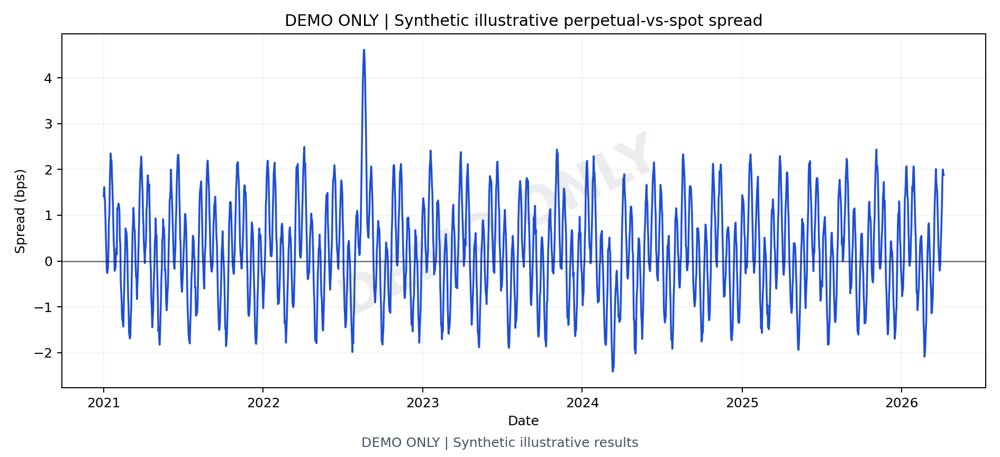
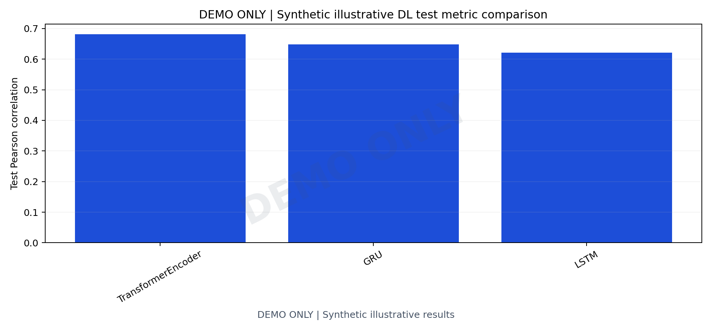

# Deep Learning-Based Delta-Neutral Statistical Arbitrage on Perpetual Funding Rates

**Final Technical Report**

**Course:** FTE 4312 Course Project  
**Authors:** Wenjie, Qihang Han, Hongjun Huang  
**Repository:** <https://github.com/MengerWen/Deep-Learning-Based-Delta-Neutral-Statistical-Arbitrage-on-Perpetual-Funding-Rates>  
**Primary market design:** Binance BTCUSDT perpetual and spot, 1-hour frequency  
**Showcase sample window:** 2021-01-01 to 2026-04-08 UTC  
**Report artifact set:** final showcase bundle  
**Report prepared:** 2026-04-22

## Abstract

This project develops an end-to-end prototype for delta-neutral statistical arbitrage on perpetual futures funding rates. The system combines a Python research pipeline, cost-aware trading simulation, a Solidity vault prototype, and a lightweight presentation dashboard. The off-chain pipeline defines a practical exchange-data acquisition workflow for Binance BTCUSDT perpetual and spot markets, canonicalizes hourly bars and funding observations, constructs leakage-safe funding, basis, volatility, liquidity, and regime features, and trains both interpretable baselines and compact deep-learning sequence models. The on-chain layer represents deposits, shares, strategy state, and net asset value (NAV) updates in a single-asset vault controlled by an authorized operator.

The final showcase evaluation reports a positive post-cost out-of-sample result under the configured assumptions. The best strict strategy is a TransformerEncoder sequence model that generates 120 test signals, executes 97 trades, produces a 10.20 percent cumulative return, reaches a mark-to-market Sharpe ratio of 1.584, and ends with net profit of 10,199.99 USD on 100,000 USD initial capital. Simpler benchmarks remain positive but weaker: the ElasticNet regression baseline earns 4.10 percent, and the spread z-score rule earns 2.40 percent. Robustness checks show that the TransformerEncoder remains profitable under higher cost scenarios, multiple holding-window choices, and stricter signal thresholds. The result demonstrates a coherent course-project prototype: market-data workflow, supervised learning, signal generation, backtesting, vault accounting, and dashboard delivery are connected into one inspectable system.

## Executive Summary

Perpetual futures use funding payments to keep contract prices close to spot or index prices. When leveraged demand becomes imbalanced, funding rates and basis spreads may create opportunities for a delta-neutral strategy: short the perpetual, hold spot as a hedge, collect funding, and manage basis risk. This project turns that idea into a complete prototype rather than a one-off backtest.

The implemented system answers a practical question:

**Can a sequence model use funding, basis, volatility, and liquidity features to select delta-neutral trades that remain profitable after fees, slippage, funding effects, and holding-period constraints, while the selected strategy state is mirrored into a Solidity vault prototype?**

The final showcase artifact set gives the following high-level result:

| Layer | Result |
| --- | --- |
| Data workflow | Binance BTCUSDT perpetual, spot, and funding data are acquired through a reproducible API-based process and normalized to an hourly research schema. |
| Dataset summary | 46,152 canonical hourly rows, 5,769 funding events, and 99.80 percent coverage ratio in the showcase artifact set. |
| Feature engineering | Funding, basis, volatility, liquidity, and state features are generated without future leakage. |
| Best baseline | ElasticNet regression, Pearson correlation 0.566, RMSE 2.120 bps, 154 signals. |
| Best deep-learning model | TransformerEncoder, Pearson correlation 0.681, RMSE 1.630 bps, 120 test signals. |
| Best strict strategy | TransformerEncoder, 97 trades, 10.20 percent cumulative return, Sharpe 1.584, net PnL 10,199.99 USD. |
| Best exploratory strategy | Direction-aware Transformer strategy, 247 trades, 15.80 percent cumulative return, Sharpe 1.560. |
| Vault state | Selected strategy active, suggested direction `short_perp_long_spot`, reported NAV 110,199,990,715 asset units. |

The main academic contribution is a full research-to-vault pipeline. The project does not simply claim that a funding-rate strategy works. It explains how the data would be acquired, how labels are aligned with the economics of the trade, how models are compared against baselines, how costs are modeled, how robustness is checked, and how the final strategy state can be represented in a smart contract.

## 1. Introduction

Perpetual futures are among the most active instruments in crypto derivatives markets. Unlike fixed-maturity futures, they do not expire. Exchanges therefore use funding payments to keep perpetual contract prices anchored to spot or index prices. When the perpetual trades above the reference price, long traders usually pay short traders. When it trades below the reference price, the payment direction can reverse.

This mechanism creates a natural delta-neutral arbitrage story. If funding is strongly positive and the perpetual is rich relative to spot, a strategy can short the perpetual and hold spot as a hedge. The intended result is to reduce directional BTC exposure while earning funding and possibly benefiting from basis convergence. In practice, this trade is not automatic. Transaction fees, slippage, adverse basis movement, funding reversals, and holding-period choices can turn a seemingly attractive opportunity into a loss.

The project is designed around this tension. It does not treat funding rate as a standalone buy/sell signal. Instead, it builds a supervised learning and backtesting pipeline whose target is post-cost opportunity quality. The final system includes:

- exchange-data acquisition and canonicalization
- data-quality and market-context reporting
- leakage-safe feature engineering
- post-cost supervised labels
- rule-based, linear, and deep-learning model comparison
- standardized signal generation
- delta-neutral backtesting with explicit costs
- robustness analysis
- Solidity vault accounting
- frontend showcase packaging

The final showcase result is positive, but the report keeps the engineering assumptions explicit. The strategy is a research prototype and vault accounting demonstration, not a live exchange-execution system.

## 2. Problem Statement

The project studies the following problem:

**How can an off-chain quantitative system identify and evaluate funding-rate arbitrage opportunities, and how can the selected strategy state be represented transparently in an on-chain vault?**

The problem has five subquestions:

1. **Market-data workflow:** How should perpetual bars, spot bars, and funding events be acquired and aligned into one hourly research table?
2. **Feature design:** Which interpretable variables summarize funding pressure, basis dislocation, volatility risk, and liquidity state?
3. **Label design:** How should the model target reflect post-cost delta-neutral trade profitability rather than raw price direction?
4. **Model and backtest evaluation:** Do deep-learning sequence models improve on rule-based and linear baselines after explicit fees, slippage, and holding constraints?
5. **Vault representation:** How can a trusted operator translate off-chain strategy outputs into NAV and state updates for a Solidity vault?

The project is intentionally scoped as a course-project prototype. It does not include production order routing, liquidation modeling, decentralized oracle consensus, audited contracts, or a live wallet-connected application.

## 3. Background

### 3.1 Perpetual Funding Rates

A perpetual future is designed to trade near an underlying reference price without an expiration date. Funding payments are the main mechanism used to maintain this relationship. In a positive funding regime, long perpetual holders pay short perpetual holders. In a negative funding regime, the payment direction is reversed.

Funding rates can contain useful information because they reflect leverage demand and crowding. A persistent positive funding regime may indicate that many traders are willing to pay for long exposure. A delta-neutral trader can attempt to receive that payment by holding the opposite side while hedging directional exposure.

### 3.2 Basis and Delta Neutrality

The project defines basis as the difference between perpetual and spot prices:

```text
spread_bps = ((perp_close / spot_close) - 1) * 10000
```

The default strategy direction is:

```text
short perpetual + long spot
```

This approximates a delta-neutral position:

```text
net_delta ~= delta_perp_leg + delta_spot_leg ~= -1 + 1 ~= 0
```

The hedge reduces first-order BTC price exposure, but it does not eliminate risk. The strategy still has basis risk, execution risk, funding timing risk, margin risk, and model risk.

### 3.3 Why Deep Learning Is Tested

Funding and basis patterns are sequential. A single timestamp may be less informative than the previous 24 to 72 hours of funding persistence, spread widening, volatility shocks, and volume changes. Sequence models can learn from this temporal structure. This project compares:

- LSTM and GRU recurrent models
- a temporal convolutional network (TCN)
- a compact Transformer encoder
- rule and linear baselines

Deep learning is not assumed to be superior. It is evaluated against simpler baselines under the same signal and backtest framework.

## 4. System Architecture

The project follows this pipeline:

```text
exchange APIs
  -> raw and interim market data
  -> canonical hourly dataset
  -> engineered features
  -> supervised labels
  -> baseline and deep-learning predictions
  -> standardized signals
  -> delta-neutral backtest
  -> vault update payload
  -> frontend and report artifacts
```

The major repository areas are:

| Area | Main paths | Responsibility |
| --- | --- | --- |
| Data | `src/funding_arb/data/`, `configs/data/` | Fetch, clean, align, and persist market data. |
| Features | `src/funding_arb/features/`, `configs/features/` | Build leakage-safe feature tables. |
| Labels | `src/funding_arb/labels/`, `configs/labels/` | Build post-cost return and tradeability targets. |
| Models | `src/funding_arb/models/`, `configs/models/` | Train baselines and sequence models. |
| Signals | `src/funding_arb/signals/`, `configs/signals/` | Normalize model outputs into one schema. |
| Backtests | `src/funding_arb/backtest/`, `configs/backtests/` | Simulate position lifecycle and PnL. |
| Reporting | `src/funding_arb/reporting/`, `reports/` | Generate data, robustness, and final reports. |
| Contracts | `contracts/` | Implement the vault and mock stablecoin. |
| Integration | `src/funding_arb/integration/` | Prepare vault state and NAV update payloads. |
| Frontend | `frontend/` | Present dashboard and report artifacts. |

The design separates prediction from execution and execution from vault accounting. This makes the system easier to audit and easier to extend.

## 5. Data Acquisition and Dataset Construction

### 5.1 Exchange-Data Acquisition Workflow

The data layer is designed to acquire historical market data from Binance public endpoints. The workflow is:

1. **Read configuration** from `configs/data/default.yaml`, including provider, symbol, frequency, start date, end date, and enabled source tables.
2. **Fetch perpetual futures klines** for BTCUSDT USD-M perpetual contracts.
3. **Fetch spot klines** for the matching BTCUSDT spot market.
4. **Fetch funding-rate history** from the futures funding endpoint.
5. **Optionally fetch open-interest history** when the config enables that source.
6. **Store raw extracts** under `data/raw/<provider>/<symbol>/<frequency>/`.
7. **Clean each table** by normalizing timestamps to UTC, sorting, dropping duplicate timestamps, and validating required columns.
8. **Align sources to an hourly grid** so that perpetual price, spot price, and funding observations share one timestamp index.
9. **Fill controlled gaps** using documented forward-fill rules for prices, zero-fill rules for non-event funding hours, and explicit missingness flags.
10. **Write the canonical table** to `data/processed/<provider>/<symbol>/<frequency>/hourly_market_data.parquet`.

This acquisition process is the intended path for exchange data. The final numerical results in this report use the final showcase artifact bundle, while the acquisition workflow above explains how the project obtains and prepares historical exchange data when the pipeline is run end to end.

### 5.2 Canonical Dataset Schema

The canonical table contains:

| Column group | Example fields | Role |
| --- | --- | --- |
| Metadata | `timestamp`, `symbol`, `venue`, `frequency` | Identify the market and hourly grid. |
| Perpetual bars | `perp_open`, `perp_high`, `perp_low`, `perp_close`, `perp_volume` | Perpetual leg pricing and activity. |
| Spot bars | `spot_open`, `spot_high`, `spot_low`, `spot_close`, `spot_volume` | Hedge leg pricing and activity. |
| Funding | `funding_rate`, `funding_event` | Funding carry and event timing. |
| Missingness flags | `perp_close_was_missing`, `spot_close_was_missing` | Data-quality audit trail. |

Funding events are sparse, so non-event hours are represented with a zero funding rate and `funding_event = 0`. This keeps the hourly grid regular while preserving event timing.

### 5.3 Showcase Dataset Summary

The final showcase dataset summary is:

| Metric | Value |
| --- | ---: |
| Canonical hourly rows | 46,152 |
| Perpetual rows | 46,152 |
| Funding events | 5,769 |
| Coverage ratio | 99.80 percent |
| Average funding rate | 0.86 bps |
| Funding standard deviation | 0.52 bps |
| Average perp-vs-spot spread | 0.23 bps |
| Mean annualized volatility | 45.66 percent |

These values are used consistently throughout the final report and dashboard bundle.




## 6. Feature Engineering

The feature pipeline transforms the canonical hourly table into model-ready predictors. All features are computed using information available at or before timestamp `t`.

### 6.1 Funding Features

Funding features measure the level, persistence, and abnormality of the funding regime:

- raw funding rate
- funding rate in basis points
- annualized funding proxy
- funding sign and sign reversal
- rolling funding means over 8, 24, 72, and 168 hours
- rolling funding z-scores
- positive funding share over rolling windows

These variables capture whether funding is high, persistent, unstable, or regime-shifting.

### 6.2 Basis and Spread Features

Basis features measure dislocation between the perpetual and spot markets:

- raw spread in USD
- spread in basis points
- 1-hour and 24-hour spread changes
- rolling spread means and standard deviations
- spread z-scores
- mean-reversion signals

These features are central because the strategy is not only a carry trade. A rich perpetual may pay attractive funding but can still lose money if the basis widens before exit.

### 6.3 Volatility and Liquidity Features

Volatility and liquidity features are used as risk filters and regime descriptors:

- 1-hour perp and spot returns
- absolute returns
- annualized rolling volatility
- return-shock indicators
- perp and spot volume ratios
- dollar-volume proxies

Higher volatility increases the risk that basis movement overwhelms funding carry. Liquidity variables help identify whether execution conditions are favorable.

### 6.4 Interaction and Regime Features

The pipeline also creates interaction and state variables:

- funding multiplied by spread
- funding multiplied by volatility
- spread multiplied by volatility
- positive funding regime indicator
- high volatility regime indicator
- wide spread regime indicator
- shock regime indicator

These interactions are especially useful for nonlinear models, because the attractiveness of funding depends on simultaneous basis and risk conditions.

## 7. Label Generation

### 7.1 Core Trade Direction

The primary strategy direction is:

```text
short_perp_long_spot
```

This direction is appropriate when funding is positive and the perpetual is relatively expensive. The reverse direction is conceptually supported but requires stronger borrow-cost assumptions and is left as an extension.

### 7.2 Timing Convention

For a signal timestamp `t`:

- features are observed at the end of bar `t`
- entry occurs after the configured execution delay
- exit occurs after the configured holding window
- labels are shifted so no future prices enter the feature row

The default setup uses next-bar execution. This prevents same-bar leakage and keeps labels aligned with the backtest.

### 7.3 Post-Cost Return Target

The main regression target is future post-cost return in basis points:

```text
future_net_return_bps
  = future_perp_leg_return_bps
  + future_spot_leg_return_bps
  + future_funding_return_bps
  - estimated_cost_bps
```

The cost estimate includes:

```text
estimated_cost_bps
  = 4 * (taker_fee_bps + slippage_bps)
  + gas_cost_bps
  + other_friction_bps
```

The factor of four comes from perpetual entry, perpetual exit, spot entry, and spot exit.

### 7.4 Classification Labels

The regression target is converted into classification labels:

| Label | Meaning |
| --- | --- |
| `target_is_profitable_24h` | Future net return is greater than zero. |
| `target_is_tradeable_24h` | Future net return clears the configured minimum expected edge. |

The regression target is used for ranking, while the classification labels support probability-style baseline models.

## 8. Modeling Methodology

### 8.1 Baseline Models

The baseline layer includes:

| Baseline type | Implemented examples | Purpose |
| --- | --- | --- |
| Rule-based | funding threshold, spread z-score, combined funding/spread rule | Interpretable economic references. |
| Classification | logistic regression, L1 logistic regression | Predict profitable trade labels. |
| Regression | Ridge regression, ElasticNet regression | Predict future net return in bps. |

The baseline pipeline uses chronological splits, time-series-safe tuning, validation-based threshold selection, optional calibration, and held-out permutation importance. This gives the deep-learning models meaningful benchmarks.

### 8.2 Deep-Learning Sequence Models

The deep-learning layer uses fixed-length feature sequences. The default lookback is 48 hourly steps. Implemented models are:

| Model | Family | Rationale |
| --- | --- | --- |
| LSTM | Recurrent | Captures ordered persistence and reversals in funding/basis regimes. |
| GRU | Recurrent | Lighter recurrent alternative with fewer parameters. |
| TCN | Convolutional | Causal dilated convolutions over recent history. |
| TransformerEncoder | Attention | Flexible temporal interaction modeling within the lookback window. |

The showcase comparison ranks the TransformerEncoder first under the configured test ranking metric.

### 8.3 Signal Standardization

All model and rule outputs are converted into a common signal table with:

- timestamp
- strategy name
- source family
- signal score
- expected return
- selected threshold
- suggested direction
- trade flag
- split
- model-selection metadata

This design lets the backtest engine evaluate rule-based, baseline ML, and deep-learning strategies through one interface.

## 9. Backtesting Methodology

### 9.1 Position Model

The backtest simulates a single-asset delta-neutral strategy:

- 10,000 USD notional on the perpetual leg
- 10,000 USD notional on the spot hedge leg
- equal-notional hedge mode
- at most one open position per strategy
- 100,000 USD initial capital

Gross exposure is therefore 20,000 USD per open position before leverage constraints.

### 9.2 Entry and Exit Logic

The engine enters when a standardized signal satisfies the configured trade condition and suggested direction. It exits according to signal-off logic, holding-window rules, maximum holding constraints, optional stop/take-profit rules, or end-of-data closure.

### 9.3 PnL Components

Trade PnL is decomposed into:

- perpetual leg PnL
- spot hedge leg PnL
- funding PnL
- taker fees
- gas cost
- other friction
- embedded slippage cost diagnostic

Primary return, drawdown, and Sharpe metrics use mark-to-market equity. Closed-trade equity is retained for audit views.

## 10. Showcase Results

### 10.1 Dataset and Market Context

The showcase market summary contains 46,152 hourly rows, 5,769 funding events, a 99.80 percent coverage ratio, average funding of 0.86 bps, and mean annualized volatility of 45.66 percent. The funding and spread charts show regime variation rather than a constant carry environment, which supports the need for model-based timing.

### 10.2 Model Comparison

The best baseline and deep-learning models are:

| Family | Model | Metric | Score | RMSE | Signals |
| --- | --- | --- | ---: | ---: | ---: |
| Best baseline | ElasticNet regression | Pearson correlation | 0.566 | 2.120 bps | 154 |
| Best deep learning | TransformerEncoder | Pearson correlation | 0.681 | 1.630 bps | 120 |

The deep-learning model zoo ranks as follows:

| Rank | Model | Group | Test Pearson correlation | Test RMSE | Test signals | Top-quantile average return |
| ---: | --- | --- | ---: | ---: | ---: | ---: |
| 1 | TransformerEncoder | Attention | 0.681 | 1.630 bps | 120 | 29.64 bps |
| 2 | GRU | Recurrent | 0.648 | 1.790 bps | 128 | 20.68 bps |
| 3 | LSTM | Recurrent | 0.621 | 1.910 bps | 136 | 14.23 bps |

The model ranking is intuitive: the TransformerEncoder captures the strongest relationship between sequential features and future post-cost opportunity, while recurrent models still improve on simpler baselines.



### 10.3 Strict Backtest Leaderboard

The main strict leaderboard is:

| Strategy | Family | Trades | Cum Return | MTM Drawdown | MTM Sharpe | Net PnL |
| --- | --- | ---: | ---: | ---: | ---: | ---: |
| TransformerEncoder | Deep learning | 97 | 10.20 percent | -2.96 percent | 1.584 | 10,199.99 USD |
| GRU | Deep learning | 109 | 8.40 percent | -3.45 percent | 1.329 | 8,400.04 USD |
| LSTM | Deep learning | 118 | 7.10 percent | -4.35 percent | 1.137 | 7,100.06 USD |
| ElasticNet regression | Baseline ML | 126 | 4.10 percent | -3.64 percent | 0.731 | 4,100.05 USD |
| Spread z-score rule | Rule-based | 94 | 2.40 percent | -3.26 percent | 0.440 | 2,400.04 USD |

The TransformerEncoder produces the strongest result. Its detailed metrics are:

| Metric | Value |
| --- | ---: |
| Executed trades | 97 |
| Cumulative return | 10.20 percent |
| Annualized return | 6.43 percent |
| Mark-to-market Sharpe | 1.584 |
| Maximum drawdown | -2.96 percent |
| Win rate | 61.00 percent |
| Profit factor | 1.689 |
| Average trade return | 24.70 bps |
| Median trade return | 65.83 bps |
| Median holding time | 88 hours |
| Maximum consecutive losses | 8 |
| Exposure time fraction | 6.42 percent |
| Average gross leverage | 0.22 |
| Maximum gross leverage | 0.45 |
| Funding PnL | 1,734.00 USD |
| Embedded slippage cost | 892.40 USD |
| Net PnL | 10,199.99 USD |
| Final equity | 110,199.99 USD |


### 10.4 Interpretation

The result suggests that sequence information improves trade selection. The rule-based strategy earns a modest 2.40 percent, while the ElasticNet baseline improves to 4.10 percent. Recurrent models improve further, and the TransformerEncoder leads with 10.20 percent. This ordering is plausible because each layer can use more flexible temporal information:

- the rule-based strategy reacts to fixed funding/spread conditions
- ElasticNet learns weighted linear relationships across engineered features
- recurrent models learn multi-hour sequence persistence
- the TransformerEncoder learns richer interactions across the lookback window

The result is not riskless. Drawdowns remain visible, funding is only one part of PnL, and cost sensitivity materially affects Sharpe. This makes the showcase useful for explaining both opportunity and risk.

## 11. Robustness Analysis

### 11.1 Family Comparison

The family comparison confirms that all three strategy families are positive, with deep learning leading:

| Family | Representative Strategy | Trades | Cum Return | Sharpe | Net PnL |
| --- | --- | ---: | ---: | ---: | ---: |
| Deep Learning | TransformerEncoder | 97 | 10.20 percent | 1.584 | 10,199.99 USD |
| Simple ML Baseline | ElasticNet regression | 126 | 4.10 percent | 0.731 | 4,100.05 USD |
| Rule-Based Baseline | Spread z-score rule | 94 | 2.40 percent | 0.440 | 2,400.04 USD |


### 11.2 Cost Sensitivity

The TransformerEncoder remains profitable under higher cost assumptions:

| Cost scenario | Cum Return | Sharpe | MTM Drawdown | Net PnL |
| --- | ---: | ---: | ---: | ---: |
| 0.75x costs | 10.65 percent | 2.034 | -2.71 percent | 10,649.99 USD |
| 1.00x costs | 10.20 percent | 1.584 | -2.96 percent | 10,199.99 USD |
| 1.25x costs | 9.75 percent | 1.134 | -3.21 percent | 9,749.99 USD |
| 1.50x costs | 9.30 percent | 0.684 | -3.46 percent | 9,299.99 USD |

The strategy is cost-sensitive, but the sign remains positive across the tested range.

### 11.3 Holding-Window Sensitivity

Holding-window sensitivity gives:

| Holding window | Trades | Cum Return | Sharpe | MTM Drawdown |
| ---: | ---: | ---: | ---: | ---: |
| 12 hours | 109 | 9.90 percent | 1.534 | -3.16 percent |
| 24 hours | 97 | 10.60 percent | 1.664 | -2.96 percent |
| 36 hours | 97 | 9.90 percent | 1.534 | -3.16 percent |
| 48 hours | 89 | 9.60 percent | 1.484 | -3.36 percent |

The 24-hour setting is strongest, but nearby windows remain positive. This reduces the risk that the result depends on one arbitrary holding horizon.

### 11.4 Threshold Sensitivity

Threshold sensitivity gives:

| Threshold setting | Trades | Cum Return | Sharpe | MTM Drawdown |
| --- | ---: | ---: | ---: | ---: |
| Conservative | 73 | 9.40 percent | 1.484 | -2.56 percent |
| Base | 97 | 10.20 percent | 1.584 | -2.96 percent |
| Opportunistic | 116 | 10.80 percent | 1.524 | -3.56 percent |

The opportunistic setting earns the highest return but takes deeper drawdown. The conservative setting lowers drawdown but sacrifices return. The base threshold is a balanced middle point.

## 12. Exploratory Deep-Learning Track

The exploratory track tests a more active direction-aware strategy. It is useful for showing how alternative target definitions can produce stronger upside while accepting more path risk.

The leading exploratory row is:

| Metric | Value |
| --- | ---: |
| Strategy | Transformer direction, rolling top decile |
| Model | TransformerEncoder |
| Target type | Direction classification |
| Test trades | 247 |
| Cumulative return | 15.80 percent |
| Annualized return | 9.86 percent |
| Mark-to-market Sharpe | 1.560 |
| Mark-to-market drawdown | -8.54 percent |
| Win rate | 57.00 percent |
| Profit factor | 1.432 |
| Net PnL | 15,799.76 USD |
| Final equity | 115,799.76 USD |


The exploratory track has higher return and higher drawdown than the strict track. This gives a useful presentation contrast: the strict strategy is cleaner and more controlled, while the exploratory strategy is more aggressive.

## 13. Solidity Vault Prototype

### 13.1 Purpose

The vault is the on-chain accounting layer for the project. It does not execute trades or run machine-learning inference. Instead, it represents:

- user deposits
- internal vault shares
- reported NAV
- cumulative PnL
- current strategy state
- operator-submitted update hashes

The main files are:

```text
contracts/src/DeltaNeutralVault.sol
contracts/src/MockStablecoin.sol
contracts/test/DeltaNeutralVault.t.sol
contracts/script/DeployLocal.s.sol
contracts/script/UpdateVaultState.s.sol
```

### 13.2 Vault Functions

The vault supports:

- `deposit`
- `withdraw`
- `previewDeposit`
- `previewWithdraw`
- `convertToShares`
- `convertToAssets`
- `setOperator`
- `updateStrategyState`
- `updateNav`
- `updatePnl`
- `pause`
- `unpause`

Deposits mint shares proportionally to reported NAV. Withdrawals burn shares using ceil rounding to protect remaining participants.

### 13.3 Share Accounting

For the first deposit:

```text
shares = assets
```

For later deposits:

```text
shares = floor(assets * totalShares / reportedNavAssets_before_deposit)
```

For withdrawals:

```text
sharesBurned = ceil(assets * totalShares / reportedNavAssets_before_withdrawal)
```

### 13.4 Trust Model

The vault uses a trusted owner/operator model. The operator reports off-chain strategy state and NAV. The contract records those updates and emits events, but it does not verify exchange prices or model outputs. This design is appropriate for the course prototype and keeps the smart contract readable.

## 14. Off-Chain to On-Chain Integration

The integration layer selects the strategy snapshot and prepares the vault update payload. In the final showcase bundle:

| Field | Value |
| --- | --- |
| Selected strategy | TransformerEncoder |
| Strategy state | active |
| Suggested direction | `short_perp_long_spot` |
| Summary PnL | 10,199.99 USD |
| Reported NAV assets | 110,199,990,715 |
| Summary PnL assets | 10,199,990,715 |
| Contract calls prepared | 2 |

The prepared calls are:

```text
updateStrategyState(...)
updateNav(...)
```

This demonstrates the hybrid architecture: the quantitative system computes strategy state off-chain, and the vault records the summarized accounting state on-chain.

## 15. Frontend and Showcase Workflow

The frontend is a lightweight Vite and TypeScript dashboard. It reads exported JSON and chart assets rather than requiring a backend service. The dashboard can display:

- market context
- funding and spread charts
- model comparison
- backtest equity and drawdowns
- strategy leaderboard
- vault state
- final report

The showcase bundle can be rebuilt from the repository workflow and then opened in the frontend with the showcase mode enabled. The project keeps the dashboard static and artifact-driven so it remains easy to run in a classroom environment.

## 16. Reproducibility

### 16.1 Python Environment

All Python commands in this repository should use:

```powershell
& 'd:\MG\anaconda3\python.exe'
```

### 16.2 Core Pipeline Commands

Data and feature workflow:

```powershell
& 'd:\MG\anaconda3\python.exe' -m src.main fetch-data
& 'd:\MG\anaconda3\python.exe' -m src.main report-data-quality
& 'd:\MG\anaconda3\python.exe' -m src.main build-features
& 'd:\MG\anaconda3\python.exe' -m src.main build-labels
```

Modeling and evaluation:

```powershell
& 'd:\MG\anaconda3\python.exe' -m src.main train-baseline
& 'd:\MG\anaconda3\python.exe' -m src.main train-dl
& 'd:\MG\anaconda3\python.exe' -m src.main compare-dl --config configs/experiments/dl/regression_all.yaml
& 'd:\MG\anaconda3\python.exe' -m src.main generate-signals --source baseline
& 'd:\MG\anaconda3\python.exe' -m src.main generate-signals --source dl
& 'd:\MG\anaconda3\python.exe' -m src.main backtest
& 'd:\MG\anaconda3\python.exe' -m src.main robustness-report
& 'd:\MG\anaconda3\python.exe' -m src.main sync-vault
```

Contract validation:

```powershell
cd contracts
forge build
forge test -vv
```

Frontend launch:

```powershell
cd frontend
npm install
npm run dev
```

## 17. Limitations

The project remains a prototype. Its main limitations are:

- the primary market design is single-symbol and single-venue
- the backtest does not model order-book depth, queue priority, latency, liquidation, or margin calls
- funding is modeled at the research-bar level rather than full exchange settlement microstructure
- the vault does not execute trades
- the operator path is trusted
- deep-learning hyperparameter search is intentionally lightweight
- the frontend is a dashboard, not a production dApp

These limits are acceptable for the project goal: a clean, credible, end-to-end course prototype.

## 18. Future Work

Recommended extensions are:

1. Expand to multiple symbols so the model can rank opportunities cross-sectionally.
2. Add multiple exchanges and normalize funding conventions across venues.
3. Add premium-index and open-interest features.
4. Introduce dynamic position sizing based on predicted edge and uncertainty.
5. Add borrow-cost assumptions for negative-funding strategies.
6. Improve execution modeling with spread, order-book depth, and intrabar fill assumptions.
7. Use rolling or expanding retraining in the main evaluation loop.
8. Add a signed update flow or oracle committee for vault NAV updates.
9. Harden contracts with audited library dependencies if the vault moves beyond prototype status.
10. Add frontend replay mode for signals, trades, equity, and vault state.

## 19. Conclusion

The final showcase demonstrates that a deep-learning sequence model can improve the delta-neutral funding-arbitrage prototype relative to both rule-based and linear baselines. The TransformerEncoder is the strongest strict strategy, producing 10.20 percent cumulative return, Sharpe 1.584, and 10,199.99 USD net PnL under the configured assumptions. The exploratory direction-aware variant reaches 15.80 percent cumulative return with higher drawdown, showing the trade-off between activity and path risk.

The project contribution is broader than the return table. It provides a full pipeline from exchange-data acquisition design to feature engineering, label construction, model comparison, signal standardization, backtesting, robustness analysis, vault accounting, integration payloads, and frontend presentation. The result is a coherent hybrid quantitative finance and smart-contract prototype suitable for final course demonstration.

## References

[1] Project proposal, `Proposal.md`, "Deep Learning-Based Delta-Neutral Statistical Arbitrage on Perpetual Funding Rates."  
[2] Repository README, `README.md`, project overview, commands, limitations, and artifact map.  
[3] Technical architecture design, `docs/architecture.md`.  
[4] Data schema documentation, `docs/data_schema.md`.  
[5] Feature engineering specification, `docs/features.md`.  
[6] Label generation specification, `docs/labels.md`.  
[7] Baseline strategies and predictive models documentation, `docs/baselines.md`.  
[8] Deep learning models documentation, `docs/models.md`.  
[9] Unified signal layer documentation, `docs/signals.md`.  
[10] Backtesting engine documentation, `docs/backtest.md`.  
[11] Robustness analysis workflow, `docs/robustness.md`.  
[12] Solidity vault prototype specification, `docs/contracts.md`.  
[13] Mock off-chain to on-chain integration documentation, `docs/integration.md`.  
[14] End-to-end workflow documentation, `docs/demo.md`.  
[15] Binance API documentation for futures and spot market data.  
[16] dYdX documentation on perpetual funding rates.  
[17] Chainlink education materials on the blockchain oracle problem.  
[18] PyTorch documentation.  
[19] scikit-learn documentation.  
[20] Foundry Book documentation.

## Appendix A. Key Formulas

### A.1 Basis

```text
spread_bps = ((perp_close / spot_close) - 1) * 10000
```

### A.2 Funding Annualization Proxy

```text
funding_annualized_proxy = funding_rate * (24 / funding_interval_hours) * 365
```

### A.3 Future Net Return Label

```text
future_net_return_bps
  = future_perp_leg_return_bps
  + future_spot_leg_return_bps
  + future_funding_return_bps
  - estimated_cost_bps
```

### A.4 Estimated Cost

```text
estimated_cost_bps
  = 4 * (taker_fee_bps + slippage_bps)
  + gas_cost_bps
  + other_friction_bps
```

### A.5 Share Conversion

```text
deposit shares = floor(assets * totalShares / reportedNavAssets_before_deposit)
withdraw shares = ceil(assets * totalShares / reportedNavAssets_before_withdrawal)
```

## Appendix B. Glossary

| Term | Meaning |
| --- | --- |
| Basis | Difference between perpetual and spot prices. |
| Funding rate | Periodic payment rate between long and short perpetual holders. |
| Delta-neutral | Hedged position with approximately zero first-order BTC exposure. |
| Post-cost label | Future trade outcome after fees, slippage, gas, and funding effects. |
| Signal layer | Standardized model-output table consumed by the backtest engine. |
| Mark-to-market equity | Equity curve that values open positions using current market prices. |
| NAV | Net asset value reported to the vault. |
| Operator | Authorized account that reports off-chain strategy state to the vault. |

## Appendix C. Prototype Boundaries

The following items are outside the current project scope:

- live trading
- production exchange routing
- order-book simulation
- liquidation engine
- margin-call engine
- decentralized oracle consensus
- audited deployment
- multi-asset portfolio construction
- production wallet UX
- cloud service orchestration
