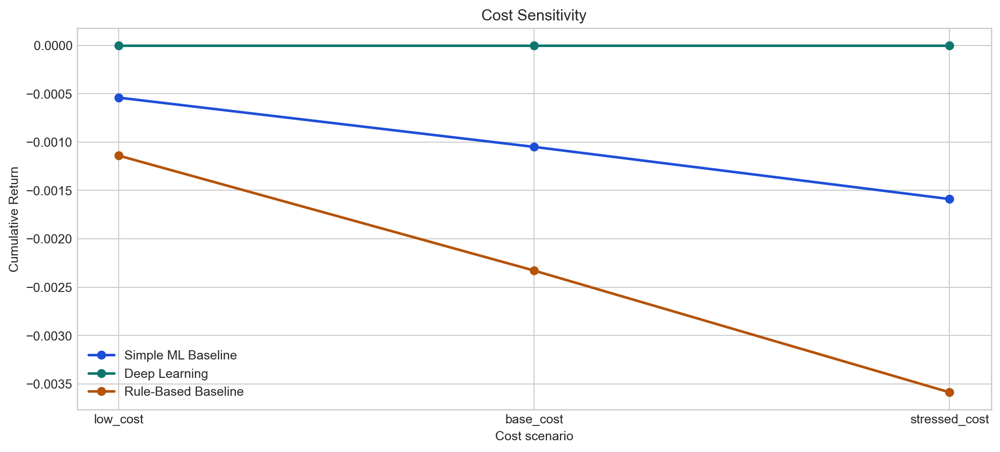
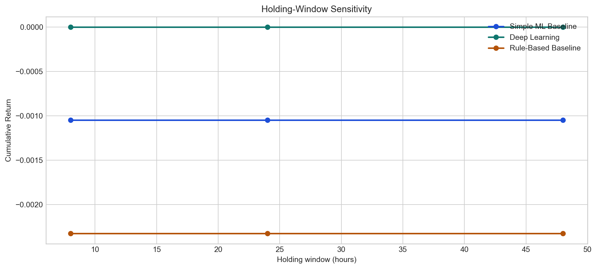
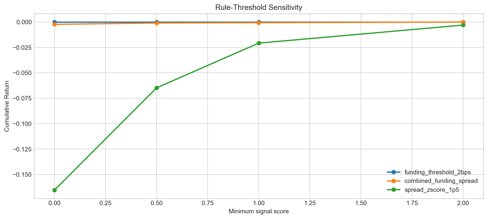
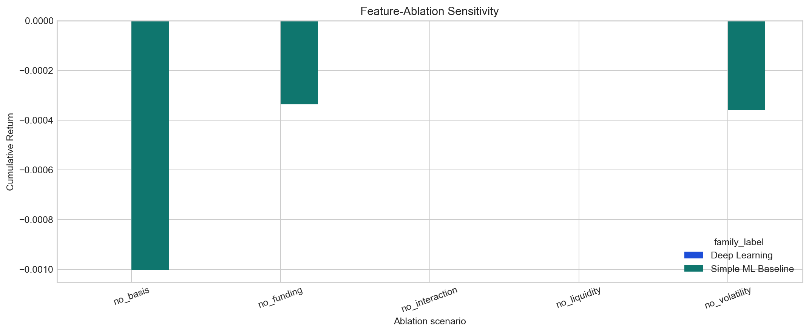

# Robustness Report

## Overview

- Symbol: `BTCUSDT`
- Provider: `binance`
- Venue: `binance`
- Frequency: `1h`
- Evaluation split(s): `['test']`
- Ranking metric: `cumulative_return`
- Best family under the base test-period configuration: `Deep Learning`

## Method Notes

- Cost and holding-window sweeps reuse the same standardized signals and the same backtest engine, so the accounting logic stays identical to the main strategy evaluation.
- Rule-threshold sensitivity is implemented by tightening or relaxing `min_signal_score` in the standardized rule-based signal layer. This measures robustness to stronger or weaker entry confidence, not a full redefinition of the raw heuristic itself.
- Feature ablation retrains only predictive baselines and the deep-learning model, regenerates their signals, and reruns the same backtest logic. Rule-based heuristics are excluded from ablation because they do not consume the engineered feature matrix.
- The comparison tables preserve baseline-specific metadata such as `source_subtype`, `prediction_mode`, `calibration_method`, `signal_threshold`, and `threshold_objective`, so the report stays aligned with the upgraded baseline pipeline rather than collapsing everything into one generic ML bucket.

## Family Comparison

| experiment        | family_name   | family_label        | family_source_name   | scenario_name   |   scenario_order | run_name                             | strategy_name           | source      | source_subtype   | task           | signal_threshold   | signal_threshold_mode   | threshold_objective   | prediction_mode   | calibration_method   | feature_importance_method   | selected_hyperparameters_json   |   trade_count |   active_position_count |   cumulative_return |   annualized_return |   sharpe_ratio |   max_drawdown |   win_rate |   average_trade_return_bps |   average_trade_pnl_usd |   average_holding_hours |   total_turnover_usd |   total_fees_usd |   total_gas_cost_usd |   total_other_friction_usd |   total_funding_pnl_usd |   total_gross_pnl_usd |   total_net_pnl_usd |   final_equity_usd | strategy_detail_label   | scenario_label   |
|:------------------|:--------------|:--------------------|:---------------------|:----------------|-----------------:|:-------------------------------------|:------------------------|:------------|:-----------------|:---------------|:-------------------|:------------------------|:----------------------|:------------------|:---------------------|:----------------------------|:--------------------------------|--------------:|------------------------:|--------------------:|--------------------:|---------------:|---------------:|-----------:|---------------------------:|------------------------:|------------------------:|---------------------:|-----------------:|---------------------:|---------------------------:|------------------------:|----------------------:|--------------------:|-------------------:|:------------------------|:-----------------|
| family_comparison | baseline_ml   | Simple ML Baseline  | baseline-ml          | base            |                1 | family_comparison_baseline_ml_base   | logistic_regression     | baseline-ml | baseline_ml      | classification |                    | missing                 |                       |                   |                      |                             | {}                              |             3 |                       3 |           -0.00105  |           -0.001028 |       -1.70852 |      -0.00105  |          0 |                   -35.0034 |                -35.0034 |                       1 |               120000 |               60 |                    6 |                          0 |                       0 |              -39.0101 |            -105.01  |            99895   | baseline_ml             | base             |
| family_comparison | deep_learning | Deep Learning       | dl                   | base            |                1 | family_comparison_deep_learning_base | lstm                    | dl          | deep_learning    | regression     |                    | missing                 |                       |                   |                      |                             | {}                              |             0 |                       0 |            0        |            0        |        0       |       0        |          0 |                     0      |                  0      |                       0 |                    0 |                0 |                    0 |                          0 |                       0 |                0      |               0     |           100000   | deep_learning           | base             |
| family_comparison | rule_based    | Rule-Based Baseline | rules                | base            |                1 | family_comparison_rule_based_base    | combined_funding_spread | rules       | rule_based       | classification |                    | missing                 |                       |                   |                      |                             | {}                              |             7 |                       7 |           -0.002328 |           -0.002279 |       -2.61808 |      -0.002328 |          0 |                   -33.2594 |                -33.2594 |                       1 |               280000 |              140 |                   14 |                          0 |                       0 |              -78.8157 |            -232.816 |            99767.2 | rule_based              | base             |

## Cost Sensitivity

| experiment       | family_name   | family_label        | family_source_name   | scenario_name   |   scenario_order | run_name                                     | strategy_name           | source      | source_subtype   | task           | signal_threshold   | signal_threshold_mode   | threshold_objective   | prediction_mode   | calibration_method   | feature_importance_method   | selected_hyperparameters_json   |   trade_count |   active_position_count |   cumulative_return |   annualized_return |   sharpe_ratio |   max_drawdown |   win_rate |   average_trade_return_bps |   average_trade_pnl_usd |   average_holding_hours |   total_turnover_usd |   total_fees_usd |   total_gas_cost_usd |   total_other_friction_usd |   total_funding_pnl_usd |   total_gross_pnl_usd |   total_net_pnl_usd |   final_equity_usd | strategy_detail_label   | name          |   taker_fee_bps |   slippage_bps |   gas_cost_usd |   other_friction_bps |
|:-----------------|:--------------|:--------------------|:---------------------|:----------------|-----------------:|:---------------------------------------------|:------------------------|:------------|:-----------------|:---------------|:-------------------|:------------------------|:----------------------|:------------------|:---------------------|:----------------------------|:--------------------------------|--------------:|------------------------:|--------------------:|--------------------:|---------------:|---------------:|-----------:|---------------------------:|------------------------:|------------------------:|---------------------:|-----------------:|---------------------:|---------------------------:|------------------------:|----------------------:|--------------------:|-------------------:|:------------------------|:--------------|----------------:|---------------:|---------------:|---------------------:|
| cost_sensitivity | baseline_ml   | Simple ML Baseline  | baseline-ml          | base_cost       |                2 | cost_sensitivity_baseline_ml_base_cost       | logistic_regression     | baseline-ml | baseline_ml      | classification |                    | missing                 |                       |                   |                      |                             | {}                              |             3 |                       3 |           -0.00105  |           -0.001028 |       -1.70852 |      -0.00105  |          0 |                   -35.0034 |                -35.0034 |                       1 |               120000 |               60 |                    6 |                          0 |                       0 |              -39.0101 |           -105.01   |            99895   | baseline_ml             | base_cost     |               5 |              3 |              2 |                    0 |
| cost_sensitivity | baseline_ml   | Simple ML Baseline  | baseline-ml          | low_cost        |                1 | cost_sensitivity_baseline_ml_low_cost        | logistic_regression     | baseline-ml | baseline_ml      | classification |                    | missing                 |                       |                   |                      |                             | {}                              |             3 |                       3 |           -0.000541 |           -0.00053  |       -1.69462 |      -0.000541 |          0 |                   -18.0346 |                -18.0346 |                       1 |               120000 |               36 |                    3 |                          0 |                       0 |              -15.1037 |            -54.1037 |            99945.9 | baseline_ml             | low_cost      |               3 |              1 |              1 |                    0 |
| cost_sensitivity | baseline_ml   | Simple ML Baseline  | baseline-ml          | stressed_cost   |                3 | cost_sensitivity_baseline_ml_stressed_cost   | logistic_regression     | baseline-ml | baseline_ml      | classification |                    | missing                 |                       |                   |                      |                             | {}                              |             3 |                       3 |           -0.001589 |           -0.001555 |       -1.71142 |      -0.001589 |          0 |                   -52.9722 |                -52.9722 |                       1 |               120000 |               84 |                    9 |                          3 |                       0 |              -62.9166 |           -158.917  |            99841.1 | baseline_ml             | stressed_cost |               7 |              5 |              3 |                    1 |
| cost_sensitivity | deep_learning | Deep Learning       | dl                   | base_cost       |                2 | cost_sensitivity_deep_learning_base_cost     | lstm                    | dl          | deep_learning    | regression     |                    | missing                 |                       |                   |                      |                             | {}                              |             0 |                       0 |            0        |            0        |        0       |       0        |          0 |                     0      |                  0      |                       0 |                    0 |                0 |                    0 |                          0 |                       0 |                0      |              0      |           100000   | deep_learning           | base_cost     |               5 |              3 |              2 |                    0 |
| cost_sensitivity | deep_learning | Deep Learning       | dl                   | low_cost        |                1 | cost_sensitivity_deep_learning_low_cost      | lstm                    | dl          | deep_learning    | regression     |                    | missing                 |                       |                   |                      |                             | {}                              |             0 |                       0 |            0        |            0        |        0       |       0        |          0 |                     0      |                  0      |                       0 |                    0 |                0 |                    0 |                          0 |                       0 |                0      |              0      |           100000   | deep_learning           | low_cost      |               3 |              1 |              1 |                    0 |
| cost_sensitivity | deep_learning | Deep Learning       | dl                   | stressed_cost   |                3 | cost_sensitivity_deep_learning_stressed_cost | lstm                    | dl          | deep_learning    | regression     |                    | missing                 |                       |                   |                      |                             | {}                              |             0 |                       0 |            0        |            0        |        0       |       0        |          0 |                     0      |                  0      |                       0 |                    0 |                0 |                    0 |                          0 |                       0 |                0      |              0      |           100000   | deep_learning           | stressed_cost |               7 |              5 |              3 |                    1 |
| cost_sensitivity | rule_based    | Rule-Based Baseline | rules                | base_cost       |                2 | cost_sensitivity_rule_based_base_cost        | combined_funding_spread | rules       | rule_based       | classification |                    | missing                 |                       |                   |                      |                             | {}                              |             7 |                       7 |           -0.002328 |           -0.002279 |       -2.61808 |      -0.002328 |          0 |                   -33.2594 |                -33.2594 |                       1 |               280000 |              140 |                   14 |                          0 |                       0 |              -78.8157 |           -232.816  |            99767.2 | rule_based              | base_cost     |               5 |              3 |              2 |                    0 |
| cost_sensitivity | rule_based    | Rule-Based Baseline | rules                | low_cost        |                1 | cost_sensitivity_rule_based_low_cost         | combined_funding_spread | rules       | rule_based       | classification |                    | missing                 |                       |                   |                      |                             | {}                              |             7 |                       7 |           -0.00114  |           -0.001116 |       -2.61699 |      -0.00114  |          0 |                   -16.2841 |                -16.2841 |                       1 |               280000 |               84 |                    7 |                          0 |                       0 |              -22.989  |           -113.989  |            99886   | rule_based              | low_cost      |               3 |              1 |              1 |                    0 |
| cost_sensitivity | rule_based    | Rule-Based Baseline | rules                | stressed_cost   |                3 | cost_sensitivity_rule_based_stressed_cost    | combined_funding_spread | rules       | rule_based       | classification |                    | missing                 |                       |                   |                      |                             | {}                              |             7 |                       7 |           -0.003586 |           -0.00351  |       -2.61827 |      -0.003586 |          0 |                   -51.2346 |                -51.2346 |                       1 |               280000 |              196 |                   21 |                          7 |                       0 |             -134.642  |           -358.642  |            99641.4 | rule_based              | stressed_cost |               7 |              5 |              3 |                    1 |

## Holding-Window Sensitivity

| experiment                 | family_name   | family_label        | family_source_name   | scenario_name   |   scenario_order | run_name                                          | strategy_name           | source      | source_subtype   | task           | signal_threshold   | signal_threshold_mode   | threshold_objective   | prediction_mode   | calibration_method   | feature_importance_method   | selected_hyperparameters_json   |   trade_count |   active_position_count |   cumulative_return |   annualized_return |   sharpe_ratio |   max_drawdown |   win_rate |   average_trade_return_bps |   average_trade_pnl_usd |   average_holding_hours |   total_turnover_usd |   total_fees_usd |   total_gas_cost_usd |   total_other_friction_usd |   total_funding_pnl_usd |   total_gross_pnl_usd |   total_net_pnl_usd |   final_equity_usd | strategy_detail_label   | name     |   holding_window_hours |   maximum_holding_hours |
|:---------------------------|:--------------|:--------------------|:---------------------|:----------------|-----------------:|:--------------------------------------------------|:------------------------|:------------|:-----------------|:---------------|:-------------------|:------------------------|:----------------------|:------------------|:---------------------|:----------------------------|:--------------------------------|--------------:|------------------------:|--------------------:|--------------------:|---------------:|---------------:|-----------:|---------------------------:|------------------------:|------------------------:|---------------------:|-----------------:|---------------------:|---------------------------:|------------------------:|----------------------:|--------------------:|-------------------:|:------------------------|:---------|-----------------------:|------------------------:|
| holding_window_sensitivity | baseline_ml   | Simple ML Baseline  | baseline-ml          | hold_24h        |                2 | holding_window_sensitivity_baseline_ml_hold_24h   | logistic_regression     | baseline-ml | baseline_ml      | classification |                    | missing                 |                       |                   |                      |                             | {}                              |             3 |                       3 |           -0.00105  |           -0.001028 |       -1.70852 |      -0.00105  |          0 |                   -35.0034 |                -35.0034 |                       1 |               120000 |               60 |                    6 |                          0 |                       0 |              -39.0101 |            -105.01  |            99895   | baseline_ml             | hold_24h |                     24 |                      48 |
| holding_window_sensitivity | baseline_ml   | Simple ML Baseline  | baseline-ml          | hold_48h        |                3 | holding_window_sensitivity_baseline_ml_hold_48h   | logistic_regression     | baseline-ml | baseline_ml      | classification |                    | missing                 |                       |                   |                      |                             | {}                              |             3 |                       3 |           -0.00105  |           -0.001028 |       -1.70852 |      -0.00105  |          0 |                   -35.0034 |                -35.0034 |                       1 |               120000 |               60 |                    6 |                          0 |                       0 |              -39.0101 |            -105.01  |            99895   | baseline_ml             | hold_48h |                     48 |                      72 |
| holding_window_sensitivity | baseline_ml   | Simple ML Baseline  | baseline-ml          | hold_8h         |                1 | holding_window_sensitivity_baseline_ml_hold_8h    | logistic_regression     | baseline-ml | baseline_ml      | classification |                    | missing                 |                       |                   |                      |                             | {}                              |             3 |                       3 |           -0.00105  |           -0.001028 |       -1.70852 |      -0.00105  |          0 |                   -35.0034 |                -35.0034 |                       1 |               120000 |               60 |                    6 |                          0 |                       0 |              -39.0101 |            -105.01  |            99895   | baseline_ml             | hold_8h  |                      8 |                      16 |
| holding_window_sensitivity | deep_learning | Deep Learning       | dl                   | hold_24h        |                2 | holding_window_sensitivity_deep_learning_hold_24h | lstm                    | dl          | deep_learning    | regression     |                    | missing                 |                       |                   |                      |                             | {}                              |             0 |                       0 |            0        |            0        |        0       |       0        |          0 |                     0      |                  0      |                       0 |                    0 |                0 |                    0 |                          0 |                       0 |                0      |               0     |           100000   | deep_learning           | hold_24h |                     24 |                      48 |
| holding_window_sensitivity | deep_learning | Deep Learning       | dl                   | hold_48h        |                3 | holding_window_sensitivity_deep_learning_hold_48h | lstm                    | dl          | deep_learning    | regression     |                    | missing                 |                       |                   |                      |                             | {}                              |             0 |                       0 |            0        |            0        |        0       |       0        |          0 |                     0      |                  0      |                       0 |                    0 |                0 |                    0 |                          0 |                       0 |                0      |               0     |           100000   | deep_learning           | hold_48h |                     48 |                      72 |
| holding_window_sensitivity | deep_learning | Deep Learning       | dl                   | hold_8h         |                1 | holding_window_sensitivity_deep_learning_hold_8h  | lstm                    | dl          | deep_learning    | regression     |                    | missing                 |                       |                   |                      |                             | {}                              |             0 |                       0 |            0        |            0        |        0       |       0        |          0 |                     0      |                  0      |                       0 |                    0 |                0 |                    0 |                          0 |                       0 |                0      |               0     |           100000   | deep_learning           | hold_8h  |                      8 |                      16 |
| holding_window_sensitivity | rule_based    | Rule-Based Baseline | rules                | hold_24h        |                2 | holding_window_sensitivity_rule_based_hold_24h    | combined_funding_spread | rules       | rule_based       | classification |                    | missing                 |                       |                   |                      |                             | {}                              |             7 |                       7 |           -0.002328 |           -0.002279 |       -2.61808 |      -0.002328 |          0 |                   -33.2594 |                -33.2594 |                       1 |               280000 |              140 |                   14 |                          0 |                       0 |              -78.8157 |            -232.816 |            99767.2 | rule_based              | hold_24h |                     24 |                      48 |
| holding_window_sensitivity | rule_based    | Rule-Based Baseline | rules                | hold_48h        |                3 | holding_window_sensitivity_rule_based_hold_48h    | combined_funding_spread | rules       | rule_based       | classification |                    | missing                 |                       |                   |                      |                             | {}                              |             7 |                       7 |           -0.002328 |           -0.002279 |       -2.61808 |      -0.002328 |          0 |                   -33.2594 |                -33.2594 |                       1 |               280000 |              140 |                   14 |                          0 |                       0 |              -78.8157 |            -232.816 |            99767.2 | rule_based              | hold_48h |                     48 |                      72 |
| holding_window_sensitivity | rule_based    | Rule-Based Baseline | rules                | hold_8h         |                1 | holding_window_sensitivity_rule_based_hold_8h     | combined_funding_spread | rules       | rule_based       | classification |                    | missing                 |                       |                   |                      |                             | {}                              |             7 |                       7 |           -0.002328 |           -0.002279 |       -2.61808 |      -0.002328 |          0 |                   -33.2594 |                -33.2594 |                       1 |               280000 |              140 |                   14 |                          0 |                       0 |              -78.8157 |            -232.816 |            99767.2 | rule_based              | hold_8h  |                      8 |                      16 |

## Rule Threshold Sensitivity

| experiment                 | family_name   | family_label        | family_source_name   | scenario_name   |   scenario_order | run_name                                        | strategy_name           | source   | source_subtype   | task           | signal_threshold   | signal_threshold_mode   | threshold_objective   | prediction_mode   | calibration_method   | feature_importance_method   | selected_hyperparameters_json   |   trade_count |   active_position_count |   cumulative_return |   annualized_return |   sharpe_ratio |   max_drawdown |   win_rate |   average_trade_return_bps |   average_trade_pnl_usd |   average_holding_hours |   total_turnover_usd |   total_fees_usd |   total_gas_cost_usd |   total_other_friction_usd |   total_funding_pnl_usd |   total_gross_pnl_usd |   total_net_pnl_usd |   final_equity_usd | strategy_detail_label   | name      |   min_signal_score | min_confidence   | min_expected_return_bps   |
|:---------------------------|:--------------|:--------------------|:---------------------|:----------------|-----------------:|:------------------------------------------------|:------------------------|:---------|:-----------------|:---------------|:-------------------|:------------------------|:----------------------|:------------------|:---------------------|:----------------------------|:--------------------------------|--------------:|------------------------:|--------------------:|--------------------:|---------------:|---------------:|-----------:|---------------------------:|------------------------:|------------------------:|---------------------:|-----------------:|---------------------:|---------------------------:|------------------------:|----------------------:|--------------------:|-------------------:|:------------------------|:----------|-------------------:|:-----------------|:--------------------------|
| rule_threshold_sensitivity | rule_based    | Rule-Based Baseline | rules                | score_0         |                1 | rule_threshold_sensitivity_rule_based_score_0   | funding_threshold_2bps  | rules    | rule_based       | classification |                    | missing                 |                       |                   |                      |                             | {}                              |             0 |                       0 |            0        |            0        |        0       |       0        |          0 |                     0      |                  0      |                 0       |            0         |                0 |                    0 |                          0 |                  0      |                0      |              0      |           100000   | rule_based              | score_0   |                0   |                  |                           |
| rule_threshold_sensitivity | rule_based    | Rule-Based Baseline | rules                | score_0         |                1 | rule_threshold_sensitivity_rule_based_score_0   | combined_funding_spread | rules    | rule_based       | classification |                    | missing                 |                       |                   |                      |                             | {}                              |             7 |                       7 |           -0.002328 |           -0.002279 |       -2.61808 |      -0.002328 |          0 |                   -33.2594 |                -33.2594 |                 1       |       280000         |              140 |                   14 |                          0 |                  0      |              -78.8157 |           -232.816  |            99767.2 | rule_based              | score_0   |                0   |                  |                           |
| rule_threshold_sensitivity | rule_based    | Rule-Based Baseline | rules                | score_0         |                1 | rule_threshold_sensitivity_rule_based_score_0   | spread_zscore_1p5       | rules    | rule_based       | classification |                    | missing                 |                       |                   |                      |                             | {}                              |           507 |                     507 |           -0.165365 |           -0.162156 |      -22.8905  |      -0.165365 |          0 |                   -32.6164 |                -32.6164 |                 1.27022 |            2.028e+07 |            10140 |                 1014 |                          0 |                 20.3583 |            -5382.54   |         -16536.5    |            83463.5 | rule_based              | score_0   |                0   |                  |                           |
| rule_threshold_sensitivity | rule_based    | Rule-Based Baseline | rules                | score_0p5       |                2 | rule_threshold_sensitivity_rule_based_score_0p5 | funding_threshold_2bps  | rules    | rule_based       | classification |                    | missing                 |                       |                   |                      |                             | {}                              |             0 |                       0 |            0        |            0        |        0       |       0        |          0 |                     0      |                  0      |                 0       |            0         |                0 |                    0 |                          0 |                  0      |                0      |              0      |           100000   | rule_based              | score_0p5 |                0.5 |                  |                           |
| rule_threshold_sensitivity | rule_based    | Rule-Based Baseline | rules                | score_0p5       |                2 | rule_threshold_sensitivity_rule_based_score_0p5 | combined_funding_spread | rules    | rule_based       | classification |                    | missing                 |                       |                   |                      |                             | {}                              |             3 |                       3 |           -0.000986 |           -0.000965 |       -1.71357 |      -0.000986 |          0 |                   -32.8738 |                -32.8738 |                 1       |       120000         |               60 |                    6 |                          0 |                  0      |              -32.6215 |            -98.6215 |            99901.4 | rule_based              | score_0p5 |                0.5 |                  |                           |
| rule_threshold_sensitivity | rule_based    | Rule-Based Baseline | rules                | score_0p5       |                2 | rule_threshold_sensitivity_rule_based_score_0p5 | spread_zscore_1p5       | rules    | rule_based       | classification |                    | missing                 |                       |                   |                      |                             | {}                              |           200 |                     200 |           -0.064749 |           -0.063419 |      -14.1376  |      -0.064749 |          0 |                   -32.3743 |                -32.3743 |                 1.185   |            8e+06     |             4000 |                  400 |                          0 |                  7.9136 |            -2074.85   |          -6474.85   |            93525.1 | rule_based              | score_0p5 |                0.5 |                  |                           |
| rule_threshold_sensitivity | rule_based    | Rule-Based Baseline | rules                | score_1p0       |                3 | rule_threshold_sensitivity_rule_based_score_1p0 | funding_threshold_2bps  | rules    | rule_based       | classification |                    | missing                 |                       |                   |                      |                             | {}                              |             0 |                       0 |            0        |            0        |        0       |       0        |          0 |                     0      |                  0      |                 0       |            0         |                0 |                    0 |                          0 |                  0      |                0      |              0      |           100000   | rule_based              | score_1p0 |                1   |                  |                           |
| rule_threshold_sensitivity | rule_based    | Rule-Based Baseline | rules                | score_1p0       |                3 | rule_threshold_sensitivity_rule_based_score_1p0 | combined_funding_spread | rules    | rule_based       | classification |                    | missing                 |                       |                   |                      |                             | {}                              |             2 |                       2 |           -0.000664 |           -0.00065  |       -1.39918 |      -0.000664 |          0 |                   -33.2038 |                -33.2038 |                 1       |        80000         |               40 |                    4 |                          0 |                  0      |              -22.4076 |            -66.4076 |            99933.6 | rule_based              | score_1p0 |                1   |                  |                           |
| rule_threshold_sensitivity | rule_based    | Rule-Based Baseline | rules                | score_1p0       |                3 | rule_threshold_sensitivity_rule_based_score_1p0 | spread_zscore_1p5       | rules    | rule_based       | classification |                    | missing                 |                       |                   |                      |                             | {}                              |            65 |                      65 |           -0.020765 |           -0.020329 |       -7.99612 |      -0.020765 |          0 |                   -31.946  |                -31.946  |                 1.16923 |            2.6e+06   |             1300 |                  130 |                          0 |                  3.2375 |             -646.488  |          -2076.49   |            97923.5 | rule_based              | score_1p0 |                1   |                  |                           |
| rule_threshold_sensitivity | rule_based    | Rule-Based Baseline | rules                | score_2p0       |                4 | rule_threshold_sensitivity_rule_based_score_2p0 | combined_funding_spread | rules    | rule_based       | classification |                    | missing                 |                       |                   |                      |                             | {}                              |             0 |                       0 |            0        |            0        |        0       |       0        |          0 |                     0      |                  0      |                 0       |            0         |                0 |                    0 |                          0 |                  0      |                0      |              0      |           100000   | rule_based              | score_2p0 |                2   |                  |                           |
| rule_threshold_sensitivity | rule_based    | Rule-Based Baseline | rules                | score_2p0       |                4 | rule_threshold_sensitivity_rule_based_score_2p0 | funding_threshold_2bps  | rules    | rule_based       | classification |                    | missing                 |                       |                   |                      |                             | {}                              |             0 |                       0 |            0        |            0        |        0       |       0        |          0 |                     0      |                  0      |                 0       |            0         |                0 |                    0 |                          0 |                  0      |                0      |              0      |           100000   | rule_based              | score_2p0 |                2   |                  |                           |
| rule_threshold_sensitivity | rule_based    | Rule-Based Baseline | rules                | score_2p0       |                4 | rule_threshold_sensitivity_rule_based_score_2p0 | spread_zscore_1p5       | rules    | rule_based       | classification |                    | missing                 |                       |                   |                      |                             | {}                              |            10 |                      10 |           -0.003029 |           -0.002964 |       -3.12168 |      -0.003029 |          0 |                   -30.2858 |                -30.2858 |                 1       |       400000         |              200 |                   20 |                          0 |                  0      |              -82.8576 |           -302.858  |            99697.1 | rule_based              | score_2p0 |                2   |                  |                           |

## Feature Ablation

| experiment       | family_name   | family_label       | family_source_name   | scenario_name   |   scenario_order | run_name                                    | strategy_name          | source      | source_subtype   | task           |   signal_threshold | signal_threshold_mode   | threshold_objective   | prediction_mode   | calibration_method   | feature_importance_method   | selected_hyperparameters_json                                                                                                                                      |   trade_count |   active_position_count |   cumulative_return |   annualized_return |   sharpe_ratio |   max_drawdown |   win_rate |   average_trade_return_bps |   average_trade_pnl_usd |   average_holding_hours |   total_turnover_usd |   total_fees_usd |   total_gas_cost_usd |   total_other_friction_usd |   total_funding_pnl_usd |   total_gross_pnl_usd |   total_net_pnl_usd |   final_equity_usd | strategy_detail_label               | ablation_name   | excluded_feature_groups   |   excluded_feature_count | model_family_type   |
|:-----------------|:--------------|:-------------------|:---------------------|:----------------|-----------------:|:--------------------------------------------|:-----------------------|:------------|:-----------------|:---------------|-------------------:|:------------------------|:----------------------|:------------------|:---------------------|:----------------------------|:-------------------------------------------------------------------------------------------------------------------------------------------------------------------|--------------:|------------------------:|--------------------:|--------------------:|---------------:|---------------:|-----------:|---------------------------:|------------------------:|------------------------:|---------------------:|-----------------:|---------------------:|---------------------------:|------------------------:|----------------------:|--------------------:|-------------------:|:------------------------------------|:----------------|:--------------------------|-------------------------:|:--------------------|
| feature_ablation | baseline_ml   | Simple ML Baseline | baseline-ml          | no_basis        |                2 | feature_ablation_baseline_ml_no_basis       | logistic_l1            | baseline-ml | baseline_linear  | classification |               0.75 | constant                | avg_signal_return_bps | static            | none                 | permutation_validation      | {"c": 0.5, "class_weight": "balanced", "estimator": "logistic_l1", "l1_ratio": null, "max_iter": 2500, "penalty": "l1", "random_state": 42, "solver": "liblinear"} |             3 |                       3 |           -0.001001 |           -0.00098  |      -1.71351  |      -0.001001 |          0 |                   -33.3708 |                -33.3708 |                       1 |               120000 |               60 |                    6 |                          0 |                       0 |              -34.1123 |           -100.112  |            99899.9 | baseline_linear | static | thr=0.75 | no_basis        | basis                     |                       24 | baseline_ml         |
| feature_ablation | baseline_ml   | Simple ML Baseline | baseline-ml          | no_funding      |                1 | feature_ablation_baseline_ml_no_funding     | logistic_l1            | baseline-ml | baseline_linear  | classification |               0.65 | constant                | avg_signal_return_bps | static            | none                 | permutation_validation      | {"c": 0.1, "class_weight": "balanced", "estimator": "logistic_l1", "l1_ratio": null, "max_iter": 2500, "penalty": "l1", "random_state": 42, "solver": "liblinear"} |             1 |                       1 |           -0.000337 |           -0.00033  |      -0.989329 |      -0.000337 |          0 |                   -33.7234 |                -33.7234 |                       1 |                40000 |               20 |                    2 |                          0 |                       0 |              -11.7234 |            -33.7234 |            99966.3 | baseline_linear | static | thr=0.65 | no_funding      | funding                   |                       22 | baseline_ml         |
| feature_ablation | baseline_ml   | Simple ML Baseline | baseline-ml          | no_interaction  |                5 | feature_ablation_baseline_ml_no_interaction | elastic_net_regression | baseline-ml | baseline_linear  | regression     |               0    | constant                | avg_signal_return_bps | static            | none                 | permutation_validation      | {"alpha": 1.0, "estimator": "elastic_net", "l1_ratio": 0.2, "random_state": 42}                                                                                    |             0 |                       0 |            0        |            0        |       0        |       0        |          0 |                     0      |                  0      |                       0 |                    0 |                0 |                    0 |                          0 |                       0 |                0      |              0      |           100000   | baseline_linear | static | thr=0    | no_interaction  | interaction               |                        7 | baseline_ml         |
| feature_ablation | baseline_ml   | Simple ML Baseline | baseline-ml          | no_liquidity    |                4 | feature_ablation_baseline_ml_no_liquidity   | elastic_net_regression | baseline-ml | baseline_linear  | regression     |               0    | constant                | avg_signal_return_bps | static            | none                 | permutation_validation      | {"alpha": 1.0, "estimator": "elastic_net", "l1_ratio": 0.2, "random_state": 42}                                                                                    |             0 |                       0 |            0        |            0        |       0        |       0        |          0 |                     0      |                  0      |                       0 |                    0 |                0 |                    0 |                          0 |                       0 |                0      |              0      |           100000   | baseline_linear | static | thr=0    | no_liquidity    | liquidity                 |                       14 | baseline_ml         |
| feature_ablation | baseline_ml   | Simple ML Baseline | baseline-ml          | no_volatility   |                3 | feature_ablation_baseline_ml_no_volatility  | logistic_l1            | baseline-ml | baseline_linear  | classification |               0.65 | constant                | avg_signal_return_bps | static            | none                 | permutation_validation      | {"c": 1.0, "class_weight": "balanced", "estimator": "logistic_l1", "l1_ratio": null, "max_iter": 2500, "penalty": "l1", "random_state": 42, "solver": "liblinear"} |             1 |                       1 |           -0.000359 |           -0.000352 |      -0.989329 |      -0.000359 |          0 |                   -35.9184 |                -35.9184 |                       1 |                40000 |               20 |                    2 |                          0 |                       0 |              -13.9184 |            -35.9184 |            99964.1 | baseline_linear | static | thr=0.65 | no_volatility   | volatility                |                       14 | baseline_ml         |
| feature_ablation | deep_learning | Deep Learning      | dl                   | no_basis        |                2 | feature_ablation_deep_learning_no_basis     | lstm                   | dl          | deep_learning    | regression     |               0    | constant                |                       |                   |                      |                             | {}                                                                                                                                                                 |             0 |                       0 |            0        |            0        |       0        |       0        |          0 |                     0      |                  0      |                       0 |                    0 |                0 |                    0 |                          0 |                       0 |                0      |              0      |           100000   | deep_learning | thr=0               | no_basis        | basis                     |                       24 | deep_learning       |
| feature_ablation | deep_learning | Deep Learning      | dl                   | no_funding      |                1 | feature_ablation_deep_learning_no_funding   | lstm                   | dl          | deep_learning    | regression     |               0    | constant                |                       |                   |                      |                             | {}                                                                                                                                                                 |             0 |                       0 |            0        |            0        |       0        |       0        |          0 |                     0      |                  0      |                       0 |                    0 |                0 |                    0 |                          0 |                       0 |                0      |              0      |           100000   | deep_learning | thr=0               | no_funding      | funding                   |                       22 | deep_learning       |

## Figures

